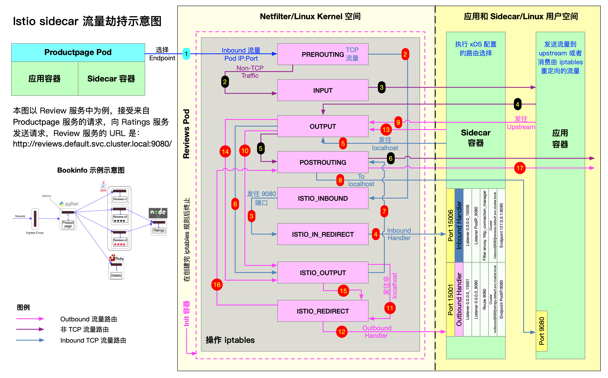
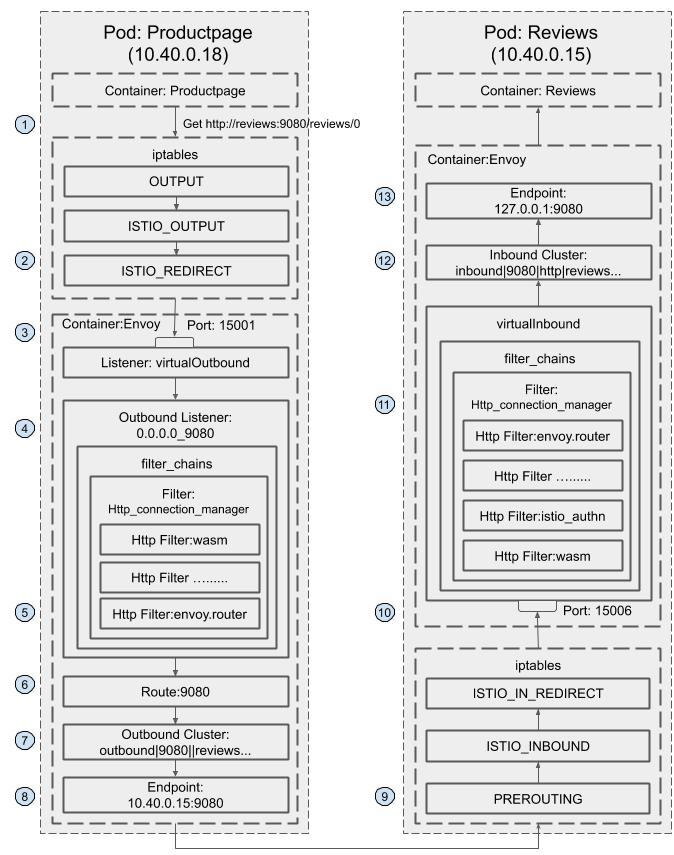

# service-mesh

记录学习istio、envoy等内容

## 流量劫持原理



1. `productpage` 服务对`reviews` 服务发送 TCP 连接请求
2. 请求进入`reviews`服务所在Pod内核空间，被netfilter拦截入口流量，经过`PREROUTING`链然后转发至`ISTIO_INBOUND`链
3. 在被`ISTIO_INBOUND`链被这个规则`-A ISTIO_INBOUND -p tcp -j ISTIO_IN_REDIRECT`拦截再次转发至`ISTIO_IN_REDIRECT`链
4. **`ISTIO_IN_REDIRECT`链直接重定向至 envoy监听的 `15006` 入口流量端口**
5. 在 envoy 内部经过一系列入口流量治理动作后，发出TCP连接请求 `reviews` 服务，这一步对envoy来说属于出口流量，会被netfilter拦截转发至出口流量`OUTPUT`链
6. `OUTPUT`链转发流量至`ISTIO_OUTPUT`链
7. 目的地为localhost，不能匹配到转发规则链，直接`RETURN`到下一个链，即`POSTROUTING`链
8. sidecar发出的请求到达`reviews`服务`9080`端口
9. `reviews`服务处理完业务逻辑后响应sidecar，这一步对`reviews`服务来说属于出口流量，再次被netfilter拦截转发至出口流量`OUTPUT`链
10. `OUTPUT`链转发流量至`ISTIO_OUTPUT`链
11. 发送非localhost请求且为`istio-proxy`用户空间的流量被转发至`ISTIO_REDIRECT`链
12. **`ISTIO_REDIRECT`链直接重定向至 envoy监听的 `15001` 出口流量端口**
13. 在 envoy 内部经过一系列出口流量治理动作后继续发送响应数据，响应时又会被netfilter拦截转发至出口流量`OUTPUT`链
14. `OUTPUT`链转发流量至`ISTIO_OUTPUT`链
15. 流量直接`RETURN`到下一个链，即`POSTROUTING`链




```shell


## 通过 docker ps 和 docker container 得到 Pid，通过Pid 获取 istio-proxy容器的iptables 规则
[root@biz-node-44 ~]# docker ps | grep istio-proxy_mall-gateway
d6905bd7da1e   efa1f0f99897                                             "/usr/local/bin/pilo…"   2 days ago     Up 2 days               k8s_istio-proxy_mall-gateway-7dcbb864cc-95wmg_mall_2123174e-cf99-40d8-b831-3752e650adac_0
[root@biz-node-44 ~]# docker container top d6905bd7da1e
UID                 PID                 PPID                C                   STIME               TTY                 TIME                CMD
1337                2541                2520                0                   Apr19               ?                   00:01:30            /usr/local/bin/pilot-agent proxy sidecar --domain mall.svc.cluster.local --proxyLogLevel=warning --proxyComponentLogLevel=misc:error --log_output_level=default:info --concurrency 2
1337                2753                2541                0                   Apr19               ?                   00:05:55            /usr/local/bin/envoy -c etc/istio/proxy/envoy-rev0.json --restart-epoch 0 --drain-time-s 45 --drain-strategy immediate --parent-shutdown-time-s 60 --local-address-ip-version v4 --file-flush-interval-msec 1000 --disable-hot-restart --log-format %Y-%m-%dT%T.%fZ?%l?envoy %n?%v -l warning --component-log-level misc:error --concurrency 2
[root@biz-node-44 ~]# nsenter -t 2541 -n iptables -t nat -S
# -P 改变PREROUTING、INPUT、OUTPUT、POSTROUTING链的默认策略为ACCEPT
-P PREROUTING ACCEPT
-P INPUT ACCEPT
-P OUTPUT ACCEPT
-P POSTROUTING ACCEPT
# -N 添加ISTIO_INBOUND、ISTIO_IN_REDIRECT、ISTIO_OUTPUT、ISTIO_REDIRECT 自定义链
-N ISTIO_INBOUND
-N ISTIO_IN_REDIRECT
-N ISTIO_OUTPUT
-N ISTIO_REDIRECT
# 在PREROUTING链后面追加ISTIO_INBOUND链
-A PREROUTING -p tcp -j ISTIO_INBOUND链
# 在OUTPUT链后面追加ISTIO_OUTPUT链
-A OUTPUT -p tcp -j ISTIO_OUTPUT
# 在ISTIO_INBOUND链中添加对端口15008、15090、15021、15020端口的返回规则
-A ISTIO_INBOUND -p tcp -m tcp --dport 15008 -j RETURN
-A ISTIO_INBOUND -p tcp -m tcp --dport 15090 -j RETURN
-A ISTIO_INBOUND -p tcp -m tcp --dport 15021 -j RETURN
-A ISTIO_INBOUND -p tcp -m tcp --dport 15020 -j RETURN
-A ISTIO_INBOUND -p tcp -j ISTIO_IN_REDIRECT
# 在ISTIO_IN_REDIRECT链中添加对所有tcp请求重定向到15006端口的规则
-A ISTIO_IN_REDIRECT -p tcp -j REDIRECT --to-ports 15006
-A ISTIO_OUTPUT -s 127.0.0.6/32 -o lo -j RETURN
-A ISTIO_OUTPUT ! -d 127.0.0.1/32 -o lo -m owner --uid-owner 1337 -j ISTIO_IN_REDIRECT
-A ISTIO_OUTPUT -o lo -m owner ! --uid-owner 1337 -j RETURN
-A ISTIO_OUTPUT -m owner --uid-owner 1337 -j RETURN
-A ISTIO_OUTPUT ! -d 127.0.0.1/32 -o lo -m owner --gid-owner 1337 -j ISTIO_IN_REDIRECT
-A ISTIO_OUTPUT -o lo -m owner ! --gid-owner 1337 -j RETURN
-A ISTIO_OUTPUT -m owner --gid-owner 1337 -j RETURN
-A ISTIO_OUTPUT -d 127.0.0.1/32 -j RETURN
-A ISTIO_OUTPUT -j ISTIO_REDIRECT
-A ISTIO_REDIRECT -p tcp -j REDIRECT --to-ports 15001

# 查看 NAT 表中规则配置的详细信息。
[root@biz-node-44 ~]# nsenter -t 2541 -n iptables -t nat -L -v 
# PREROUTING 链：用于目标地址转换（DNAT），将所有入站 TCP 流量跳转到 ISTIO_INBOUND 链上。
Chain PREROUTING (policy ACCEPT 85821 packets, 5149K bytes)
 pkts bytes target     prot opt in     out     source               destination         
85873 5152K ISTIO_INBOUND  tcp  --  any    any     anywhere             anywhere   

# INPUT 链：处理输入数据包，非 TCP 流量将继续 OUTPUT 链。
Chain INPUT (policy ACCEPT 85873 packets, 5152K bytes)
 pkts bytes target     prot opt in     out     source               destination         

# OUTPUT 链：将所有出站数据包跳转到 ISTIO_OUTPUT 链上。
Chain OUTPUT (policy ACCEPT 86721 packets, 5381K bytes)
 pkts bytes target     prot opt in     out     source               destination         
 138K 8253K ISTIO_OUTPUT  tcp  --  any    any     anywhere             anywhere            

# POSTROUTING 链：所有数据包流出网卡时都要先进入POSTROUTING 链，内核根据数据包目的地判断是否需要转发出去，我们看到此处未做任何处理。
Chain POSTROUTING (policy ACCEPT 144K packets, 8813K bytes)
 pkts bytes target     prot opt in     out     source               destination         

# ISTIO_INBOUND 链：将所有入站流量重定向到 ISTIO_IN_REDIRECT 链上，目的地为 15090（mixer 使用）和 15020（Ingress gateway 使用，用于 Pilot 健康检查）端口的流量除外，发送到以上两个端口的流量将返回 iptables 规则链的调用点，即 PREROUTING 链的后继 POSTROUTING。
Chain ISTIO_INBOUND (1 references)
 pkts bytes target     prot opt in     out     source               destination         
    0     0 RETURN     tcp  --  any    any     anywhere             anywhere             tcp dpt:15008
    0     0 RETURN     tcp  --  any    any     anywhere             anywhere             tcp dpt:15090
85820 5149K RETURN     tcp  --  any    any     anywhere             anywhere             tcp dpt:15021
    1    60 RETURN     tcp  --  any    any     anywhere             anywhere             tcp dpt:15020
   52  2704 ISTIO_IN_REDIRECT  tcp  --  any    any     anywhere             anywhere            

# ISTIO_IN_REDIRECT 链：将所有的入站流量跳转到本地的 15006 端口，至此成功的拦截了流量到 sidecar 中。
Chain ISTIO_IN_REDIRECT (3 references)
 pkts bytes target     prot opt in     out     source               destination         
   52  2704 REDIRECT   tcp  --  any    any     anywhere             anywhere             redir ports 15006

# ISTIO_OUTPUT 链：选择需要重定向到 Envoy（即本地） 的出站流量，所有非 localhost 的流量全部转发到 ISTIO_REDIRECT。为了避免流量在该 Pod 中无限循环，所有到 istio-proxy 用户空间的流量都返回到它的调用点中的下一条规则，本例中即 OUTPUT 链，因为跳出 ISTIO_OUTPUT 规则之后就进入下一条链 POSTROUTING。如果目的地非 localhost 就跳转到 ISTIO_REDIRECT；如果流量是来自 istio-proxy 用户空间的，那么就跳出该链，返回它的调用链继续执行下一条规则（OUTPUT 的下一条规则，无需对流量进行处理）；所有的非 istio-proxy 用户空间的目的地是 localhost 的流量就跳转到 ISTIO_REDIRECT。
Chain ISTIO_OUTPUT (1 references)
 pkts bytes target     prot opt in     out     source               destination         
   61  3660 RETURN     all  --  any    lo      127.0.0.6            anywhere            
    0     0 ISTIO_IN_REDIRECT  all  --  any    lo      anywhere            !localhost            owner UID match 1337
22906 1374K RETURN     all  --  any    lo      anywhere             anywhere             ! owner UID match 1337
57374 3442K RETURN     all  --  any    any     anywhere             anywhere             owner UID match 1337
    0     0 ISTIO_IN_REDIRECT  all  --  any    lo      anywhere            !localhost            owner GID match 1337
    0     0 RETURN     all  --  any    lo      anywhere             anywhere             ! owner GID match 1337
    0     0 RETURN     all  --  any    any     anywhere             anywhere             owner GID match 1337
    0     0 RETURN     all  --  any    any     anywhere             localhost           
57202 3432K ISTIO_REDIRECT  all  --  any    any     anywhere             anywhere            

#ISTIO_REDIRECT 链：将所有流量重定向到 Sidecar（即本地） 的 15001 端口。
Chain ISTIO_REDIRECT (1 references)
 pkts bytes target     prot opt in     out     source               destination         
57202 3432K REDIRECT   tcp  --  any    any     anywhere             anywhere             redir ports 15001


```

`istio-init`日志
```shell
[root@biz-master-48 ~]# kubectl logs -f mall-admin-6cbfb4bf8f-gbfkl -n mall -c istio-init
2022-04-21T10:19:44.852472Z	info	Istio iptables environment:
ENVOY_PORT=
INBOUND_CAPTURE_PORT=
ISTIO_INBOUND_INTERCEPTION_MODE=
ISTIO_INBOUND_TPROXY_ROUTE_TABLE=
ISTIO_INBOUND_PORTS=
ISTIO_OUTBOUND_PORTS=
ISTIO_LOCAL_EXCLUDE_PORTS=
ISTIO_EXCLUDE_INTERFACES=
ISTIO_SERVICE_CIDR=
ISTIO_SERVICE_EXCLUDE_CIDR=
ISTIO_META_DNS_CAPTURE=
INVALID_DROP=

2022-04-21T10:19:44.852544Z	info	Istio iptables variables:
PROXY_PORT=15001
PROXY_INBOUND_CAPTURE_PORT=15006
PROXY_TUNNEL_PORT=15008
PROXY_UID=1337
PROXY_GID=1337
INBOUND_INTERCEPTION_MODE=REDIRECT
INBOUND_TPROXY_MARK=1337
INBOUND_TPROXY_ROUTE_TABLE=133
INBOUND_PORTS_INCLUDE=*
INBOUND_PORTS_EXCLUDE=15090,15021,15020
OUTBOUND_IP_RANGES_INCLUDE=*
OUTBOUND_IP_RANGES_EXCLUDE=
OUTBOUND_PORTS_INCLUDE=
OUTBOUND_PORTS_EXCLUDE=
KUBE_VIRT_INTERFACES=
ENABLE_INBOUND_IPV6=false
DNS_CAPTURE=false
DROP_INVALID=false
CAPTURE_ALL_DNS=false
DNS_SERVERS=[],[]
OUTPUT_PATH=
NETWORK_NAMESPACE=
CNI_MODE=false
EXCLUDE_INTERFACES=

2022-04-21T10:19:44.852747Z	info	Writing following contents to rules file: /tmp/iptables-rules-1650536384852623234.txt3242838786
* nat
-N ISTIO_INBOUND
-N ISTIO_REDIRECT
-N ISTIO_IN_REDIRECT
-N ISTIO_OUTPUT
-A ISTIO_INBOUND -p tcp --dport 15008 -j RETURN
-A ISTIO_REDIRECT -p tcp -j REDIRECT --to-ports 15001
-A ISTIO_IN_REDIRECT -p tcp -j REDIRECT --to-ports 15006
-A PREROUTING -p tcp -j ISTIO_INBOUND
-A ISTIO_INBOUND -p tcp --dport 15090 -j RETURN
-A ISTIO_INBOUND -p tcp --dport 15021 -j RETURN
-A ISTIO_INBOUND -p tcp --dport 15020 -j RETURN
-A ISTIO_INBOUND -p tcp -j ISTIO_IN_REDIRECT
-A OUTPUT -p tcp -j ISTIO_OUTPUT
-A ISTIO_OUTPUT -o lo -s 127.0.0.6/32 -j RETURN
-A ISTIO_OUTPUT -o lo ! -d 127.0.0.1/32 -m owner --uid-owner 1337 -j ISTIO_IN_REDIRECT
-A ISTIO_OUTPUT -o lo -m owner ! --uid-owner 1337 -j RETURN
-A ISTIO_OUTPUT -m owner --uid-owner 1337 -j RETURN
-A ISTIO_OUTPUT -o lo ! -d 127.0.0.1/32 -m owner --gid-owner 1337 -j ISTIO_IN_REDIRECT
-A ISTIO_OUTPUT -o lo -m owner ! --gid-owner 1337 -j RETURN
-A ISTIO_OUTPUT -m owner --gid-owner 1337 -j RETURN
-A ISTIO_OUTPUT -d 127.0.0.1/32 -j RETURN
-A ISTIO_OUTPUT -j ISTIO_REDIRECT
COMMIT
2022-04-21T10:19:44.852778Z	info	Running command: iptables-restore --noflush /tmp/iptables-rules-1650536384852623234.txt3242838786
2022-04-21T10:19:44.855491Z	info	Writing following contents to rules file: /tmp/ip6tables-rules-1650536384855431751.txt3425188538

2022-04-21T10:19:44.855514Z	info	Running command: ip6tables-restore --noflush /tmp/ip6tables-rules-1650536384855431751.txt3425188538
2022-04-21T10:19:44.856621Z	info	Running command: iptables-save 
2022-04-21T10:19:44.858410Z	info	Command output: 
# Generated by iptables-save v1.8.4 on Thu Apr 21 10:19:44 2022
*mangle
:PREROUTING ACCEPT [0:0]
:INPUT ACCEPT [0:0]
:FORWARD ACCEPT [0:0]
:OUTPUT ACCEPT [0:0]
:POSTROUTING ACCEPT [0:0]
COMMIT
# Completed on Thu Apr 21 10:19:44 2022
# Generated by iptables-save v1.8.4 on Thu Apr 21 10:19:44 2022
*filter
:INPUT ACCEPT [0:0]
:FORWARD ACCEPT [0:0]
:OUTPUT ACCEPT [0:0]
-A INPUT -s 10.32.0.0/12 -d 224.0.0.0/4 -i eth0 -j ACCEPT
-A INPUT -d 224.0.0.0/4 -i eth0 -j DROP
COMMIT
# Completed on Thu Apr 21 10:19:44 2022
# Generated by iptables-save v1.8.4 on Thu Apr 21 10:19:44 2022
*nat
:PREROUTING ACCEPT [0:0]
:INPUT ACCEPT [0:0]
:OUTPUT ACCEPT [0:0]
:POSTROUTING ACCEPT [0:0]
:ISTIO_INBOUND - [0:0]
:ISTIO_IN_REDIRECT - [0:0]
:ISTIO_OUTPUT - [0:0]
:ISTIO_REDIRECT - [0:0]
-A PREROUTING -p tcp -j ISTIO_INBOUND
-A OUTPUT -p tcp -j ISTIO_OUTPUT
-A ISTIO_INBOUND -p tcp -m tcp --dport 15008 -j RETURN
-A ISTIO_INBOUND -p tcp -m tcp --dport 15090 -j RETURN
-A ISTIO_INBOUND -p tcp -m tcp --dport 15021 -j RETURN
-A ISTIO_INBOUND -p tcp -m tcp --dport 15020 -j RETURN
-A ISTIO_INBOUND -p tcp -j ISTIO_IN_REDIRECT
-A ISTIO_IN_REDIRECT -p tcp -j REDIRECT --to-ports 15006
-A ISTIO_OUTPUT -s 127.0.0.6/32 -o lo -j RETURN
-A ISTIO_OUTPUT ! -d 127.0.0.1/32 -o lo -m owner --uid-owner 1337 -j ISTIO_IN_REDIRECT
-A ISTIO_OUTPUT -o lo -m owner ! --uid-owner 1337 -j RETURN
-A ISTIO_OUTPUT -m owner --uid-owner 1337 -j RETURN
-A ISTIO_OUTPUT ! -d 127.0.0.1/32 -o lo -m owner --gid-owner 1337 -j ISTIO_IN_REDIRECT
-A ISTIO_OUTPUT -o lo -m owner ! --gid-owner 1337 -j RETURN
-A ISTIO_OUTPUT -m owner --gid-owner 1337 -j RETURN
-A ISTIO_OUTPUT -d 127.0.0.1/32 -j RETURN
-A ISTIO_OUTPUT -j ISTIO_REDIRECT
-A ISTIO_REDIRECT -p tcp -j REDIRECT --to-ports 15001
COMMIT
# Completed on Thu Apr 21 10:19:44 2022

```

修改 `istio-proxy`日志级别，调试wasm的时候很有用：
```shell
istioctl -n mall proxy-config log mall-admin-5498f4fb79-svt7l --level trace
```


