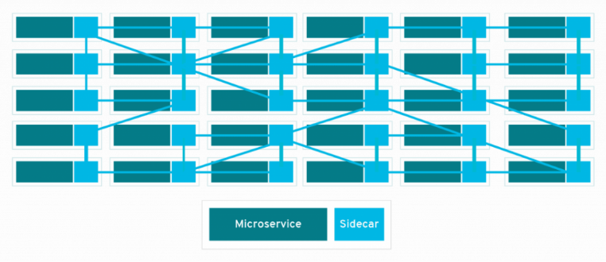

# eBPF 如何简化服务网格

今天有几个服务网格产品和项目，承诺简化应用程序微服务之间的连接，同时提供额外的功能，如安全连接、可观察性和流量管理。
但正如我们在过去几年中反复看到的那样，对服务网格的兴奋已经被对额外复杂性和开销的实际担忧所缓和。让我们探索 eBPF 如何让我们简化服务网格，使服务网格数据平面更高效、更易于部署。

## Sidecar的问题

今天的 Kubernetes 服务网格解决方案要求您向每个应用程序 pod 添加代理 sidecar 容器，例如 Envoy 或 Linkerd-proxy。没错：即使在一个非常小的环境中，比如有 20 个服务，每个服务运行 5 个 Pod，分布在三个节点上，
你也有 100 个代理容器。无论代理实现多么小而高效，纯粹的重复都会消耗资源。

每个代理使用的内存随着它需要能够与之通信的服务数量而增加。 Pranay Singhal 写了他配置 Istio 以将每个代理的消耗从大约 1GB 减少到更合理的每个代理的 60-70MB 的经验。
但即使在我们在三个节点上有 100 个代理的小型虚构环境中，这种优化配置仍然需要每个节点大约 2GB。

为什么我们需要所有这些边车？此模型允许代理容器与 pod 中的应用程序容器共享网络命名空间。网络命名空间是 Linux 内核结构，它允许容器和 Pod 拥有自己独立的网络堆栈，从而将容器化应用程序彼此隔离。
这使应用程序不会相互干扰，这就是为什么，例如，您可以拥有任意数量的 Pod，在端口 80 上运行 Web 应用程序——网络命名空间意味着它们每个都有自己的端口 80。
代理必须共享相同的网络命名空间，以便它可以拦截和处理进出应用程序容器的流量。

## 进入eBPF

eBPF 是一种内核技术，允许自定义程序在内核中运行。这些程序响应事件而运行，并且有数千个可能的事件可以附加到 eBPF 程序上。这些事件包括跟踪点、进入或退出任何功能（在内核或用户空间），或者——对于服务网格来说很重要——网络数据包的到达。

重要的是，每个节点只有一个内核；在一个节点上运行的所有容器（以及所有 pod）共享同一个内核。如果您将 eBPF 程序添加到内核中的事件中，无论是哪个进程导致该事件，它都会被触发，无论它是在应用程序容器中运行还是直接在主机上运行。

这就是为什么 eBPF 对于 Kubernetes 中的任何类型的检测来说都是如此令人兴奋的技术——您只需为每个节点添加一次检测，所有应用程序 pod 都将被覆盖。无论您是在寻找可观察性、安全性还是网络，基于 eBPF 的解决方案都可以在不需要 Sidecar 的情况下检测应用程序。

基于 eBPF 的 Cilium 项目（最近在孵化级别加入了云计算基金会）将这种“无边车”模型带入了服务网格世界。与传统的 sidecar 模型一样，Cilium 支持使用每个节点的单个 Envoy 代理实例来运行服务网格数据平面。使用我们之前的示例，这将代理实例的数量从 100 个减少到只有三个。

## 更少的YAML
在 sidecar 模型中，需要修改指定每个应用程序 pod 的 YAML 以添加 sidecar 容器。这通常是自动化的——例如，使用 mutating webhook 在每个应用程序 pod 部署时注入 sidecar。

例如，在 Istio 中，这需要标记 Kubernetes 命名空间和/或 pod 来定义是否应该注入 sidecar——当然，它需要为集群启用 mutating webhook。

但是如果出现问题怎么办？如果命名空间或 pod 标记错误，则不会注入 sidecar，并且 pod 也不会连接到服务网格。更糟糕的是，如果攻击者破坏了集群并能够运行恶意工作负载（例如，加密货币矿工），他们将不太可能对其进行标记以使其参与服务网格。
它不会通过服务网格提供的流量可观察性可见。

相比之下，在启用 eBPF 的无 sidecarless 代理模型中，Pod 不需要任何额外的 YAML 即可进行检测。相反，CRD 用于在集群范围内配置服务网格。即使是预先存在的 pod 也可以成为服务网格的一部分，而无需重新启动！

如果攻击者试图通过直接在主机上运行工作负载来绕过 Kubernetes 编排，eBPF 程序可以看到并控制此活动，因为它在内核中都是可见的。

## eBPF具有网络效率
消除 sidecar 并不是 eBPF 优化服务网格的唯一方法。启用 eBPF 的网络允许数据包采用绕过内核网络堆栈部分的捷径，这可以显着提高 Kubernetes 网络的性能。让我们看看这在服务网格数据平面中是如何应用的。

在服务网格的情况下，代理在传统网络中作为 sidecar 运行，数据包到达应用程序的路径非常曲折：入站数据包必须遍历主机 TCP/IP 堆栈才能到达 pod 的通过虚拟以太网连接的网络命名空间。从那里，数据包必须通过 pod 的网络堆栈到达代理，代理通过环回接口转发数据包到达应用程序。
请记住，流量必须流经连接两端的代理，与非服务网格流量相比，这会导致延迟显着增加。

基于 eBPF 的 Kubernetes CNI 实现（例如 Cilium）可以使用 eBPF 程序，明智地连接到内核中的特定点，沿更直接的路由重定向数据包。这是可能的，因为 Cilium 知道所有 Kubernetes 端点和服务身份。
当一个数据包到达主机时，Cilium 可以直接将它分派到它的目的地代理或 Pod 端点。

## 网络中的加密
给定一个了解 Kubernetes 服务并在这些服务的端点之间提供网络连接的网络解决方案，它可以提供服务网格数据平面的功能也就不足为奇了。但这些功能可以超越基本的连接性。一个例子是透明加密。

使用服务网格来确保所有应用程序流量都经过身份验证和加密是很常见的。这是通过双向 TLS (mTLS) 实现的；服务网格代理组件充当网络连接的端点，并与其远程对等方协商安全的 TLS 连接。此连接对代理之间的流量进行加密，而无需对应用程序进行任何更改。

但是，在应用层管理的 TLS 并不是实现组件之间经过身份验证和加密的流量的唯一方法。另一种选择是使用 IPSec 或 WireGuard 在网络层加密流量。因为它在网络层运行，所以这种加密不仅对应用程序而且对代理都是完全透明的——它可以在有或没有服务网格的情况下启用。
如果您使用服务网格的唯一原因是提供加密，您可能需要考虑网络级加密。它不仅更简单，而且还可以用于对节点上的任何流量进行身份验证和加密——它不仅限于那些支持 Sidecar 的工作负载。

## eBPF 是服务网格的数据平面
现在，Linux 生产发行版中使用的内核版本广泛支持 eBPF，企业可以利用它来实现更高效的网络解决方案，并作为服务网格的更高效数据平面。 Solo.io 在最近的 ServiceMeshCon 上将其描述为 "Super Charging your Service Mesh with eBPF"  。

去年，我代表 CNCF 的技术监督委员会对服务网格领域的整合和清晰度做出了一些预测。在同一个主题演讲中，我谈到了 eBPF 成为更多项目和更广泛部署功能的基础的可能性。这两个想法现在融合在一起，因为 eBPF 似乎是服务网格数据平面的自然路径。

## Reference
[How eBPF Streamlines the Service Mesh](https://thenewstack.io/how-ebpf-streamlines-the-service-mesh/)

