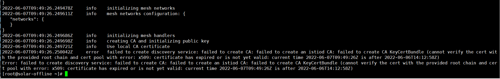

# istio 问题解决

## 证书过期
证书过期，导致istiod一直报错，错误详情如下：



解决办法：重新生成证书

参考：[在集群中插入证书和密钥](https://istio.io/latest/zh/docs/tasks/security/cert-management/plugin-ca-cert/)

具体做法就是，在 `/istio/tools/certs` 目录下执行
```shell
$ make -f Makefile.selfsigned.mk mark-cacerts

generating root-key.pem
Generating RSA private key, 4096 bit long modulus
......................................................................................................................................................................................................................................................................................................++
............................................................................................++
e is 65537 (0x10001)
generating root-cert.csr
generating root-cert.pem
Signature ok
subject=/O=Istio/CN=Root CA
Getting Private key
generating mark/ca-key.pem
Generating RSA private key, 4096 bit long modulus
........++
.............................................................................................................++
e is 65537 (0x10001)
generating mark/cluster-ca.csr
generating mark/ca-cert.pem
Signature ok
subject=/O=Istio/CN=Intermediate CA/L=mark
Getting CA Private Key
generating mark/cert-chain.pem
Intermediate inputs stored in mark/
done
rm mark/cluster-ca.csr mark/intermediate.conf
```

然后会在mark 目录下生成几个文件：
```shell
➜  mark git:(release-1.9) ✗ ls
ca-cert.pem  ca-key.pem  cert-chain.pem  root-cert.pem
```

默认 ca-cert.pem 中生成的证书有效时间是730天，可以修改 `/istio/tools/certs/common.mk`文件中的`INTERMEDIATE_DAYS`参数的值，如

原：
```makefile
# variables: intermediate CA
INTERMEDIATE_DAYS ?= 730
INTERMEDIATE_KEYSZ ?= 4096
INTERMEDIATE_ORG ?= Istio
INTERMEDIATE_CN ?= Intermediate CA
INTERMEDIATE_SAN_DNS ?= istiod.istio-system.svc
```
修改后：
```makefile
# variables: intermediate CA
INTERMEDIATE_DAYS ?= 3650
INTERMEDIATE_KEYSZ ?= 4096
INTERMEDIATE_ORG ?= Istio
INTERMEDIATE_CN ?= Intermediate CA
INTERMEDIATE_SAN_DNS ?= istiod.istio-system.svc
```
这样证书的有效期就有10年了，够用了

接下来，可以根据这几个文件，生成一个 secret:
```shell
kubectl create secret generic cacerts -n istio-system \
      --from-file=ca-cert.pem \
      --from-file=ca-key.pem \
      --from-file=root-cert.pem \
      --from-file=cert-chain.pem
```

再重新apply这个secret，重启istiod。istiod就正常起来了~


