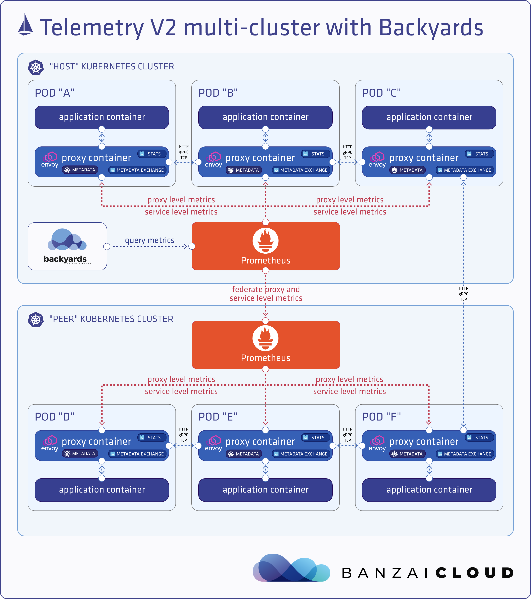

# Istio telemetry V2 (Mixerless) deep dive

Istio 服务网格最受欢迎和最强大的功能之一是其先进的可观察性。因为所有服务到服务的通信都通过 Envoy 代理进行路由，并且 Istio 的控制平面能够从这些代理收集日志和指标，所以服务网格可以为我们提供关于网络状态和服务行为的深入见解。这为运营商提供了独特的故障排除、管理和优化服务的方法，而不会给应用程序开发人员带来任何额外的负担。

因此，运营商可以深入了解受监控的服务如何在入站和出站方向进行交互。这些指标提供了各种各样的信息，包括总流量、错误率和请求的响应时间。

istio的metrics暴露，是通过 envoy wasm 实现的。

## Telemetry V2

## Reference

[Istio telemetry V2 (Mixerless) deep dive](https://banzaicloud.com/blog/istio-mixerless-telemetry/#proxy-level-metrics)

