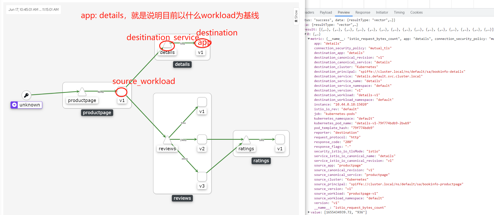

# kiali

## 关于Kiali
Kiali是Istio服务网格的管理控制台。它给你的服务网格提供了强大的可观测能力，让您快速诊断并修复问题。Kiali提供深入的流量拓扑，健康等级，强大的仪表板，并让您深入到组件的细节。 Kiali提供了相关的指标、日志和tracing视图，和验证能力以查明配置问题。Kiali提供向导，来帮助您将服务添加到服务网格，定义流量路由，网关，流量策略和其他。Kiali能够与Grafana和Jaeger集成。

## kiali中的基本概念

在了解 Kiali 如何提供 Service Mesh 中微服务可观察性之前，我们需要先了解下 Kiali 如何划分监控类别的。

- Application：使用运行的工作负载，必须使用 Istio 的将 Label 标记为 app 才算。注意，如果一个应用有多个版本，只要 app 标签的值相同就是属于同一个应用。
- Deployment：即 Kubernetes 中的 Deployment。
- Label：这个值对于 Istio 很重要，因为 Istio 要用它来标记 metrics。每个 Application 要求包括 app 和 version 两个 label。
- Namespace：通常用于区分项目和用户。
- Service：即 Kubernetes 中的 Service，不过要求必须有 app label。
- Workload：Kubernetes 中的所有常用资源类型如 Deployment、StatefulSet、Job 等都可以检测到，不论这些负载是否加入到 Istio Service Mesh 中。

## 源码解读

HTTP 请求的处理逻辑入口位于 `kiali/handlers/graph.go` . 以GraphNamespaces这个绘制namespace graph的方法为例，它的核心逻辑如下：

```go
// GraphNamespaces is a REST http.HandlerFunc handling graph generation for 1 or more namespaces
func GraphNamespaces(w http.ResponseWriter, r *http.Request) {
	defer handlePanic(w)

    // 设置 绘图的选项：什么namespace的图、是否需要显示什么appenders等...
    o := graph.NewOptions(r)
    // 设置k8s、p8s、jaeger client，以及初始化kiali缓存。而kiali缓存了k8s和istio的资源和namespace信息
    business, err := getBusiness(r)
    graph.CheckError(err)
    // 根据options生成namespace的graph
    code, payload := api.GraphNamespaces(business, o)
    respond(w, code, payload)
}
```
Appender 是一个接口，在 service graph 中注入详细的信息，这里后文做了很详细的介绍。

## appender
appenders 可以 增、删、改 nodes

### DeadNodeAppender
负责删除多余的节点。他有两种情况:
- 没有traffic 报告的nodes和后台的workload不能被发现的nodes
- service node中没有service entries 的node、没有incoming错误traffic和没有outgoing edges的节点

以上都会被认为是dead node，而从trafficMap中被删除。

还有一种，如果是node对于的workload 的pod 数量为0，那么标记为`isDead`

### SidecarsCheckAppender
负责检查 workload 和 app 类型的node中是否missing sidecars，如果丢失sidecar，那么标记为`hasMissingSC`。

### ServiceEntryAppender
负责识别在istio中定义为serviceEntry的service nodes。

### IstioAppender
负责标记具有特殊Istio意义（CircuitBreaker、VirtualService，分别标记为HasCB、HasVS）的节点。

### SecurityPolicyAppender
负责将安全策略信息添加到graph，现在只支持tls。

### ResponseTimeAppender
负责将responseTime信息添加到graph。

### UnusedNodeAppender
负责查找traffic中从未见过的服务请求。它增加了节点代表未使用的定义。添加的节点类型取决于图表类型和/或标签定义


## 程序运行流程


## 指标中的名称解释
- reporter: 这标识了请求的报告者。如果报告来自服务器 Istio proxy，则设置为destination，如果报告来自客户端 Istio 代理，则设置为source。如：details
- app: 当前的应用，相同app标签为一组应用。
- source: Envoy 代理的下游(DownUpstream)客户端。在服务网格中，source通常是workload，但入口流量的source可能包括其他客户端，例如浏览器或移动应用程序。
- source_workload: 这标识了控制源的源工作负载(source workload)的名称。如：productpage-v1
- source_workload_namespace: 这标识了源工作负载的命名空间。如：default
- source_principal: 这标识了流量源的对等主体。使用对等身份验证时设置。如：spiffe://cluster.local/ns/default/sa/bookinfo-productpage
- source_app: 这会根据源工作负载的应用标签识别源应用。如：productpage
- source_version: 这标识了源工作负载的版本。如：v1
- source_cluster: 这标识了源工作负载所在的集群。如：Kubernetes
- source_canonical_service: 。如：productpage
- source_canonical_revision: 。如：v1
- destination_workload: 这标识了目标工作负载(destination workload)的名称。如：details-v1
- destination_workload_namespace: 这标识了目标工作负载(destination workload)的命名空间。如：default
- destination_principal: 这标识了流量目的地的对等主体。使用对等身份验证时设置。如：spiffe://cluster.local/ns/default/sa/bookinfo-details
- destination_app: 这会根据目标工作负载的应用标签(app)识别目标应用。如：details
- destination_version: 这标识了目标工作负载的版本。如：v1
- destination_service: 这标识了负责传入请求的目标服务主机。如：details.default.svc.cluster.local
- destination_service_name: 这标识了目标服务名称。如：details
- destination_service_namespace: 这标识了目标服务命名空间。如：default
- destination_canonical_revision: 。如：v1 
- destination_canonical_service: 。如：details
- destination_cluster: 这标识了目标工作负载所在的集群。如：Kubernetes
- request_protocol: 这标识了请求的协议。如果提供，则设置为 API 协议，否则设置为请求或连接协议。如：http
- response_code: 这标识了请求的响应代码。此标签仅出现在 HTTP 指标上。如：200
- response_flags: 有关来自代理的响应或连接的其他详细信息。如果是 Envoy，请参阅 Envoy 访问日志中的 %RESPONSE_FLAGS% 了解更多详细信息。如："-"
- connection_security_policy: 这标识了请求的服务认证策略。当 Istio 用于确保通信安全并且报告来自目的地时(destination)，它设置为mutual_tls。当报告来自源时，它设置为未知，因为无法正确填充安全策略。如：mutual_tls
- istio_io_rev: istio注入后的标签指标，原标签为"istio.io/rev: default"
- service_istio_io_canonical_name: 工作负载所属的规范服务的名称。它是istio注入后的标签指标，原标签为"service.istio.io/canonical-name: details"
- service_istio_io_canonical_revision: istio注入后的标签指标，原标签为"service.istio.io/canonical-revision: v1"
- security_istio_io_tlsMode: istio注入后的标签指标，原标签为"security.istio.io/tlsMode: istio"

### 实际案例

Demo1：查看details的pod（details-v1-79f774bdb9-2bwb9）在Prometheus中生成的数据，以及对应的kiali图的情况。

流量走向：流量从productpage指向details

数据如下：

```json
{
  app: "details"
  connection_security_policy: "mutual_tls"
  destination_app: "details"
  destination_canonical_revision: "v1"
  destination_canonical_service: "details"
  destination_cluster: "Kubernetes"
  destination_principal: "spiffe://cluster.local/ns/default/sa/bookinfo-details"
  destination_service: "details.default.svc.cluster.local"
  destination_service_name: "details"
  destination_service_namespace: "default"
  destination_version: "v1"
  destination_workload: "details-v1"
  destination_workload_namespace: "default"
  instance: "10.44.0.18:15020"
  istio_io_rev: "default"
  job: "kubernetes-pods"
  kubernetes_namespace: "default"
  kubernetes_pod_name: "details-v1-79f774bdb9-2bwb9"
  pod_template_hash: "79f774bdb9"
  reporter: "destination"
  request_protocol: "http"
  response_code: "200"
  response_flags: "-"
  security_istio_io_tlsMode: "istio"
  service_istio_io_canonical_name: "details"
  service_istio_io_canonical_revision: "v1"
  source_app: "productpage"
  source_canonical_revision: "v1"
  source_canonical_service: "productpage"
  source_cluster: "Kubernetes"
  source_principal: "spiffe://cluster.local/ns/default/sa/bookinfo-productpage"
  source_version: "v1"
  source_workload: "productpage-v1"
  source_workload_namespace: "default"
  version: "v1"
  __name__: "istio_request_bytes_count"
}
```

对应的图如下：




Demo2：查看productpage的pod（productpage-v1-6b746f74dc-bkdw2）在Prometheus中生成的数据，以及对应的kiali图的情况。

流量走向：流量从外部指向productpage


数据如下：

```json
{
  app: "productpage"
  connection_security_policy: "none"
  destination_app: "productpage"
  destination_canonical_revision: "v1"
  destination_canonical_service: "productpage"
  destination_cluster: "Kubernetes"
  destination_principal: "unknown"
  destination_service: "productpage.default.svc.cluster.local"
  destination_service_name: "productpage"
  destination_service_namespace: "default"
  destination_version: "v1"
  destination_workload: "productpage-v1"
  destination_workload_namespace: "default"
  instance: "10.44.0.15:15020"
  istio_io_rev: "default"
  job: "kubernetes-pods"
  kubernetes_namespace: "default"
  kubernetes_pod_name: "productpage-v1-6b746f74dc-bkdw2"
  pod_template_hash: "6b746f74dc"
  reporter: "destination"
  request_protocol: "http"
  response_code: "0"
  response_flags: "DC"
  security_istio_io_tlsMode: "istio"
  service_istio_io_canonical_name: "productpage"
  service_istio_io_canonical_revision: "v1"
  source_app: "unknown"
  source_canonical_revision: "latest"
  source_canonical_service: "unknown"
  source_cluster: "unknown"
  source_principal: "unknown"
  source_version: "unknown"
  source_workload: "unknown"
  source_workload_namespace: "unknown"
  version: "v1"
  __name__: "istio_request_bytes_count"
}
```

对应的图如下：


### 关于unknown
unknown node： 没有sidecar的pod发出的流量。这些流量不是来自部署了 Envoy 代理的源 pod，因此不是 Mesh 的一部分。

有篇文章也说到了这个，原文如下：

[Where does the ‘unknown’ traffic in Istio come from (updated)?](https://itnext.io/where-does-the-unknown-taffic-in-istio-come-from-4a9a7e4454c3)


## Reference

[metrics](https://istio.io/v1.6/docs/reference/config/policy-and-telemetry/metrics/)


