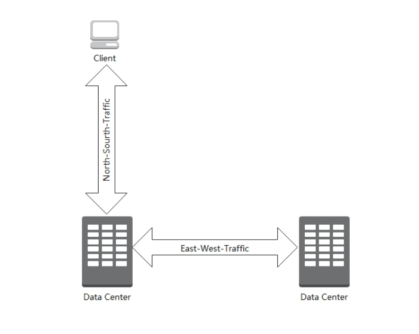
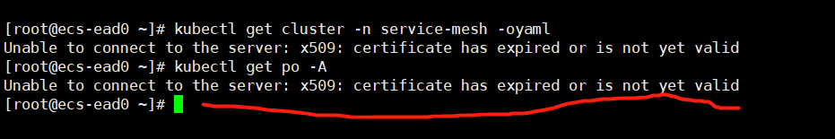
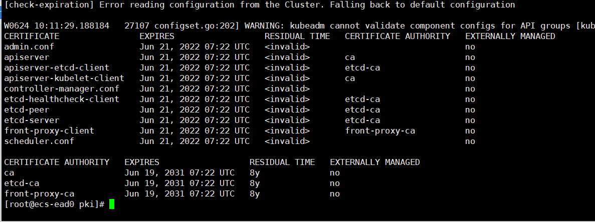

# 通用知识

## 什么是南北流量？东西流量？

南北流量： 它指的是客户端到服务器之间通信的流量，英文是NORTH-SOURTH-TRAFFIC，直接是字面翻译过来的。那为啥叫南北而不叫东西呢？因为通常画网络拓扑图时，习惯上把服务器和客户端之间画成上下方向，因此叫南北流量。

东西流量：有南北自然就有东西流量(EAST-WEST-TRAFFIC)，指的是服务器和服务器之间的流量或不同数据中心之间的网络流被称为东西流量，为啥叫东西呢？原因也一样，习惯而已，网络图拓扑图中将服务器之间的流量喜欢画在水平方向，因此叫东西流量。



## nohup 使脚本后台不中断执行

你可以在Linux命令或者脚本后面增加&符号，从而使命令或脚本在后台执行，例如：
```shell
$ ./curlsolarbookinfo2 &
```
使用&符号在后台执行命令或脚本后，如果你退出登录，这个命令就会被自动终止掉。要避免这种情况，你可以使用nohup命令，如下所示：
```shell
$ nohup ./curlsolarbookinfo2 &
```

使用ps -ef |grep curlsolarbookinfo2.sh可查看到正在运行的脚本进程
退出当前shell终端，再重新打开，使用ps -ef可以看到

脚本内容：
```shell
#!/bin/bash 

while true
do 
   curl http://bookinfo.solarmesh.cn/productpage
   sleep 15
done 

```

## 更新k8s证书
问题描述
```shell
Unable to connect to the server: x509: certificate has expired or is not yet valid
```

状况如图所示：


### 解决方案
(1)先看下证书是否过期
```shell
kubeadm alpha certs check-expiration
```

如图所示，证书截至日期为6月21日，已过期3天，问题锁定，下面执行证书更新操作。



(2)更新证书
```shell
kubeadm alpha renew all
```

```shell
[root@ecs-ead0 ~]# kubeadm alpha certs check-expiration
[check-expiration] Reading configuration from the cluster...
[check-expiration] FYI: You can look at this config file with 'kubectl -n kube-system get cm kubeadm-config -oyaml'

CERTIFICATE                EXPIRES                  RESIDUAL TIME   CERTIFICATE AUTHORITY   EXTERNALLY MANAGED
admin.conf                 Jun 24, 2023 02:13 UTC   364d                                    no      
apiserver                  Jun 24, 2023 02:13 UTC   364d            ca                      no      
apiserver-etcd-client      Jun 24, 2023 02:13 UTC   364d            etcd-ca                 no      
apiserver-kubelet-client   Jun 24, 2023 02:13 UTC   364d            ca                      no      
controller-manager.conf    Jun 24, 2023 02:13 UTC   364d                                    no      
etcd-healthcheck-client    Jun 24, 2023 02:13 UTC   364d            etcd-ca                 no      
etcd-peer                  Jun 24, 2023 02:13 UTC   364d            etcd-ca                 no      
etcd-server                Jun 24, 2023 02:13 UTC   364d            etcd-ca                 no      
front-proxy-client         Jun 24, 2023 02:13 UTC   364d            front-proxy-ca          no      
scheduler.conf             Jun 24, 2023 02:13 UTC   364d                                    no      

CERTIFICATE AUTHORITY   EXPIRES                  RESIDUAL TIME   EXTERNALLY MANAGED
ca                      Jun 19, 2031 07:22 UTC   8y              no      
etcd-ca                 Jun 19, 2031 07:22 UTC   8y              no      
front-proxy-ca          Jun 19, 2031 07:22 UTC   8y              no      

```

注意，我们可以观察到，即使更新完，再次输入”kubectl get pods“，问题仍然未得到解决，仍然报错 “Unable to connect to the server: x509: certificate has expired or is not yet valid”。

(3)用docker 对k8s相关的几个pod执行重启
```shell
/usr/bin/docker ps -af 'name=k8s_POD_(kube-apiserver|kube-controller-manager|kube-scheduler|etcd)-*' -q | /usr/bin/xargs /usr/bin/docker rm -f
```

(4)pod重启后认证账户就失效了，需要用该命令重新认证
```shell
/usr/bin/cp /etc/kubernetes/admin.conf /root/.kube/config
```

(5) 执行完前4步后，大功告成。输入 ”kubectl get pods“，问题解决。

### Reference
[Kubernetes 证书过期](https://blog.csdn.net/weixin_43509834/article/details/121606410?spm=1001.2101.3001.6661.1&utm_medium=distribute.pc_relevant_t0.none-task-blog-2%7Edefault%7ECTRLIST%7ERate-1-121606410-blog-115755311.pc_relevant_antiscanv2&depth_1-utm_source=distribute.pc_relevant_t0.none-task-blog-2%7Edefault%7ECTRLIST%7ERate-1-121606410-blog-115755311.pc_relevant_antiscanv2&utm_relevant_index=1)


