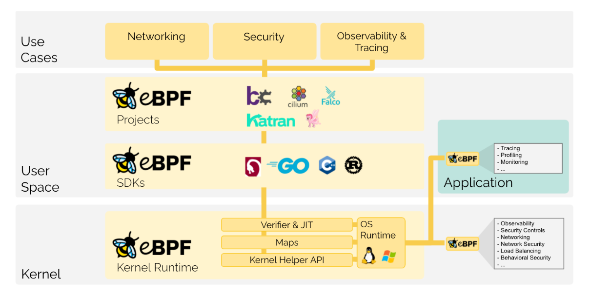

# eBPF

eBPF 是一项革命性的技术，起源于 Linux 内核，可以在操作系统内核中运行沙盒程序。它用于安全有效地扩展内核的功能，而无需更改内核源代码或加载内核模块。

从历史上看，由于内核具有监督和控制整个系统的特权，操作系统一直是实现可观察性、安全性和网络功能的理想场所。
同时，操作系统内核由于其核心作用和对稳定性和安全性的高要求，难以演进。因此，与在操作系统之外实现的功能相比，操作系统级别的创新率较低。

eBPF 从根本上改变了这个公式。通过允许在操作系统中运行沙盒程序，应用程序开发人员可以运行 eBPF 程序以在运行时向操作系统添加额外的功能。然后，操作系统保证安全性和执行效率，
就像借助即时 (JIT) 编译器和验证引擎进行本地编译一样。这引发了一波基于 eBPF 的项目，涵盖了广泛的用例，包括下一代网络、可观察性和安全功能。

今天，eBPF 被广泛用于驱动各种各样的用例：在现代数据中心和云原生环境中提供高性能网络和负载平衡，以低开销提取细粒度的安全可观察性数据，
帮助应用程序开发人员跟踪应用程序，为性能故障排除、预防性应用程序和容器运行时安全实施等提供见解。可能性无穷无尽，解锁eBPF的创新才刚刚开始。

## Security
建立在查看和理解所有系统调用的基础上，并将其与所有网络操作的数据包和套接字级别视图相结合，可以为保护系统提供革命性的新方法。
虽然系统调用过滤、网络级过滤和进程上下文跟踪的各个方面通常由完全独立的系统处理，但 eBPF 允许结合所有方面的可见性和控制，以创建在更多上下文上运行并具有更好控制级别的安全系统。

## Tracing & Profiling
将 eBPF 程序附加到跟踪点以及内核和用户应用程序探测点的能力允许对应用程序和系统本身的运行时行为进行前所未有的可见性。
通过为应用程序和系统端提供自省能力，可以将两种视图结合起来，从而提供强大而独特的洞察力来解决系统性能问题。
先进的统计数据结构允许以有效的方式提取有意义的可见性数据，而无需像类似系统通常所做的那样导出大量采样数据。

## Networking
可编程性和效率的结合使 eBPF 自然适合网络解决方案的所有数据包处理要求。 eBPF 的可编程性允许添加额外的协议解析器并轻松编程任何转发逻辑以满足不断变化的需求，
而无需离开 Linux 内核的数据包处理上下文。 JIT 编译器提供的效率提供了接近于本地编译的内核代码的执行性能。

## Observability & Monitoring
eBPF 不依赖于操作系统公开的静态计数器和计量器，而是支持自定义指标的收集和内核聚合，并基于各种可能的来源生成可见性事件。
这扩展了可以实现的可见性深度，并通过仅收集所需的可见性数据并在事件源处生成直方图和类似数据结构而不是依赖于样本的导出来显着降低整体系统开销。

## Reference
[eBPF](https://ebpf.io/)

