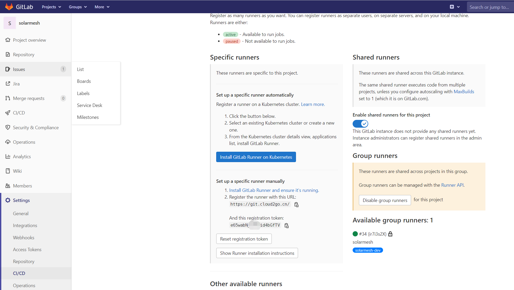

# gitlab-runner
gitlab-ci全称是gitlab continuous integration的意思，也就是持续集成。中心思想是当每一次push到gitlab的时候，都会触发一次脚本执行，然后脚本的内容包括了测试，编译，部署等一系列自定义的内容。本文就是利用gitlab-ci的持续集成来实现自动部署。相比之前webhook的自动部署还是强大以及方便了许多。

## 原理
自动部署涉及了若干个角色，主要介绍如下

GitLab-CI 这个是一套配合GitLab使用的持续集成系统，是GitLab自带的，也就是你装GitLab的那台服务器上就带有的。无需多考虑。.gitlab-ci.yml的脚本解析就由它来负责。

GitLab-Runner 这个是脚本执行的承载者，.gitlab-ci.yml的script部分的运行就是由runner来负责的。GitLab-CI浏览过项目里的.gitlab-ci.yml文件之后，根据里面的规则，分配到各个Runner来运行相应的脚本script。这些脚本有的是测试项目用的，有的是部署用的。


GitLab-CI与GitLab-Runner关系示意图

.gitlab-ci.yml 这个是在git项目的根目录下的一个文件，记录了一系列的阶段和执行规则。GitLab-CI在push后会解析它，根据里面的内容调用runner来运行。


## 安装启动gitlab-runner
```shell
docker run -d --name gitlab-runner --restart always \
  -v /srv/gitlab-runner/config:/etc/gitlab-runner \
  -v /var/run/docker.sock:/var/run/docker.sock \
  gitlab/gitlab-runner:latest
```

## 注册runner到gitlab中
先在gitlab的CI/CD页面找到url和token，如图


```shell

#进入容器
sudo docker exec -it gitlab-runner /bin/bash
#容器中完成注册
gitlab-runner register \
  --non-interactive \
  --url "http://xxx" \
  --registration-token "xxx" \
  --executor "docker" \
  --docker-image maven:latest \
  --description "xxx " \
  --tag-list "xx" \
  --run-untagged \
  --locked="false"
```

重要参数说明：
    
url和token参考上图，在runner需要对接的gitlab中获得；

executor是runner中pipeline以什么方式运行，这里选择的是docker方式，其实还支持shell等其它方式。

docker-image是runner中pipelne以哪个image为基础来执行executor。

tag-list是runner的tag，在gitlab的project中关于ci的配置文件中会引用得到。

Runner注册成功后就会在gitlab的CI/CD页面看到上图右下角绿色图标的内容，如果出现灰色的runner说明runner虽然注册上来但是不可用，当gitlab与runner安装在同一台机器时就会出现这种情况，所以请尽量分开。

## 在gitlab的项目中配置gitlab-ci

在项目根目录下添加.gitlab-ci.yml文件，gitlab-ci很强大，本质就是以yml的格式定义了一个pipeline，与jenkins存在功能重叠的部分。


## 参考
[Gitlab-Runner原理与实现](https://blog.csdn.net/yejingtao703/article/details/83065591?utm_medium=distribute.pc_relevant.none-task-blog-2~default~baidujs_baidulandingword~default-0-83065591-blog-88803783.pc_relevant_default&spm=1001.2101.3001.4242.1&utm_relevant_index=3)

[gitlab之gitlab-runner自动部署](https://blog.csdn.net/haha_66666/article/details/85113291?utm_medium=distribute.pc_relevant.none-task-blog-2~default~baidujs_title~default-1-85113291-blog-87369501.pc_relevant_default&spm=1001.2101.3001.4242.2&utm_relevant_index=4)


