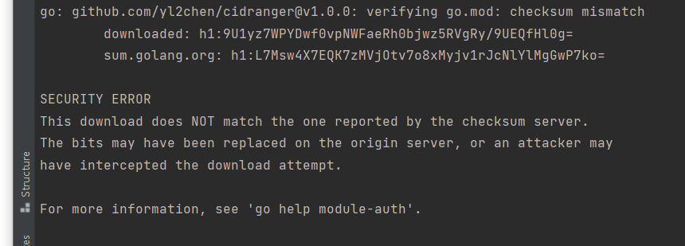

# go 问题解决

## This download does NOT match the one reported by the checksum server

大致错误如下



解决
```shell
$ go clean -modcache
$ go mod tidy
```

## 老项目如何改造成使用go mod 模式

```shell
# 1.在项目于根目录 使用 go mod init 项目名
go mod init github.com/kiali/kiali
# 2.删除项目中vendor目录
rm -rf vendor
# 3. 使用 go mod tidy
go mod tidy
```

