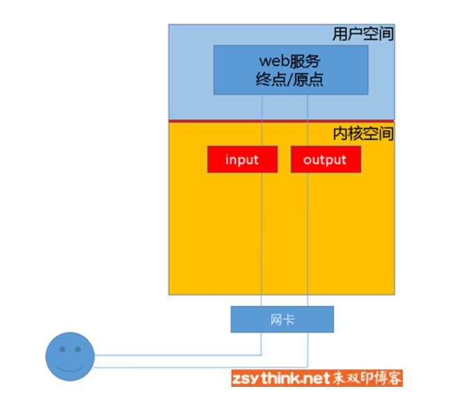
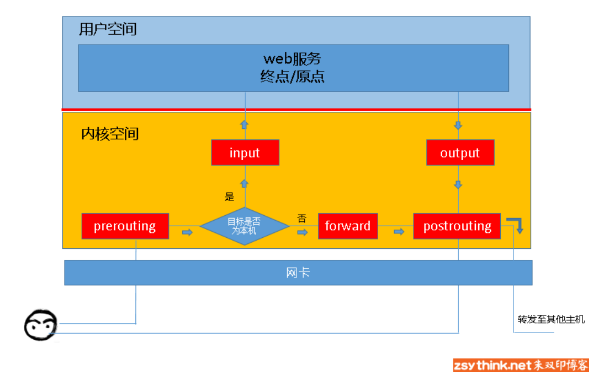

# iptables

### 概念
> https://www.zsythink.net/archives/1199

iptables进行”增、删、改”操作：
> https://www.zsythink.net/archives/1517

iptables小结之常用套路
> https://www.zsythink.net/archives/1869

`iptables`其实不是真正的防火墙，我们可以把它理解成一个客户端代理，用户通过iptables这个代理，将用户的安全设定执行到对应的”安全框架”中，这个”安全框架”才是真正的防火墙，这个框架的名字叫**netfilter**

`netfilter`才是防火墙真正的安全框架（framework），`netfilter`位于内核空间。

`iptables`其实是一个命令行工具，位于用户空间，我们用这个工具操作真正的框架。

我们说过，netfilter才是真正的防火墙，它是内核的一部分，所以，如果我们想要防火墙能够达到”防火”的目的，则需要在内核中设置关卡，所有进出的报文都要通过这些关卡，经过检查后，符合放行条件的才能放行，符合阻拦条件的则需要被阻止，于是，就出现了input关卡和output关卡，而这些关卡在iptables中不被称为”关卡”,而被称为”链”。

其实我们上面描述的场景并不完善，因为客户端发来的报文访问的目标地址可能并不是本机，而是其他服务器，当本机的内核支持IP_FORWARD时，我们可以将报文转发给其他服务器，所以，这个时候，我们就会提到iptables中的其他”关卡”，也就是其他”链”，他们就是  “路由前”、”转发”、”路由后”，他们的英文名是

PREROUTING、FORWARD、POSTROUTING

也就是说，当我们启用了防火墙功能时，报文需要经过如下关卡，也就是说，根据实际情况的不同，报文经过”链”可能不同。如果报文需要转发，那么报文则不会经过input链发往用户空间，而是直接在内核空间中经过forward链和postrouting链转发出去的。

到本机某进程的报文：PREROUTING –> INPUT

由本机转发的报文：PREROUTING –> FORWARD –> POSTROUTING

由本机的某进程发出报文（通常为响应报文）：OUTPUT –> POSTROUTING

说了一圈又说回来了，在上述描述中我们一直在提规则，可是没有细说，现在说说它。

先说说规则的概念，然后再通俗的解释它。

规则：根据指定的匹配条件来尝试匹配每个流经此处的报文，一旦匹配成功，则由规则后面指定的处理动作进行处理。

**1**、规则的顺序非常重要。

如果报文已经被前面的规则匹配到，IPTABLES则会对报文执行对应的动作，通常是ACCEPT或者REJECT，报文被放行或拒绝以后，即使后面的规则也能匹配到刚才放行或拒绝的报文，也没有机会再对报文执行相应的动作了（前面规则的动作为LOG时除外），所以，针对相同服务的规则，更严格的规则应该放在前面。

**2**、当规则中有多个匹配条件时，条件之间默认存在”与”的关系。

如果一条规则中包含了多个匹配条件，那么报文必须同时满足这个规则中的所有匹配条件，报文才能被这条规则匹配到。

**3**、在不考虑1的情况下，应该将更容易被匹配到的规则放置在前面。

