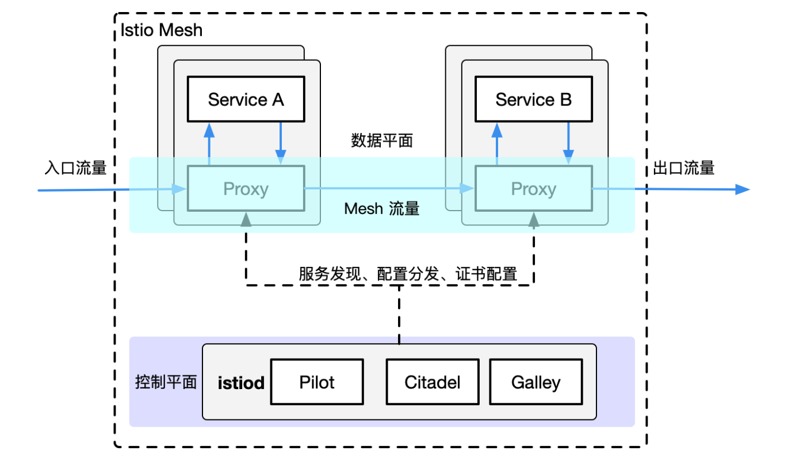
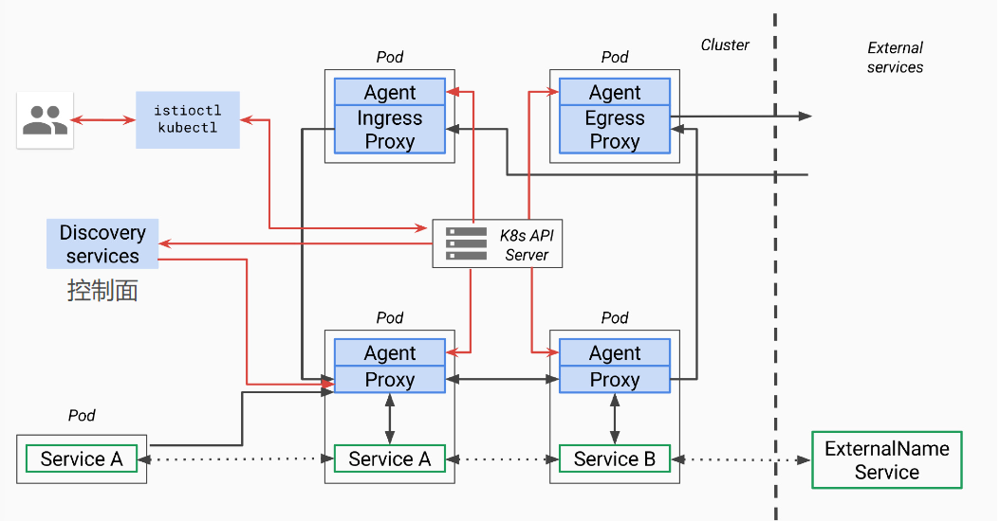

# Istio 源码解析
Istio架构

## Pilot
在应用从单体架构向微服务架构演进的过程中，微服务之间的服务发现、负载均衡、熔断、限流等服务治理需求是无法回避的问题。

在 Service Mesh 出现之前，通常的做法是将这些基础功能以 SDK 的形式嵌入业务代码中，但是这种强耦合的方案会增加开发的难度，增加维护成本，增加质量风险。比如 SDK 需要新增新特性，业务侧也很难配合 SDK 开发人员进行升级，所以很容易造成 SDK 的版本碎片化问题。如果再存在跨语言应用间的交互，对于多语言 SDK 的支持也非常的低效。一方面是相当于相同的代码以不同语言重复实现，实现这类代码既很难给开发人员带来成就感，团队稳定性难以保障；另一方面是如果实现这类基础框架时涉及到了语言特性，其他语言的开发者也很难直接翻译。

而 Service Mesh 的本质则是将此类通用的功能沉淀至 sidecar 中，由 sidecar 接管服务的流量并对其进行治理。在这个思路下，可以通过流量劫持的手段，做到代码零侵入性。这样可以让业务开发人员更关心业务功能。而底层功能由于对业务零侵入，也使得基础功能的升级和快速的更新迭代成为可能。

Istio 是近年来 Service Mesh 的代表作，而 Istio 流量管理的核心组件就是 Pilot。**Pilot 主要功能就是管理和配置部署在特定 Istio 服务网格中的所有 sidecar 代理实例。它管理 sidecar 代理之间的路由流量规则，并配置故障恢复功能，如超时、重试和熔断。**

### Pilot架构

pilot包含两个组件：pilot-agent和pilot-discovery。图里的agent对应pilot-agent，proxy对应envoy，它们两个在同一个容器中，discovery service对应pilot-discovery，它部署在控制面中。

- discovery service：从Kubernetes apiserver list/watch service/endpoint/pod/node等资源信息，监听istio控制平面配置信息（Kubernetes CRD），翻译为envoy可以直接理解的配置格式。
- proxy：也就是envoy，直接连接discovery service，间接地从Kubernetes apiserver等服务注册中心获取集群中微服务的注册情况
- agent：本文分析对象pilot-agent，生成envoy配置文件，管理envoy生命周期
- service A/B：使用了istio的应用，如Service A/B的进出网络流量会被proxy接管

