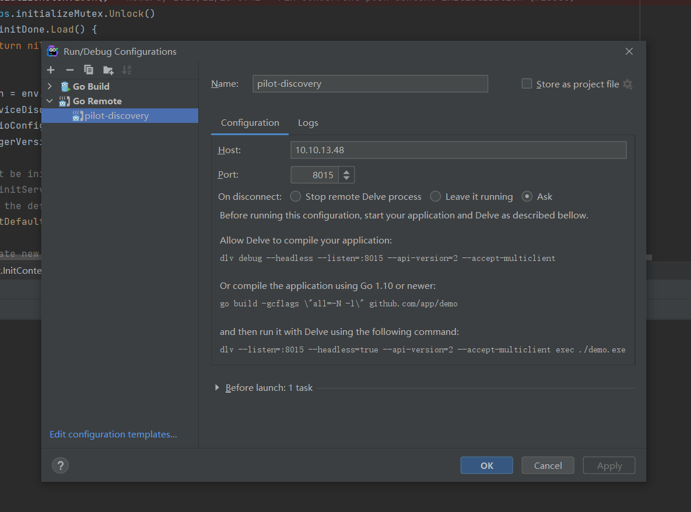
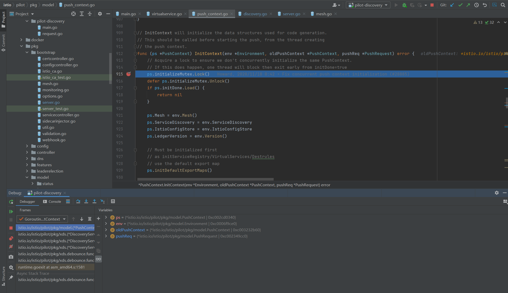

# Istio 源码解析
Istio架构


## Pilot
在应用从单体架构向微服务架构演进的过程中，微服务之间的服务发现、负载均衡、熔断、限流等服务治理需求是无法回避的问题。

在 Service Mesh 出现之前，通常的做法是将这些基础功能以 SDK 的形式嵌入业务代码中，但是这种强耦合的方案会增加开发的难度，增加维护成本，增加质量风险。比如 SDK 需要新增新特性，业务侧也很难配合 SDK 开发人员进行升级，所以很容易造成 SDK 的版本碎片化问题。如果再存在跨语言应用间的交互，对于多语言 SDK 的支持也非常的低效。一方面是相当于相同的代码以不同语言重复实现，实现这类代码既很难给开发人员带来成就感，团队稳定性难以保障；另一方面是如果实现这类基础框架时涉及到了语言特性，其他语言的开发者也很难直接翻译。

而 Service Mesh 的本质则是将此类通用的功能沉淀至 sidecar 中，由 sidecar 接管服务的流量并对其进行治理。在这个思路下，可以通过流量劫持的手段，做到代码零侵入性。这样可以让业务开发人员更关心业务功能。而底层功能由于对业务零侵入，也使得基础功能的升级和快速的更新迭代成为可能。

Istio 是近年来 Service Mesh 的代表作，而 Istio 流量管理的核心组件就是 Pilot。**Pilot 主要功能就是管理和配置部署在特定 Istio 服务网格中的所有 sidecar 代理实例。它管理 sidecar 代理之间的路由流量规则，并配置故障恢复功能，如超时、重试和熔断。**

### Pilot架构


pilot包含两个组件：pilot-agent和pilot-discovery。图里的agent对应pilot-agent，proxy对应envoy，它们两个在同一个容器中，discovery service对应pilot-discovery，它部署在控制面中。

- discovery service：从Kubernetes apiserver list/watch service/endpoint/pod/node等资源信息，监听istio控制平面配置信息（Kubernetes CRD），翻译为envoy可以直接理解的配置格式。
- proxy：也就是envoy，直接连接discovery service，间接地从Kubernetes apiserver等服务注册中心获取集群中微服务的注册情况
- agent：本文分析对象pilot-agent，生成envoy配置文件，管理envoy生命周期
- service A/B：使用了istio的应用，如Service A/B的进出网络流量会被proxy接管


## 如何调试istio代码？

### 调试 pilot-discovery

下载代码
```shell
$ git clone https://github.com/mark8s/istio.git
```

1.编译pilot-discovery

```shell
$ cd istio/pilot/cmd/pilot-discovery
$ go build -gcflags=all="-N -l" .
```
得到 可执行的 `pilot-discovery`

2.安装dlv
```shell
$ git clone https://github.com/go-delve/delve
$ cd delve
$ go install github.com/go-delve/delve/cmd/dlv
```

3.重新构建istio镜像

Dockerfile
```shell
FROM docker.io/istio/pilot:1.9.4
COPY ./pilot-discovery /usr/local/bin/pilot-discovery
COPY ./dlv /usr/local/bin/dlv
```
将`dlv`、`pilot-discovery`、`Dockerfile`放到同一个目录，然后构建成新镜像（`leis17/istio-pilot:1.9.4`）

4.修改istiod的镜像为上面自己build的镜像
```shell
$ kubectl edit deployment istiod -n istio-system
```
进入istiod pod，如
```shell
$ kubectl exec -it istiod-54c88656dd-vt9r9 -n istio-system /bin/bash
## 执行命令 dlv --listen=:8015 --headless=true --api-version=2 --log attach $pid
## ps -ef 获取进程pid
$ istio-proxy@istiod-54c88656dd-vt9r9:/$ ps -ef
UID        PID  PPID  C STIME TTY          TIME CMD
istio-p+     1     0  0 07:03 ?        00:00:06 /usr/local/bin/pilot-discovery discovery --monitoringAddr=:15014 --log_
istio-p+    20     0  0 07:05 pts/0    00:00:00 /bin/bash
istio-p+    45    20  0 07:14 pts/0    00:00:00 ps -ef

istio-proxy@istiod-54c88656dd-vt9r9:/$ dlv --listen=:8015 --headless=true --api-version=2 --log attach 1
API server listening at: [::]:8015
2022-06-29T07:32:44Z warning layer=rpc Listening for remote connections (connections are not authenticated nor encrypted)
2022-06-29T07:32:44Z info layer=debugger attaching to pid 1
2022-06-29T07:32:44Z warning layer=debugger can't find build-id note on binary
2022-06-29T07:33:53Z info layer=debugger created breakpoint: &api.Breakpoint{ID:1, Name:"", Addr:0x34c3d02, Addrs:[]uint64{0x34c3d02}, File:"/root/istio/pilot/pkg/booter.go", Line:580, FunctionName:"istio.io/istio/pilot/pkg/bootstrap.(*Server).initIstiodAdminServer", Cond:"", HitCond:"", Tracepoint:false, TraceReturn:false, Goroutintacktrace:0, Variables:[]string(nil), LoadArgs:(*api.LoadConfig)(nil), LoadLocals:(*api.LoadConfig)(nil), WatchExpr:"", WatchType:0x0, VerboseDescr:[]string(nil), HitCtring]uint64{}, TotalHitCount:0x0, Disabled:false, UserData:interface {}(nil)}
2022-06-29T07:33:53Z info layer=debugger created breakpoint: &api.Breakpoint{ID:2, Name:"", Addr:0x34bef3f, Addrs:[]uint64{0x34bef3f}, File:"/root/istio/pilot/pkg/booter.go", Line:188, FunctionName:"istio.io/istio/pilot/pkg/bootstrap.NewServer", Cond:"", HitCond:"", Tracepoint:false, TraceReturn:false, Goroutine:false, Stacktrace:0,:[]string(nil), LoadArgs:(*api.LoadConfig)(nil), LoadLocals:(*api.LoadConfig)(nil), WatchExpr:"", WatchType:0x0, VerboseDescr:[]string(nil), HitCount:map[string]uint64itCount:0x0, Disabled:false, UserData:interface {}(nil)}
2022-06-29T07:33:53Z info layer=debugger created breakpoint: &api.Breakpoint{ID:3, Name:"", Addr:0x34e3059, Addrs:[]uint64{0x34e3059}, File:"/root/istio/pilot/cmd/piloy/main.go", Line:70, FunctionName:"main.glob..func2", Cond:"", HitCond:"", Tracepoint:false, TraceReturn:false, Goroutine:false, Stacktrace:0, Variables:[]string(nil),(*api.LoadConfig)(nil), LoadLocals:(*api.LoadConfig)(nil), WatchExpr:"", WatchType:0x0, VerboseDescr:[]string(nil), HitCount:map[string]uint64{}, TotalHitCount:0x0, Dise, UserData:interface {}(nil)}
2022-06-29T07:33:53Z debug layer=debugger continuing

```

5.将8015暴露出来
```shell
kubectl port-forward --address 0.0.0.0 deployment.apps/istiod -n istio-system 8015:8015 
Forwarding from 0.0.0.0:8015 -> 8015
Handling connection for 8015
E0629 07:30:45.350103   17656 portforward.go:400] an error occurred forwarding 8015 -> 8015: error forwarding port 8015 to pod 8ac3e1fa664972c870275eec88e9f8c46b83acaa4eec3923e575ab, uid : exit status 1: 2022/06/29 07:30:45 socat[19829] E write(5, 0x56446125ba60, 5): Broken pipe
Handling connection for 8015
E0629 07:30:46.874004   17656 portforward.go:400] an error occurred forwarding 8015 -> 8015: error forwarding port 8015 to pod 8ac3e1fa664972c870275eec88e9f8c46b83acaa4eec3923e575ab, uid : exit status 1: 2022/06/29 07:30:46 socat[19898] E connect(5, AF=2 127.0.0.1:8015, 16): Connection refused
Handling connection for 8015
E0629 07:30:50.384468   17656 portforward.go:400] an error occurred forwarding 8015 -> 8015: error forwarding port 8015 to pod 8ac3e1fa664972c870275eec88e9f8c46b83acaa4eec3923e575ab, uid : exit status 1: 2022/06/29 07:30:50 socat[20000] E connect(5, AF=2 127.0.0.1:8015, 16): Connection refused
Handling connection for 8015
E0629 07:31:04.440538   17656 portforward.go:400] an error occurred forwarding 8015 -> 8015: error forwarding port 8015 to pod 8ac3e1fa664972c870275eec88e9f8c46b83acaa4eec3923e575ab, uid : exit status 1: 2022/06/29 07:31:04 socat[20259] E connect(5, AF=2 127.0.0.1:8015, 16): Connection refused
Handling connection for 8015
E0629 07:31:28.703608   17656 portforward.go:400] an error occurred forwarding 8015 -> 8015: error forwarding port 8015 to pod 8ac3e1fa664972c870275eec88e9f8c46b83acaa4eec3923e575ab, uid : exit status 1: 2022/06/29 07:31:28 socat[20769] E connect(5, AF=2 127.0.0.1:8015, 16): Connection refused
Handling connection for 8015
```

6.打开idea，配置go remote


7.添加几个断点，由于pilot-discovery的定位是接收istio crd 和k8s原生资源的变化，所以我们创建vs资源，就能debug到我们本地代码中来
```shell
$ kubectl apply -f virtual-service-all-v1.yaml 
virtualservice.networking.istio.io/productpage created
virtualservice.networking.istio.io/reviews created
virtualservice.networking.istio.io/ratings created
virtualservice.networking.istio.io/details created
```




### 源码解析

[Pilot源码分析（一）](https://haidong.dev/Pilot%E6%BA%90%E7%A0%81%E5%88%86%E6%9E%90%EF%BC%88%E4%B8%80%EF%BC%89/)

[How to remote debug istiod pod using an IDE like IntelliJ or GoLand.](https://github.com/istio/istio/wiki/Remote-Debugging)

[为 Istio 做了点微小的贡献](https://www.dozer.cc/2020/08/bugs-in-istio-1-6-0.html)

## Istio 落地相关


