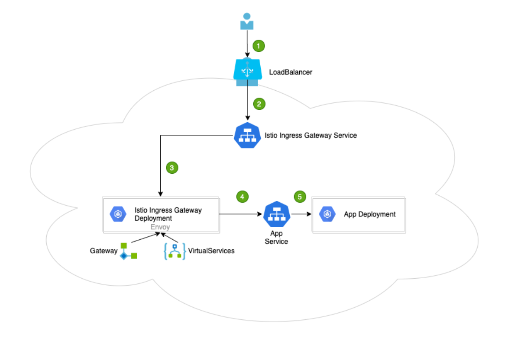

# istio ingress gateway

在Kubernetes环境中，Ingress controller用于管理进入集群的流量。在Istio服务网格中 Istio Ingress Gateway承担相应的角色，它使用新的配置模型（Gateway 和 VirtualServices）完成流量管理的功能。通过下图做一个总的描述。

1.用户向某端口发出请求

2.负载均衡器监听端口，并将请求转发到集群中的某个节点上。Istio Ingress Gateway Service 会监听集群节点端口的请求

3.Istio Ingress Gateway Service 将请求交给Istio Ingress Gateway Pod 处理。IngressGateway Pod 通过 Gateway 和 VirtualService 配置规则处理请求。其中，Gateway 用来配置端口、协议和证书；VirtualService 用来配置一些路由信息（找到请求对应处理的服务App Service）

4.Istio Ingress Gateway Pod将请求转给App Service

5.最终的请求会交给App Service 关联的App Deployment处理

