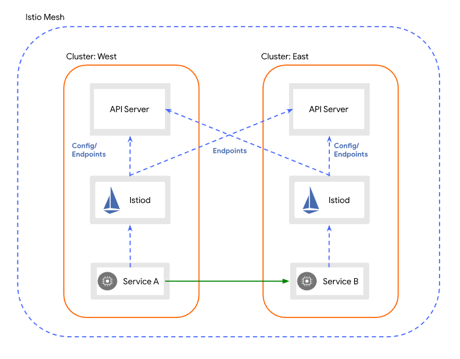
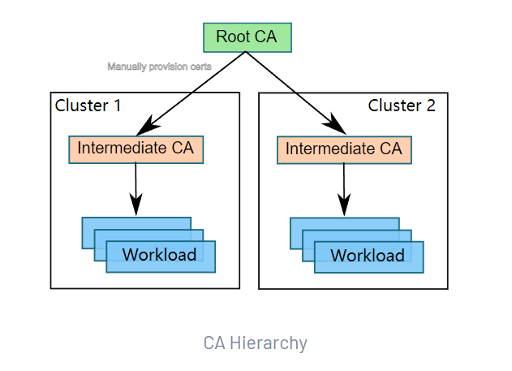
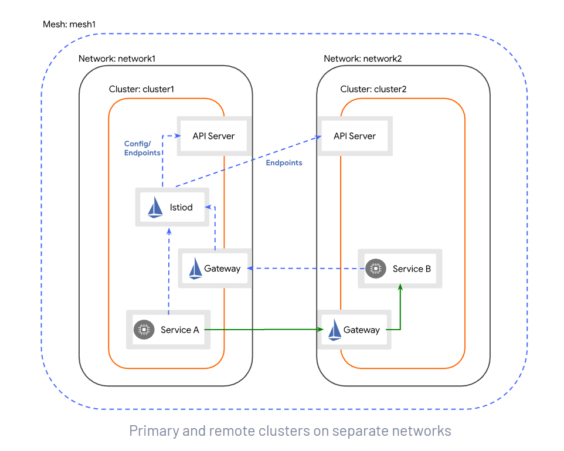
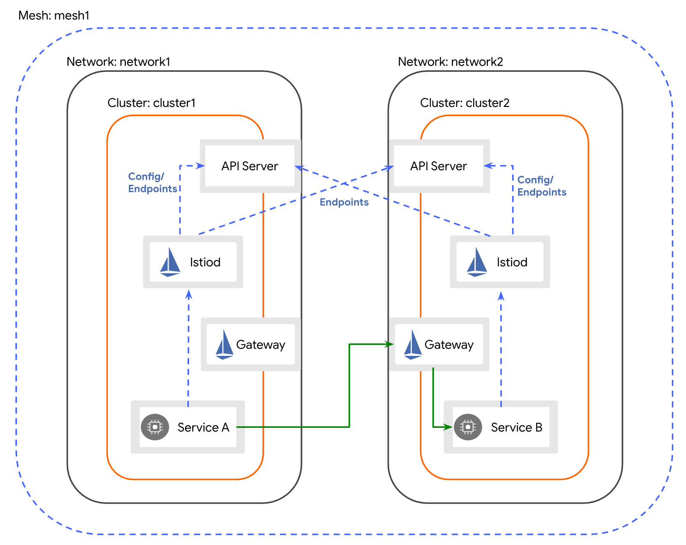
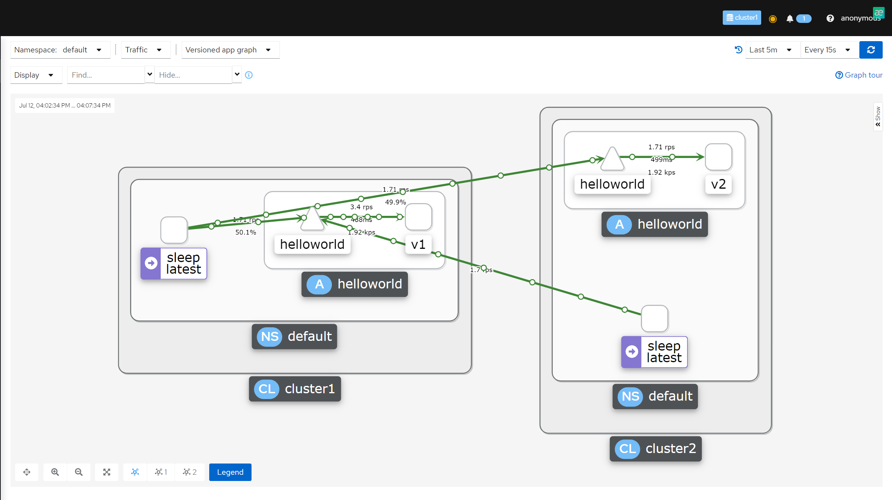

# istio multiple cluster

## 部署模型

当您将 Istio 用于生产环境部署时，需要回答一系列的问题。 网格将被限制在单个 集群 中还是分布在多个集群中？ 是将所有服务都放置在单个完全连接的网络中，还是需要网关来跨多个网络连接服务？ 
是否存在单个控制平面（可能在集群之间共享），或者是否部署了多个控制平面以确保高可用（HA）？ 如果要部署多个集群（更具体地说是在隔离的网络中），是否要将它们连接到单个多集群服务网格中， 还是将它们联合到一个 多网格 部署中？

所有这些问题，都代表了 Istio 部署的独立配置维度。

1.单一或多个集群

2.单一或多个网络

3.单一或多控制平面

4.单一或多个网格

所有组合都是可能的，尽管某些组合比其他组合更常见，并且某些组合显然不是很有趣（例如，单一集群中有多个网格）。

在涉及多个集群的生产环境部署中，部署可能使用多种模式。 例如，基于 3 个集群实现多控制平面的高可用部署，您可以通过使用单一控制平面部署 2 个集群，然后再添加第 3 个集群和 第 2 个控制平面来实现这一点，最后，再将所有 3 个集群配置为共享 2 个控制平面，以确保所有集群都有 2 个控制源来确保 HA。

如何选择正确的部署模型，取决于您对隔离性、性能和 HA 的要求。

「单网络」模式要求集群与集群处于同一个网络平面，pod IP 不重叠且可以直连；

「多网络」模式，该模式下每个集群都有一个入口网关，供其他集群访问流量进入，不过需要考虑的是业务能否接受 mTLS 带来的开销。


## 说明

### 概述

单一网络多主架构
> 单网关、单网络、多主架构部署指单个 Istio 服务网格（service mesh）运行在单个完全互联的网络上。网络内有多个集群，同时存在多个主集群（primary cluster）运行 Istio 控制平面。
> 
> 单一网络模型，即所有工作负载实例（指 pods）都可以直接相互访问、完全互联，而无需 Istio 网关。这里「可以直接相互访问」指的是 Pod 与 Pod 间互通（可互 ping），包括跨集群的 Pod 通信。不是指 Service 之间 Cluster IP 互相可 ping，Service 的 ClusterIP 不支持跨集群访问。ClusterIP 是虚拟 IP，没有对应实体，而跨集群 Pod IP 能互 ping 是因为路由表中存在对应网段的下一跳节点。
> 
> 多主架构指多个集群下，存在多个单独部署的 Istio 控制平面。我们知道，Istio 控制平面通过向Pod的 Envoy 代理下发service endpoint信息实现流量管理。因此单网格下，Istio 控制平面需要拿到所有集群的服务端点信息。服务端点发现需要配置 Istio 控制平面使其能访问每个集群的 kube-apiserver。

单一网络主从架构

> 在主从架构中，工作负载实例间可以互相通信，但从集群工作负载代理访问主集群的 Istio 控制平面需要通过 gateway。Gateway 本质上是一个运行在网格边缘的 Envoy proxy。注意，这里虽然在一个内网中，但暴露还是通过公网 IP 暴露。
> 
> 为什么单网络 pod 间可以直接通信还要通过 Gateway 暴露 Istio 控制平面？为了启动时有稳定的 IP 地址用于连接。
> 
> 安装istio时，从集群需要设置固定的地址参数 remotePilotAddress。

### topology.istio.io/network
`topology.istio.io/network`: 用于标识一个或多个 Pod 的网络的标签。当 pod 在不同的网络中时，Istio 网关 （例如东西网关）通常用于建立连接 （使用 AUTO_PASSTHROUGH 模式）。此标签可应用于以下 帮助自动化 Istio 的多网络配置的资源。

* Istio System Namespace: 将此标签应用于系统命名空间 为控制平面管理的 Pod 建立默认网络。 这通常在控制平面安装期间使用 管理员指定的值。

* Pod: 将此标签应用于 pod 允许覆盖默认网络 在每个 pod 的基础上。这通常通过 webhook 应用于 pod 注入，但也可以由服务在pod上手动指定 所有者。每个集群中的 Istio 安装配置 webhook 注入 使用管理员指定的值。

* Gateway Service: 将此标签应用于 Istio 网关的服务， 表示 Istio 应该使用这个服务作为网关 网络，在配置跨网络流量时。 Istio 将配置 驻留在网络外部以访问网关服务的 pod 通过 `spec.externalIPs`、`status.loadBalancer.ingress[].ip` 或在这种情况下 NodePort 服务的，Node 的地址。标签配置时 安装网关（例如东西网关）并且应该匹配 控制平面的默认网络（由 Istio 系统指定） 命名空间标签）或目标 pod 的网络。

### 东西向网关
东西向网关：east-west gateway的目标，除了作为跨集群东西向流量的入口点外，还使该过程对运营服务的团队透明。 为了实现这一目标，网关必须
* 启用跨集群的细粒度流量管理
* 路由加密流量以实现工作负载之间的相互身份验证

为了理解这是如何实现的，我们需要介绍 Istio 的两个特性——SNI 集群和 SNI 自动直通(SNI clusters and SNI auto passthrough) ——以及它们如何修改网关的行为。


### ExternalIP 

### remote secret 
添加remote secret方便 watch remote集群的node、namespace、service、endpoint等资源信息。

如果istiod 报错 查询不了cluster2集群的一些资源，不管是没有权限，还是连接被拒，那都是remote secret 出现了问题，此时只要重新在 cluster2生成secret，然后在cluster1集群apply即可，此时istiod 不需要重启。因为它一直在watch 这个带有mutiple label的secret的资源。

### 多集群控制平面的Endpoint discovery

Istio 控制平面通过为每个代理(proxy)提供服务端点(service endpoints)列表来管理网格内的流量。为了在多集群场景中进行这项工作，每个控制平面都必须观察每个集群中 API server的端点。 

要为集群启用端点发现，管理员会生成一个远程密钥并将其部署到网格中的每个主集群。远程密钥包含凭据，授予对集群中 API 服务器的访问权限。

然后，控制平面将连接并发现集群的服务端点，从而为这些服务启用跨集群负载平衡。



默认情况下，Istio 会在每个集群的端点之间平均负载均衡请求。

## 安装
### 准备
1.两个k8s集群，配置如下
```shell
➜  ~ kubectl get no -owide
NAME        STATUS   ROLES                  AGE     VERSION   INTERNAL-IP   EXTERNAL-IP   OS-IMAGE                KERNEL-VERSION                CONTAINER-RUNTIME
master-48   Ready    control-plane,master   7d18h   v1.21.0   10.10.13.48   <none>        CentOS Linux 7 (Core)   3.10.0-1160.21.1.el7.x86_64   docker://20.10.6
node-44     Ready    <none>                 7d18h   v1.21.0   10.10.13.44   <none>        CentOS Linux 7 (Core)   3.10.0-1160.21.1.el7.x86_64   docker://20.10.6
node-49     Ready    <none>                 7d18h   v1.21.0   10.10.13.49   <none>        CentOS Linux 7 (Core)   3.10.0-1160.21.1.el7.x86_64   docker://20.10.6

[root@master-45 ~]# kubectl get no -owide
NAME        STATUS   ROLES                  AGE   VERSION   INTERNAL-IP   EXTERNAL-IP   OS-IMAGE                KERNEL-VERSION                CONTAINER-RUNTIME
master-45   Ready    control-plane,master   18h   v1.21.0   10.10.13.45   <none>        CentOS Linux 7 (Core)   3.10.0-1160.21.1.el7.x86_64   docker://20.10.6
node-43     Ready    <none>                 18h   v1.21.0   10.10.13.43   <none>        CentOS Linux 7 (Core)   3.10.0-1160.21.1.el7.x86_64   docker://20.10.6
node-46     Ready    <none>                 18h   v1.21.0   10.10.13.46   <none>        CentOS Linux 7 (Core)   3.10.0-1160.21.1.el7.x86_64   docker://20.10.6
```

master-48 所在集群对应为cluster1集群，master-45 所在集群对应为cluster2集群。


2.istio-1.11.5
下载地址：[istio-1.11.5-linux-amd64.tar.gz](https://github.com/istio/istio/releases/download/1.11.5/istio-1.11.5-linux-amd64.tar.gz)

3.为两个集群生成中间证书

多集群服务网格部署要求你在网格中的所有集群之间建立信任关系，需要使用一个公共根，为每个集群生成中间证书。

默认情况下，Istio CA 会生成一个自签名的根证书和密钥，并使用它们来签署工作负载证书。为了保护根 CA 密钥，您应该使用在安全机器上离线运行的根 CA，并使用根 CA 向运行在每个集群上的 Istio CA 签发中间证书。Istio CA 可以使用管理员指定的证书和密钥来签署工作负载证书，并将管理员指定的根证书作为信任根分配给工作负载。

下图展示了在包含两个集群的网格中推荐的 CA 层次结构。



在 Istio 安装包的顶层目录下，创建一个目录来存放证书和密钥：
```shell
mkdir -p certs
pushd certs
```
生成根证书和密钥：
```shell
make -f ../tools/certs/Makefile.selfsigned.mk root-ca
```

对于每个集群，为 Istio CA 生成一个中间证书和密钥。
```shell
make -f ../tools/certs/Makefile.selfsigned.mk cluster1-cacerts

make -f ../tools/certs/Makefile.selfsigned.mk cluster2-cacerts
```

生成后的效果：
```shell
[root@master-45 ~]# cd istio-1.11.5/
[root@master-45 istio-1.11.5]# ls
bin  certs  LICENSE  manifests  manifest.yaml  README.md  samples  tools
[root@master-45 istio-1.11.5]# cd certs/
[root@master-45 certs]# ls
cluster1  cluster2  root-ca.conf  root-cert.csr  root-cert.pem  root-cert.srl  root-key.pem
[root@master-45 certs]# ls cluster1/
ca-cert.pem  ca-key.pem  cert-chain.pem  root-cert.pem
[root@master-45 certs]#
```
将 istio-1.11.5 scp到 cluster2中。

在 cluster1 集群上：
```shell
kubectl create namespace istio-system

kubectl create secret generic cacerts -n istio-system \
      --from-file=cluster1/ca-cert.pem \
      --from-file=cluster1/ca-key.pem \
      --from-file=cluster1/root-cert.pem \
      --from-file=cluster1/cert-chain.pem
```

在 cluster2 集群上：
```shell
kubectl create namespace istio-system

kubectl create secret generic cacerts -n istio-system \
      --from-file=cluster2/ca-cert.pem \
      --from-file=cluster2/ca-key.pem \
      --from-file=cluster2/root-cert.pem \
      --from-file=cluster2/cert-chain.pem
```

返回 Istio 安装的顶层目录：
```shell
$ popd
```

### 单一网络多主架构的安装

[Istio 多集群部署（一）：单一网络多主架构](https://huanggze.top/posts/istio-multicluster-deployment-part1/)

安装 cluster 2 时，为什么 remotePilotAddress 的参数不直接填 cluster 1 的 istiod Pod IP（明明是在同一网络，可以直连），却额外加了 Gateway 组件，填 Gateway 组件的 Service IP。实际上，这并不是多此一举。通过固定的 Gateway Service IP，这样不管cluster 1上的 istiod Pod 是挂了、扩缩容了，Pod IP 的变化都不会影响到 clutser 2.


### 跨网络单主架构的安装
在 cluster1 主集群（primary cluster） 安装 Istio 控制平面， 并配置 cluster2 从集群（remote cluster）指向 cluster1 的控制平面。 集群 cluster1 在 network1 网络上，而集群 cluster2 在 network2 网络上。 所以跨集群边界的 Pod 之间，网络不能直接连通。

在此配置中，集群 cluster1 将监测两个集群 API Server 的服务端点。 以这种方式，控制平面就能为两个集群中的工作负载提供服务发现。

跨集群边界的服务负载，通过专用的东西向流量网关，以间接的方式通讯。 每个集群中的网关必须可以从其他集群访问。

cluster2 中的服务将通过相同的的东西向网关访问 cluster1 控制平面。



说明
> cluster1再network1，cluster2再network2，cluster1有一个istiod，cluster2使用cluster1的istiod，
> cluster1的service直接注册到istiod，cluster2的service通过cluster1的东西向网关注册到istiod。
> 
> cluster1的service通过cluster2的东西向网关访问cluster2的service，cluster2得service通过cluster1的东西向网关访问cluster1的service。
> cluster1的istiod同时监控cluster1的apiserver和cluster2的apiserver。

1.给istio-system namespace打标签

```shell
# cluster1
kubectl  label namespace istio-system topology.istio.io/network=network1

# cluster2
kubectl  label namespace istio-system topology.istio.io/network=network2
```


2.生成istio operator部署文件
```shell
# cluster1
cat <<EOF > cluster1.yaml
apiVersion: install.istio.io/v1alpha1
kind: IstioOperator
spec:
  profile: demo
  values:
    global:
      meshID: mesh1
      multiCluster:
        clusterName: cluster1
      network: network1
  meshConfig:
    accessLogFile: /dev/stdout
    enableTracing: true
  components:
    egressGateways:
    - name: istio-egressgateway
      enabled: true
EOF

# cluster2
cat <<EOF > cluster2.yaml
apiVersion: install.istio.io/v1alpha1
kind: IstioOperator
spec:
  profile: demo
  values:
    global:
      meshID: mesh1
      multiCluster:
        clusterName: cluster2
      network: network2
      remotePilotAddress: 10.10.13.48
  meshConfig:
    accessLogFile: /dev/stdout
    enableTracing: true
  components:
    egressGateways:
    - name: istio-egressgateway
      enabled: true
EOF
```

cluster2 remotePilotAddress 配置为cluster1的externalIP。

3.安装一个提供 集群 API Server 访问权限的远程 Secret

````shell
# 在 cluster1 中安装一个提供 cluster2 API Server 访问权限的远程 Secret。
## 首先在48节点生成cluster1的remote Secret，然后scp给cluster2。然后再apply 45 scp过来的cluster2的remote secret
istioctl x create-remote-secret --name=cluster1  --server=https://10.10.13.48:6443 > remote-secret-cluster1.yaml
scp remote-secret-cluster1.yaml root@10.10.13.45:/root

kubectl apply -f remote-secret-cluster2.yaml

# 在 cluster2 中安装一个提供 cluster1 API Server 访问权限的远程 Secret。
# 同上，也是先生成自己集群的remote secret ，然后apply cluster1的remote secret。
istioctl x create-remote-secret --name=cluster2  --server=https://10.10.13.45:6443 > remote-secret-cluster2.yaml
scp remote-secret-cluster2.yaml root@10.10.13.48:/root

kubectl apply -f remote-secret-cluster1.yaml
````

这样，cluster1集群就可以监听cluster2的apiServer，同理，cluster2集群也可以监听cluster1的apiServer.

4.部署istio
```shell
# 在cluster1
istioctl install -f cluster1.yaml -y

# 在cluster2
istioctl install -f cluster2.yaml -y
```


5.部署东西向网关

```shell
# 在cluster1
## 部署部署东西向网关
/root/istio-1.11.5/samples/multicluster/gen-eastwest-gateway.sh --mesh mesh1 --cluster cluster1 --network network1 | istioctl  install -y  -f -

## 配置东西向网关ip ,这里我设置为cluster1的 master ip
kubectl patch svc  -n istio-system istio-eastwestgateway -p '{"spec":{"externalIPs":["10.10.13.48"]}}'


# 在cluster2
## 部署部署东西向网关
/root/istio-1.11.5/samples/multicluster/gen-eastwest-gateway.sh --mesh mesh1 --cluster cluster2 --network network2 | istioctl  install -y  -f -

## 配置东西向网关ip ,这里我设置为cluster2的 master ip
kubectl patch svc  -n istio-system istio-eastwestgateway -p '{"spec":{"externalIPs":["10.10.13.45"]}}'
```


6.暴露istiod（只在cluster1执行）
```shell
kubectl apply  -n istio-system -f /root/istio-1.11.5/samples/multicluster/expose-istiod.yaml
```

7.暴露服务
```shell
kubectl  apply -n istio-system -f /root/istio-1.11.5/samples/multicluster/expose-services.yaml
```

8.重启
```shell
kubectl rollout restart deploy -n istio-system
```


### 跨网络多主架构的安装

在 cluster1 和 cluster2 两个集群上，安装 Istio 控制平面， 且将两者均设置为主集群（primary cluster）。 集群 cluster1 在 network1 网络上，而集群 cluster2 在 network2 网络上。 这意味着这些跨集群边界的 Pod 之间，网络不能直接连通。

跨集群边界的服务负载，通过专用的东西向网关，以间接的方式通讯。每个集群中的网关在其他集群必须可以访问。



说明
> cluster1在network1网络，cluster2在network2网络，cluster1和cluster2有各自istiod。
> 
> cluster1的istiod监控cluster1和cluster2的apiserver，cluster2的istiod监控cluster1和cluster2的apiserver。
> 
> cluster1的service连接到cluster1的istiod，cluster2的service连接到cluster2的istiod。
> cluster1的service通过cluster2的东西向网关访问cluster2的service，cluster2的service通过cluster1的东西向网关访问cluster1的service。

1.给istio-system namespace打标签

```shell
# cluster1
kubectl  label namespace istio-system topology.istio.io/network=network1

# cluster2
kubectl  label namespace istio-system topology.istio.io/network=network2
```

2.生成istio operator部署文件
```shell
# cluster1
cat <<EOF > cluster1.yaml
apiVersion: install.istio.io/v1alpha1
kind: IstioOperator
spec:
  values:
    global:
      meshID: mesh1
      multiCluster:
        clusterName: cluster1
      network: network1
EOF

# cluster2
cat <<EOF > cluster2.yaml
apiVersion: install.istio.io/v1alpha1
kind: IstioOperator
spec:
  values:
    global:
      meshID: mesh1
      multiCluster:
        clusterName: cluster2
      network: network2
EOF
```

3.安装一个提供 集群 API Server 访问权限的远程 Secret

````shell
# 在 cluster1 中安装一个提供 cluster2 API Server 访问权限的远程 Secret。
## 首先在48节点生成cluster1的remote Secret，然后scp给cluster2。然后再apply 45 scp过来的cluster2的remote secret
istioctl x create-remote-secret --name=cluster1  --server=https://10.10.13.48:6443 > remote-secret-cluster1.yaml
scp remote-secret-cluster1.yaml root@10.10.13.45:/root

kubectl apply -f remote-secret-cluster2.yaml

# 在 cluster2 中安装一个提供 cluster1 API Server 访问权限的远程 Secret。
# 同上，也是先生成自己集群的remote secret ，然后apply cluster1的remote secret。
istioctl x create-remote-secret --name=cluster2  --server=https://10.10.13.45:6443 > remote-secret-cluster2.yaml
scp remote-secret-cluster2.yaml root@10.10.13.48:/root

kubectl apply -f remote-secret-cluster1.yaml
````

这样，cluster1集群就可以监听cluster2的apiServer，同理，cluster2集群也可以监听cluster1的apiServer.

4.部署istio
```shell
# 在cluster1
istioctl install -f cluster1.yaml

# 在cluster2
istioctl install -f cluster2.yaml
```

5.部署东西向网关

```shell
# 在cluster1
## 部署部署东西向网关
/root/istio-1.11.5/samples/multicluster/gen-eastwest-gateway.sh --mesh mesh1 --cluster cluster1 --network network1 | istioctl  install -y  -f -

## 配置东西向网关ip ,这里我设置为cluster1的 master ip
kubectl patch svc  -n istio-system istio-eastwestgateway -p '{"spec":{"externalIPs":["10.10.13.48"]}}'


# 在cluster2
## 部署部署东西向网关
/root/istio-1.11.5/samples/multicluster/gen-eastwest-gateway.sh --mesh mesh1 --cluster cluster2 --network network2 | istioctl  install -y  -f -

## 配置东西向网关ip ,这里我设置为cluster2的 master ip
kubectl patch svc  -n istio-system istio-eastwestgateway -p '{"spec":{"externalIPs":["10.10.13.45"]}}'
```

6.暴露服务
```shell
# cluster1 和 cluster2
kubectl  apply -n istio-system -f /root/istio-1.11.5/samples/multicluster/expose-services.yaml
```

7.重启
```shell
# cluster1 和 cluster2
kubectl rollout restart deploy -n istio-system
```

## 验证

部署业务测试容器
```shell
# 设置自动注入(cluster1和cluster2)
kubectl label namespace default istio-injection=enabled

# 部署bookinfo(cluster1和cluster2)
kubectl apply -f  istio-1.11.5/samples/bookinfo/platform/kube/bookinfo.yaml

# 部署helloworld
## cluster1
kubectl apply -f istio-1.11.5/samples/helloworld/helloworld.yaml -l service=helloworld
kubectl apply -f istio-1.11.5/samples/helloworld/helloworld.yaml -l version=v1

## cluster2
kubectl apply -f istio-1.11.5/samples/helloworld/helloworld.yaml -l service=helloworld
kubectl apply -f istio-1.11.5/samples/helloworld/helloworld.yaml -l version=v2

# 部署sleep(cluster1和cluster2)
kubectl apply -f  istio-1.11.5/samples/sleep/sleep.yaml

# 部署Kiali prometheus jaeger(cluster1和cluster2)
kubectl apply -f istio-1.11.5/samples/addons/kiali.yaml 
kubectl apply -f istio-1.11.5/samples/addons/prometheus.yaml
kubectl apply -f istio-1.11.5/samples/addons/jaeger.yaml
kubectl patch svc  -n istio-system kiali -p '{"spec":{"type":"NodePort"}}'
kubectl get svc -n istio-system kiali
kubectl rollout restart deploy

# 手动拉镜像
docker pull quay.io/kiali/kiali:v1.38
docker pull prom/prometheus:v2.26.0


```


cluster1:
```shell
$ istioctl ps
NAME                                                    CDS        LDS        EDS        RDS          ISTIOD                      VERSION
details-v1-79f774bdb9-r5kw4.default                     SYNCED     SYNCED     SYNCED     SYNCED       istiod-64dfdcc9db-j7plx     1.11.5
helloworld-v1-776f57d5f6-8sb7f.default                  SYNCED     SYNCED     SYNCED     SYNCED       istiod-64dfdcc9db-j7plx     1.11.5
istio-eastwestgateway-68786fb975-jhhpl.istio-system     SYNCED     SYNCED     SYNCED     NOT SENT     istiod-64dfdcc9db-j7plx     1.11.5
istio-ingressgateway-5cb96858b5-4zthw.istio-system      SYNCED     SYNCED     SYNCED     NOT SENT     istiod-64dfdcc9db-j7plx     1.11.5
productpage-v1-6b746f74dc-2qhqx.default                 SYNCED     SYNCED     SYNCED     SYNCED       istiod-64dfdcc9db-j7plx     1.11.5
ratings-v1-b6994bb9-88mw2.default                       SYNCED     SYNCED     SYNCED     SYNCED       istiod-64dfdcc9db-j7plx     1.11.5
reviews-v1-545db77b95-df5cz.default                     SYNCED     SYNCED     SYNCED     SYNCED       istiod-64dfdcc9db-j7plx     1.11.5
reviews-v2-7bf8c9648f-6ckfp.default                     SYNCED     SYNCED     SYNCED     SYNCED       istiod-64dfdcc9db-j7plx     1.11.5
reviews-v3-84779c7bbc-s2rkl.default                     SYNCED     SYNCED     SYNCED     SYNCED       istiod-64dfdcc9db-j7plx     1.11.5
sleep-557747455f-7h9hd.default                          SYNCED     SYNCED     SYNCED     SYNCED       istiod-64dfdcc9db-j7plx     1.11.5

## 这里查看任何pod的配置，都是一样的
$ istioctl pc endpoint -n istio-system istio-ingressgateway-5cb96858b5-4zthw|grep productpage
10.10.13.45:15443                HEALTHY     OK                outbound|9080||productpage.default.svc.cluster.local
10.44.0.8:9080                   HEALTHY     OK                outbound|9080||productpage.default.svc.cluster.local

# 或者
$ istioctl pc endpoint productpage-v1-6b746f74dc-2qhqx
ENDPOINT                         STATUS      OUTLIER CHECK     CLUSTER
10.10.13.45:15443                HEALTHY     OK                outbound|5000||helloworld.default.svc.cluster.local
10.10.13.45:15443                HEALTHY     OK                outbound|80||sleep.default.svc.cluster.local
10.10.13.45:15443                HEALTHY     OK                outbound|9080||details.default.svc.cluster.local
10.10.13.45:15443                HEALTHY     OK                outbound|9080||productpage.default.svc.cluster.local
10.10.13.45:15443                HEALTHY     OK                outbound|9080||ratings.default.svc.cluster.local
10.10.13.45:15443                HEALTHY     OK                outbound|9080||reviews.default.svc.cluster.local
10.10.13.48:6443                 HEALTHY     OK                outbound|443||kubernetes.default.svc.cluster.local
10.32.0.2:53                     HEALTHY     OK                outbound|53||kube-dns.kube-system.svc.cluster.local
10.32.0.2:9153                   HEALTHY     OK                outbound|9153||kube-dns.kube-system.svc.cluster.local
10.36.0.1:15012                  HEALTHY     OK                outbound|15012||istio-eastwestgateway.istio-system.svc.cluster.local
10.36.0.1:15017                  HEALTHY     OK                outbound|15017||istio-eastwestgateway.istio-system.svc.cluster.local
10.36.0.1:15021                  HEALTHY     OK                outbound|15021||istio-eastwestgateway.istio-system.svc.cluster.local
10.36.0.1:15443                  HEALTHY     OK                outbound|15443||istio-eastwestgateway.istio-system.svc.cluster.local
10.36.0.3:9080                   HEALTHY     OK                outbound|9080||ratings.default.svc.cluster.local
10.36.0.4:9080                   HEALTHY     OK                outbound|9080||reviews.default.svc.cluster.local
10.36.0.5:15010                  HEALTHY     OK                outbound|15010||istiod.istio-system.svc.cluster.local
10.36.0.5:15012                  HEALTHY     OK                outbound|15012||istiod.istio-system.svc.cluster.local
10.36.0.5:15014                  HEALTHY     OK                outbound|15014||istiod.istio-system.svc.cluster.local
10.36.0.5:15017                  HEALTHY     OK                outbound|443||istiod.istio-system.svc.cluster.local
10.36.0.6:8080                   HEALTHY     OK                outbound|80||istio-ingressgateway.istio-system.svc.cluster.local
10.36.0.6:8443                   HEALTHY     OK                outbound|443||istio-ingressgateway.istio-system.svc.cluster.local
10.36.0.6:15021                  HEALTHY     OK                outbound|15021||istio-ingressgateway.istio-system.svc.cluster.local
10.44.0.1:53                     HEALTHY     OK                outbound|53||kube-dns.kube-system.svc.cluster.local
10.44.0.1:9153                   HEALTHY     OK                outbound|9153||kube-dns.kube-system.svc.cluster.local
10.44.0.2:5000                   HEALTHY     OK                outbound|5000||helloworld.default.svc.cluster.local
10.44.0.3:80                     HEALTHY     OK                outbound|80||sleep.default.svc.cluster.local
10.44.0.5:9080                   HEALTHY     OK                outbound|9080||details.default.svc.cluster.local
10.44.0.6:9080                   HEALTHY     OK                outbound|9080||reviews.default.svc.cluster.local
10.44.0.7:9080                   HEALTHY     OK                outbound|9080||reviews.default.svc.cluster.local
10.44.0.8:9080                   HEALTHY     OK                outbound|9080||productpage.default.svc.cluster.local
127.0.0.1:15000                  HEALTHY     OK                prometheus_stats
127.0.0.1:15020                  HEALTHY     OK                agent
unix://./etc/istio/proxy/SDS     HEALTHY     OK                sds-grpc
unix://./etc/istio/proxy/XDS     HEALTHY     OK                xds-grpc
```

cluster2:
```shell
$ istioctl ps
NAME                                                    CDS        LDS        EDS        RDS          ISTIOD                      VERSION
details-v1-79f774bdb9-9cnwk.default                     SYNCED     SYNCED     SYNCED     SYNCED       istiod-7cb788d479-vfz5x     1.11.5
helloworld-v2-54df5f84b-mk9zj.default                   SYNCED     SYNCED     SYNCED     SYNCED       istiod-7cb788d479-vfz5x     1.11.5
istio-eastwestgateway-86f64d89b7-zmrln.istio-system     SYNCED     SYNCED     SYNCED     NOT SENT     istiod-7cb788d479-vfz5x     1.11.5
istio-ingressgateway-f5648b4b9-l6jbs.istio-system       SYNCED     SYNCED     SYNCED     NOT SENT     istiod-7cb788d479-vfz5x     1.11.5
productpage-v1-6b746f74dc-cqwd7.default                 SYNCED     SYNCED     SYNCED     SYNCED       istiod-7cb788d479-vfz5x     1.11.5
ratings-v1-b6994bb9-lf7zx.default                       SYNCED     SYNCED     SYNCED     SYNCED       istiod-7cb788d479-vfz5x     1.11.5
reviews-v1-545db77b95-vcgl6.default                     SYNCED     SYNCED     SYNCED     SYNCED       istiod-7cb788d479-vfz5x     1.11.5
reviews-v2-7bf8c9648f-nq6zz.default                     SYNCED     SYNCED     SYNCED     SYNCED       istiod-7cb788d479-vfz5x     1.11.5
reviews-v3-84779c7bbc-zptjb.default                     SYNCED     SYNCED     SYNCED     SYNCED       istiod-7cb788d479-vfz5x     1.11.5
sleep-557747455f-5hcsm.default                          SYNCED     SYNCED     SYNCED     SYNCED       istiod-7cb788d479-vfz5x     1.11.5

$ istioctl pc endpoint -n istio-system istio-ingressgateway-f5648b4b9-l6jbs.istio-system|grep productpage
10.10.13.48:15443                HEALTHY     OK                outbound|9080||productpage.default.svc.cluster.local
10.36.0.7:9080                   HEALTHY     OK                outbound|9080||productpage.default.svc.cluster.local
```

测试跨集群流量

在cluster1的sleep 容器中访问 helloworld.default 这个svc，由于cluster1中只部署了helloworld v1版本，而cluster2中只部署了helloworld v2版本。所以，如果响应是v1、v2切换，那么则表示我们的多集群部署成功了。

```shell
$ kubectl exec -it sleep-557747455f-7h9hd sh                                                            
$ kubectl exec [POD] [COMMAND] is DEPRECATED and will be removed in a future version. Use kubectl exec [POD] -- [COMMAND] instead.
/ $ for i in `seq 20`;do curl -sS helloworld.default:5000/hello;done
Hello version: v1, instance: helloworld-v1-776f57d5f6-8sb7f
Hello version: v2, instance: helloworld-v2-54df5f84b-mk9zj
Hello version: v2, instance: helloworld-v2-54df5f84b-mk9zj
Hello version: v1, instance: helloworld-v1-776f57d5f6-8sb7f
Hello version: v2, instance: helloworld-v2-54df5f84b-mk9zj
Hello version: v1, instance: helloworld-v1-776f57d5f6-8sb7f
Hello version: v1, instance: helloworld-v1-776f57d5f6-8sb7f
Hello version: v2, instance: helloworld-v2-54df5f84b-mk9zj
Hello version: v2, instance: helloworld-v2-54df5f84b-mk9zj
Hello version: v1, instance: helloworld-v1-776f57d5f6-8sb7f
Hello version: v1, instance: helloworld-v1-776f57d5f6-8sb7f
Hello version: v2, instance: helloworld-v2-54df5f84b-mk9zj
Hello version: v1, instance: helloworld-v1-776f57d5f6-8sb7f
Hello version: v2, instance: helloworld-v2-54df5f84b-mk9zj
Hello version: v2, instance: helloworld-v2-54df5f84b-mk9zj
Hello version: v1, instance: helloworld-v1-776f57d5f6-8sb7f
Hello version: v1, instance: helloworld-v1-776f57d5f6-8sb7f
Hello version: v2, instance: helloworld-v2-54df5f84b-mk9zj
Hello version: v2, instance: helloworld-v2-54df5f84b-mk9zj
Hello version: v1, instance: helloworld-v1-776f57d5f6-8sb7f
/ $
```

结果很给力，多集群部署成功！

我们可以通过查看kiali的视图，更清晰看到流量的走向：



## 问题解决
1.遇到istioctl pc endpoint 查不到remote 集群的情况？

大概率remote secret的问题，这个时候可以查看 istiod的日志，大概是报没有权限访问cluster2，或者cluster1.这个时候需要重新生成secret
也即：

错误大致：
```shell
2022-07-20T03:48:40.209808Z	error	klog	k8s.io/client-go@v0.21.2/tools/cache/reflector.go:167: Failed to watch *v1.Secret: failed to list *v1.Secret: Get "https://10.10.13.45:1443/api/v1/secrets?limit=500&resourceVersion=0": dial tcp 10.10.13.45:1443: connect: connection refused
2022-07-20T03:48:43.796183Z	error	watch error in cluster cluster2: failed to list *v1.Node: Get "https://10.10.13.45:1443/api/v1/nodes?limit=500&resourceVersion=0": dial tcp 10.10.13.45:1443: connect: connection refused
2022-07-20T03:48:44.549585Z	error	watch error in cluster cluster2: failed to list *v1.Pod: Get "https://10.10.13.45:1443/api/v1/pods?limit=500&resourceVersion=0": dial tcp 10.10.13.45:1443: connect: connection refused
2022-07-20T03:48:44.711990Z	error	watch error in cluster cluster2: failed to list *v1.Endpoints: Get "https://10.10.13.45:1443/api/v1/endpoints?limit=500&resourceVersion=0": dial tcp 10.10.13.45:1443: connect: connection refused
2022-07-20T03:48:49.099263Z	error	watch error in cluster cluster2: failed to list *v1.Namespace: Get "https://10.10.13.45:1443/api/v1/namespaces?limit=500&resourceVersion=0": dial tcp 10.10.13.45:1443: connect: connection refused
2022-07-20T03:49:08.399102Z	error	klog	k8s.io/client-go@v0.21.2/tools/cache/reflector.go:167: Failed to watch *v1.Secret: failed to list *v1.Secret: Get "https://10.10.13.45:1443/api/v1/secrets?limit=500&resourceVersion=0": dial tcp 10.10.13.45:1443: connect: connection refused
2022-07-20T03:49:11.079862Z	error	watch error in cluster cluster2: failed to list *v1.Node: Get "https://10.10.13.45:1443/api/v1/nodes?limit=500&resourceVersion=0": dial tcp 10.10.13.45:1443: connect: connection refused
2022-07-20T03:49:16.239802Z	error	watch error in cluster cluster2: failed to list *v1.Service: Get "https://10.10.13.45:1443/api/v1/services?limit=500&resourceVersion=0": dial tcp 10.10.13.45:1443: connect: connection refused
2022-07-20T03:49:19.531369Z	error	watch error in cluster cluster2: failed to list *v1.Pod: Get "https://10.10.13.45:1443/api/v1/pods?limit=500&resourceVersion=0": dial tcp 10.10.13.45:1443: connect: connection refused
2022-07-20T03:49:25.552513Z	info	ads	ADS: "10.36.0.0:39602" productpage-v1-8cc4bfc4c-q7wvx.default-18 terminated rpc error: code = Canceled desc = context canceled
2022-07-20T03:49:25.833696Z	info	ads	ADS: new connection for node:productpage-v1-8cc4bfc4c-q7wvx.default-29
2022-07-20T03:49:25.834860Z	info	ads	CDS: PUSH request for node:productpage-v1-8cc4bfc4c-q7wvx.default resources:27 size:23.3kB
2022-07-20T03:49:25.834983Z	info	ads	EDS: PUSH request for node:productpage-v1-8cc4bfc4c-q7wvx.default resources:20 size:4.2kB empty:0 cached:20/20
2022-07-20T03:49:25.837221Z	info	ads	LDS: PUSH request for node:productpage-v1-8cc4bfc4c-q7wvx.default resources:25 size:66.6kB
2022-07-20T03:49:25.837549Z	info	ads	RDS: PUSH request for node:productpage-v1-8cc4bfc4c-q7wvx.default resources:10 size:8.8kB
2022-07-20T03:49:35.365437Z	error	watch error in cluster cluster2: failed to list *v1.Endpoints: Get "https://10.10.13.45:1443/api/v1/endpoints?limit=500&resourceVersion=0": dial tcp 10.10.13.45:1443: connect: connection refused
2022-07-20T03:49:35.681031Z	error	watch error in cluster cluster2: failed to list *v1.Namespace: Get "https://10.10.13.45:1443/api/v1/namespaces?limit=500&resourceVersion=0": dial tcp 10.10.13.45:1443: connect: connection refused
```

```shell
istioctl x create-remote-secret --name=cluster2  --server=https://10.10.13.45:6443 > remote-secret-cluster2.yaml
scp remote-secret-cluster2.yaml root@10.10.13.48:/root

kubectl apply -f remote-secret-cluster1.yaml
```

## 卸载
```shell
istioctl x uninstall --purge -y 
kubectl delete namespace istio-system
kubectl rollout restart deploy
```

## Reference
[istio多集群探秘，部署了50次多集群后我得出的结论](https://blog.csdn.net/hxpjava1/article/details/120634273#:~:text=istio%E5%A4%9A%E9%9B%86%E7%BE%A4%E6%98%AF%E6%8C%87%E5%B0%86%E5%A4%9A%E4%B8%AAistio%E9%9B%86%E7%BE%A4%E8%81%94%E9%82%A6%E4%B8%BA%E4%B8%80%E4%B8%AA%E6%95%B4%E4%BD%93%E7%9A%84mesh%E3%80%82,%E6%AF%94%E5%A6%82%E6%9C%89%E4%B8%A4%E4%B8%AAk8s%E9%9B%86%E7%BE%A4%EF%BC%8C%E4%B8%8A%E9%9D%A2%E5%88%86%E5%88%AB%E9%83%A8%E7%BD%B2%E4%BA%86istio%E9%9B%86%E7%BE%A4%EF%BC%8C%E8%BF%99%E4%B8%A4%E4%B8%AAk8s%E9%9B%86%E7%BE%A4%E5%8F%AF%E4%BB%A5%E5%9C%A8%E4%B8%80%E4%B8%AA%E7%BD%91%E7%BB%9C%E4%B8%8B%EF%BC%8C%E4%B9%9F%E5%8F%AF%E4%BB%A5%E5%9C%A8%E5%A4%9A%E4%B8%AA%E7%BD%91%E7%BB%9C%E4%B8%8B%E3%80%82)

[Istio 多集群部署（一）：单一网络多主架构](https://huanggze.top/posts/istio-multicluster-deployment-part1/)

[Endpoint discovery with multiple control planes](https://istio.io/latest/docs/ops/deployment/deployment-models/#endpoint-discovery-with-multiple-control-planes)


