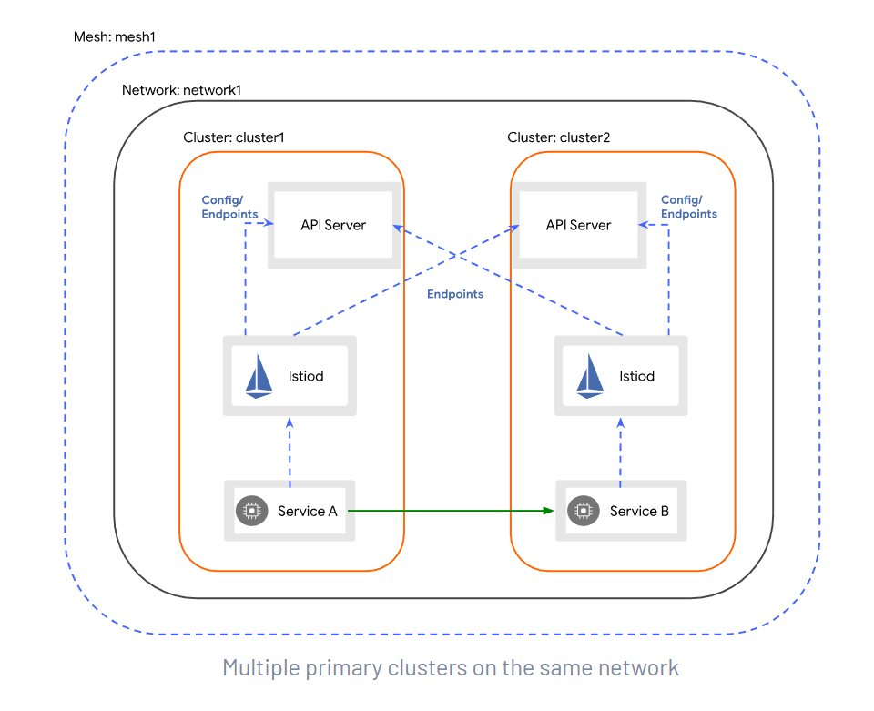

# istio multiple cluster

## 部署模型

当您将 Istio 用于生产环境部署时，需要回答一系列的问题。 网格将被限制在单个 集群 中还是分布在多个集群中？ 是将所有服务都放置在单个完全连接的网络中，还是需要网关来跨多个网络连接服务？ 
是否存在单个控制平面（可能在集群之间共享），或者是否部署了多个控制平面以确保高可用（HA）？ 如果要部署多个集群（更具体地说是在隔离的网络中），是否要将它们连接到单个多集群服务网格中， 还是将它们联合到一个 多网格 部署中？

所有这些问题，都代表了 Istio 部署的独立配置维度。

1.单一或多个集群

2.单一或多个网络

3.单一或多控制平面

4.单一或多个网格

所有组合都是可能的，尽管某些组合比其他组合更常见，并且某些组合显然不是很有趣（例如，单一集群中有多个网格）。

在涉及多个集群的生产环境部署中，部署可能使用多种模式。 例如，基于 3 个集群实现多控制平面的高可用部署，您可以通过使用单一控制平面部署 2 个集群，然后再添加第 3 个集群和 第 2 个控制平面来实现这一点，最后，再将所有 3 个集群配置为共享 2 个控制平面，以确保所有集群都有 2 个控制源来确保 HA。

如何选择正确的部署模型，取决于您对隔离性、性能和 HA 的要求。

## 说明

### topology.istio.io/network
`topology.istio.io/network`: 用于标识一个或多个 Pod 的网络的标签。当 pod 在不同的网络中时，Istio 网关 （例如东西网关）通常用于建立连接 （使用 AUTO_PASSTHROUGH 模式）。此标签可应用于以下 帮助自动化 Istio 的多网络配置的资源。

* Istio System Namespace: 将此标签应用于系统命名空间 为控制平面管理的 Pod 建立默认网络。 这通常在控制平面安装期间使用 管理员指定的值。

* Pod: 将此标签应用于 pod 允许覆盖默认网络 在每个 pod 的基础上。这通常通过 webhook 应用于 pod 注入，但也可以由服务在pod上手动指定 所有者。每个集群中的 Istio 安装配置 webhook 注入 使用管理员指定的值。

* Gateway Service: 将此标签应用于 Istio 网关的服务， 表示 Istio 应该使用这个服务作为网关 网络，在配置跨网络流量时。 Istio 将配置 驻留在网络外部以访问网关服务的 pod 通过 `spec.externalIPs`、`status.loadBalancer.ingress[].ip` 或在这种情况下 NodePort 服务的，Node 的地址。标签配置时 安装网关（例如东西网关）并且应该匹配 控制平面的默认网络（由 Istio 系统指定） 命名空间标签）或目标 pod 的网络。

### 东西向网关
东西向网关：east-west gateway的目标，除了作为跨集群东西向流量的入口点外，还使该过程对运营服务的团队透明。 为了实现这一目标，网关必须
* 启用跨集群的细粒度流量管理
* 路由加密流量以实现工作负载之间的相互身份验证

为了理解这是如何实现的，我们需要介绍 Istio 的两个特性——SNI 集群和 SNI 自动直通(SNI clusters and SNI auto passthrough) ——以及它们如何修改网关的行为。


### ExternalIP 


## 安装
### 准备
1.两个k8s集群，配置如下
```shell
➜  ~ kubectl get no -owide
NAME        STATUS   ROLES                  AGE     VERSION   INTERNAL-IP   EXTERNAL-IP   OS-IMAGE                KERNEL-VERSION                CONTAINER-RUNTIME
master-48   Ready    control-plane,master   7d18h   v1.21.0   10.10.13.48   <none>        CentOS Linux 7 (Core)   3.10.0-1160.21.1.el7.x86_64   docker://20.10.6
node-44     Ready    <none>                 7d18h   v1.21.0   10.10.13.44   <none>        CentOS Linux 7 (Core)   3.10.0-1160.21.1.el7.x86_64   docker://20.10.6
node-49     Ready    <none>                 7d18h   v1.21.0   10.10.13.49   <none>        CentOS Linux 7 (Core)   3.10.0-1160.21.1.el7.x86_64   docker://20.10.6

[root@master-45 ~]# kubectl get no -owide
NAME        STATUS   ROLES                  AGE   VERSION   INTERNAL-IP   EXTERNAL-IP   OS-IMAGE                KERNEL-VERSION                CONTAINER-RUNTIME
master-45   Ready    control-plane,master   18h   v1.21.0   10.10.13.45   <none>        CentOS Linux 7 (Core)   3.10.0-1160.21.1.el7.x86_64   docker://20.10.6
node-43     Ready    <none>                 18h   v1.21.0   10.10.13.43   <none>        CentOS Linux 7 (Core)   3.10.0-1160.21.1.el7.x86_64   docker://20.10.6
node-46     Ready    <none>                 18h   v1.21.0   10.10.13.46   <none>        CentOS Linux 7 (Core)   3.10.0-1160.21.1.el7.x86_64   docker://20.10.6
```

master-48 所在集群对应为cluster1集群，master-45 所在集群对应为cluster2集群。


2.istio-1.11.5
下载地址：[istio-1.11.5-linux-amd64.tar.gz](https://github.com/istio/istio/releases/download/1.11.5/istio-1.11.5-linux-amd64.tar.gz)

3.为两个集群生成中间证书

多集群服务网格部署要求你在网格中的所有集群之间建立信任关系，需要使用一个公共根，为每个集群生成中间证书。

默认情况下，Istio CA 会生成一个自签名的根证书和密钥，并使用它们来签署工作负载证书。为了保护根 CA 密钥，您应该使用在安全机器上离线运行的根 CA，并使用根 CA 向运行在每个集群上的 Istio CA 签发中间证书。Istio CA 可以使用管理员指定的证书和密钥来签署工作负载证书，并将管理员指定的根证书作为信任根分配给工作负载。

下图展示了在包含两个集群的网格中推荐的 CA 层次结构。


在 Istio 安装包的顶层目录下，创建一个目录来存放证书和密钥：
```shell
mkdir -p certs
pushd certs
```
生成根证书和密钥：
```shell
make -f ../tools/certs/Makefile.selfsigned.mk root-ca
```

对于每个集群，为 Istio CA 生成一个中间证书和密钥。
```shell
make -f ../tools/certs/Makefile.selfsigned.mk cluster1-cacerts

make -f ../tools/certs/Makefile.selfsigned.mk cluster2-cacerts
```

生成后的效果：
```shell
[root@master-45 ~]# cd istio-1.11.5/
[root@master-45 istio-1.11.5]# ls
bin  certs  LICENSE  manifests  manifest.yaml  README.md  samples  tools
[root@master-45 istio-1.11.5]# cd certs/
[root@master-45 certs]# ls
cluster1  cluster2  root-ca.conf  root-cert.csr  root-cert.pem  root-cert.srl  root-key.pem
[root@master-45 certs]# ls cluster1/
ca-cert.pem  ca-key.pem  cert-chain.pem  root-cert.pem
[root@master-45 certs]#
```
将 istio-1.11.5 scp到 cluster2中。

在 cluster1 集群上：
```shell
kubectl create namespace istio-system

kubectl create secret generic cacerts -n istio-system \
      --from-file=cluster1/ca-cert.pem \
      --from-file=cluster1/ca-key.pem \
      --from-file=cluster1/root-cert.pem \
      --from-file=cluster1/cert-chain.pem
```

在 cluster2 集群上：
```shell
kubectl create namespace istio-system

kubectl create secret generic cacerts -n istio-system \
      --from-file=cluster2/ca-cert.pem \
      --from-file=cluster2/ca-key.pem \
      --from-file=cluster2/root-cert.pem \
      --from-file=cluster2/cert-chain.pem
```

返回 Istio 安装的顶层目录：
```shell
$ popd
```


### 同网络多主架构的安装
在 cluster1 和 cluster2 两个集群上安装 Istio 控制平面， 将每一个集群都设置为主集群（primary cluster）。 两个集群都运行在网络 network1 上，所以两个集群中的 Pod 可以直接通信。

在此配置中，每一个控制平面都会监测两个集群 API 服务器的服务端点。

服务的工作负载（pod 到 pod）跨集群边界直接通讯。



说明
> cluster1和cluster2在同一个网络network1，cluster1和cluster2分别有一个istiod，cluster1的istiod监控cluster1和cluster2的apiserver，cluster2的isitod监控cluster1和cluster2的apiserver。
> 
> cluster1的service链接cluster1的istiod，cluster2的service连的试cluster2的istiod。cluster1的service和cluster2的service直接链接。

1.给istio-system namespace打标签

```shell
# cluster1
kubectl  label namespace istio-system topology.istio.io/network=network1

# cluster2
kubectl  label namespace istio-system topology.istio.io/network=network1
```


2.生成istio operator部署文件

```shell
cat <<EOF > cluster1.yaml
apiVersion: install.istio.io/v1alpha1
kind: IstioOperator
spec:
  profile: demo
  values:
    global:
      meshID: mesh1
      multiCluster:
        clusterName: cluster1
      network: network1
  meshConfig:
    accessLogFile: /dev/stdout
    enableTracing: true
  components:
    egressGateways:
    - name: istio-egressgateway
      enabled: true
EOF
```

```shell

cat <<EOF > cluster2.yaml
apiVersion: install.istio.io/v1alpha1
kind: IstioOperator
spec:
  profile: demo
  values:
    global:
      meshID: mesh1
      multiCluster:
        clusterName: cluster2
      network: network1
  meshConfig:
    accessLogFile: /dev/stdout
    enableTracing: true
  components:
    egressGateways:
    - name: istio-egressgateway
      enabled: true
EOF

```


### 跨网络单主架构的安装
在 cluster1 主集群（primary cluster） 安装 Istio 控制平面， 并配置 cluster2 从集群（remote cluster）指向 cluster1 的控制平面。 集群 cluster1 在 network1 网络上，而集群 cluster2 在 network2 网络上。 所以跨集群边界的 Pod 之间，网络不能直接连通。

在此配置中，集群 cluster1 将监测两个集群 API Server 的服务端点。 以这种方式，控制平面就能为两个集群中的工作负载提供服务发现。

跨集群边界的服务负载，通过专用的东西向流量网关，以间接的方式通讯。 每个集群中的网关必须可以从其他集群访问。

cluster2 中的服务将通过相同的的东西向网关访问 cluster1 控制平面。


说明
> cluster1再network1，cluster2再network2，cluster1有一个istiod，cluster2使用cluster1的istiod，
> cluster1的service直接注册到istiod，cluster2的service通过cluster1的东西向网关注册到istiod。
> 
> cluster1的service通过cluster2的东西向网关访问cluster2的service，cluster2得service通过cluster1的东西向网关访问cluster1的service。
> cluster1的istiod同时监控cluster1的apiserver和cluster2的apiserver。

1.给istio-system namespace打标签

```shell
# cluster1
kubectl  label namespace istio-system topology.istio.io/network=network1

# cluster2
kubectl  label namespace istio-system topology.istio.io/network=network2
```


2.生成istio operator部署文件
```shell
# cluster1
cat <<EOF > cluster1.yaml
apiVersion: install.istio.io/v1alpha1
kind: IstioOperator
spec:
  profile: demo
  values:
    global:
      meshID: mesh1
      multiCluster:
        clusterName: cluster1
      network: network1
  meshConfig:
    accessLogFile: /dev/stdout
    enableTracing: true
  components:
    egressGateways:
    - name: istio-egressgateway
      enabled: true
EOF

# cluster2
cat <<EOF > cluster2.yaml
apiVersion: install.istio.io/v1alpha1
kind: IstioOperator
spec:
  profile: demo
  values:
    global:
      meshID: mesh1
      multiCluster:
        clusterName: cluster2
      network: network2
      remotePilotAddress: 10.10.13.48
  meshConfig:
    accessLogFile: /dev/stdout
    enableTracing: true
  components:
    egressGateways:
    - name: istio-egressgateway
      enabled: true
EOF
```

cluster2 remotePilotAddress 配置为cluster1的externalIP。

3.安装一个提供 集群 API Server 访问权限的远程 Secret

````shell
# 在 cluster1 中安装一个提供 cluster2 API Server 访问权限的远程 Secret。
## 首先在48节点生成cluster1的remote Secret，然后scp给cluster2。然后再apply 45 scp过来的cluster2的remote secret
istioctl x create-remote-secret --name=cluster1  --server=https://10.10.13.48:6443 > remote-secret-cluster1.yaml
scp remote-secret-cluster1.yaml root@10.10.13.45:/root

kubectl apply -f remote-secret-cluster2.yaml

# 在 cluster2 中安装一个提供 cluster1 API Server 访问权限的远程 Secret。
# 同上，也是先生成自己集群的remote secret ，然后apply cluster1的remote secret。
istioctl x create-remote-secret --name=cluster2  --server=https://10.10.13.45:6443 > remote-secret-cluster2.yaml
scp remote-secret-cluster2.yaml root@10.10.13.48:/root

kubectl apply -f remote-secret-cluster1.yaml
````

这样，cluster1集群就可以监听cluster2的apiServer，同理，cluster2集群也可以监听cluster1的apiServer.

4.部署istio
```shell
# 在cluster1
istioctl install -f cluster1.yaml -y

# 在cluster2
istioctl install -f cluster2.yaml -y
```


5.部署东西向网关

```shell
# 在cluster1
## 部署部署东西向网关
/root/istio-1.11.5/samples/multicluster/gen-eastwest-gateway.sh --mesh mesh1 --cluster cluster1 --network network1 | istioctl  install -y  -f -

## 配置东西向网关ip ,这里我设置为cluster1的 master ip
kubectl patch svc  -n istio-system istio-eastwestgateway -p '{"spec":{"externalIPs":["10.10.13.48"]}}'


# 在cluster2
## 部署部署东西向网关
/root/istio-1.11.5/samples/multicluster/gen-eastwest-gateway.sh --mesh mesh1 --cluster cluster2 --network network2 | istioctl  install -y  -f -

## 配置东西向网关ip ,这里我设置为cluster2的 master ip
kubectl patch svc  -n istio-system istio-eastwestgateway -p '{"spec":{"externalIPs":["10.10.13.45"]}}'
```


6.暴露istiod（只在cluster1执行）
```shell
kubectl apply  -n istio-system -f /root/istio-1.11.5/samples/multicluster/expose-istiod.yaml
```

7.暴露服务
```shell
kubectl  apply -n istio-system -f /root/istio-1.11.5/samples/multicluster/expose-services.yaml
```

8.重启
```shell
kubectl rollout restart deploy -n istio-system
```


### 跨网络多主架构的安装

在 cluster1 和 cluster2 两个集群上，安装 Istio 控制平面， 且将两者均设置为主集群（primary cluster）。 集群 cluster1 在 network1 网络上，而集群 cluster2 在 network2 网络上。 这意味着这些跨集群边界的 Pod 之间，网络不能直接连通。

跨集群边界的服务负载，通过专用的东西向网关，以间接的方式通讯。每个集群中的网关在其他集群必须可以访问。


说明
> cluster1在network1网络，cluster2在network2网络，cluster1和cluster2有各自istiod。
> 
> cluster1的istiod监控cluster1和cluster2的apiserver，cluster2的istiod监控cluster1和cluster2的apiserver。
> 
> cluster1的service连接到cluster1的istiod，cluster2的service连接到cluster2的istiod。
> cluster1的service通过cluster2的东西向网关访问cluster2的service，cluster2的service通过cluster1的东西向网关访问cluster1的service。

1.给istio-system namespace打标签

```shell
# cluster1
kubectl  label namespace istio-system topology.istio.io/network=network1

# cluster2
kubectl  label namespace istio-system topology.istio.io/network=network2
```

2.生成istio operator部署文件
```shell
# cluster1
cat <<EOF > cluster1.yaml
apiVersion: install.istio.io/v1alpha1
kind: IstioOperator
spec:
  values:
    global:
      meshID: mesh1
      multiCluster:
        clusterName: cluster1
      network: network1
EOF

# cluster2
cat <<EOF > cluster2.yaml
apiVersion: install.istio.io/v1alpha1
kind: IstioOperator
spec:
  values:
    global:
      meshID: mesh1
      multiCluster:
        clusterName: cluster2
      network: network2
EOF
```

3.安装一个提供 集群 API Server 访问权限的远程 Secret

````shell
# 在 cluster1 中安装一个提供 cluster2 API Server 访问权限的远程 Secret。
## 首先在48节点生成cluster1的remote Secret，然后scp给cluster2。然后再apply 45 scp过来的cluster2的remote secret
istioctl x create-remote-secret --name=cluster1  --server=https://10.10.13.48:6443 > remote-secret-cluster1.yaml
scp remote-secret-cluster1.yaml root@10.10.13.45:/root

kubectl apply -f remote-secret-cluster2.yaml

# 在 cluster2 中安装一个提供 cluster1 API Server 访问权限的远程 Secret。
# 同上，也是先生成自己集群的remote secret ，然后apply cluster1的remote secret。
istioctl x create-remote-secret --name=cluster2  --server=https://10.10.13.45:6443 > remote-secret-cluster2.yaml
scp remote-secret-cluster2.yaml root@10.10.13.48:/root

kubectl apply -f remote-secret-cluster1.yaml
````

这样，cluster1集群就可以监听cluster2的apiServer，同理，cluster2集群也可以监听cluster1的apiServer.

4.部署istio
```shell
# 在cluster1
istioctl install -f cluster1.yaml

# 在cluster2
istioctl install -f cluster2.yaml
```

5.部署东西向网关

```shell
# 在cluster1
## 部署部署东西向网关
/root/istio-1.11.5/samples/multicluster/gen-eastwest-gateway.sh --mesh mesh1 --cluster cluster1 --network network1 | istioctl  install -y  -f -

## 配置东西向网关ip ,这里我设置为cluster1的 master ip
kubectl patch svc  -n istio-system istio-eastwestgateway -p '{"spec":{"externalIPs":["10.10.13.48"]}}'


# 在cluster2
## 部署部署东西向网关
/root/istio-1.11.5/samples/multicluster/gen-eastwest-gateway.sh --mesh mesh1 --cluster cluster2 --network network2 | istioctl  install -y  -f -

## 配置东西向网关ip ,这里我设置为cluster2的 master ip
kubectl patch svc  -n istio-system istio-eastwestgateway -p '{"spec":{"externalIPs":["10.10.13.45"]}}'
```

6.暴露服务
```shell
# cluster1 和 cluster2
kubectl  apply -n istio-system -f /root/istio-1.11.5/samples/multicluster/expose-services.yaml
```

7.重启
```shell
# cluster1 和 cluster2
kubectl rollout restart deploy -n istio-system
```

## 验证

部署业务测试容器
```shell
# 设置自动注入(cluster1和cluster2)
kubectl label namespace default istio-injection=enabled

# 部署bookinfo(cluster1和cluster2)
kubectl apply -f  istio-1.11.5/samples/bookinfo/platform/kube/bookinfo.yaml

# 部署helloworld
## cluster1
kubectl apply -f istio-1.11.5/samples/helloworld/helloworld.yaml -l service=helloworld
kubectl apply -f istio-1.11.5/samples/helloworld/helloworld.yaml -l version=v1

## cluster2
kubectl apply -f istio-1.11.5/samples/helloworld/helloworld.yaml -l service=helloworld
kubectl apply -f istio-1.11.5/samples/helloworld/helloworld.yaml -l version=v2

# 部署sleep(cluster1和cluster2)
kubectl apply -f  istio-1.11.5/samples/sleep/sleep.yaml

# 部署Kiali prometheus jaeger(cluster1和cluster2)
kubectl apply -f istio-1.11.5/samples/addons/kiali.yaml 
kubectl apply -f istio-1.11.5/samples/addons/prometheus.yaml
kubectl apply -f istio-1.11.5/samples/addons/jaeger.yaml
kubectl patch svc  -n istio-system kiali -p '{"spec":{"type":"NodePort"}}'
kubectl get svc -n istio-system kiali
kubectl rollout restart deploy

# 手动拉镜像
docker pull quay.io/kiali/kiali:v1.38
docker pull prom/prometheus:v2.26.0


```


cluster1:
```shell
$ istioctl ps
NAME                                                    CDS        LDS        EDS        RDS          ISTIOD                      VERSION
details-v1-79f774bdb9-r5kw4.default                     SYNCED     SYNCED     SYNCED     SYNCED       istiod-64dfdcc9db-j7plx     1.11.5
helloworld-v1-776f57d5f6-8sb7f.default                  SYNCED     SYNCED     SYNCED     SYNCED       istiod-64dfdcc9db-j7plx     1.11.5
istio-eastwestgateway-68786fb975-jhhpl.istio-system     SYNCED     SYNCED     SYNCED     NOT SENT     istiod-64dfdcc9db-j7plx     1.11.5
istio-ingressgateway-5cb96858b5-4zthw.istio-system      SYNCED     SYNCED     SYNCED     NOT SENT     istiod-64dfdcc9db-j7plx     1.11.5
productpage-v1-6b746f74dc-2qhqx.default                 SYNCED     SYNCED     SYNCED     SYNCED       istiod-64dfdcc9db-j7plx     1.11.5
ratings-v1-b6994bb9-88mw2.default                       SYNCED     SYNCED     SYNCED     SYNCED       istiod-64dfdcc9db-j7plx     1.11.5
reviews-v1-545db77b95-df5cz.default                     SYNCED     SYNCED     SYNCED     SYNCED       istiod-64dfdcc9db-j7plx     1.11.5
reviews-v2-7bf8c9648f-6ckfp.default                     SYNCED     SYNCED     SYNCED     SYNCED       istiod-64dfdcc9db-j7plx     1.11.5
reviews-v3-84779c7bbc-s2rkl.default                     SYNCED     SYNCED     SYNCED     SYNCED       istiod-64dfdcc9db-j7plx     1.11.5
sleep-557747455f-7h9hd.default                          SYNCED     SYNCED     SYNCED     SYNCED       istiod-64dfdcc9db-j7plx     1.11.5

## 这里查看任何pod的配置，都是一样的
$ istioctl pc endpoint -n istio-system istio-ingressgateway-5cb96858b5-4zthw|grep productpage
10.10.13.45:15443                HEALTHY     OK                outbound|9080||productpage.default.svc.cluster.local
10.44.0.8:9080                   HEALTHY     OK                outbound|9080||productpage.default.svc.cluster.local

# 或者
$ istioctl pc endpoint productpage-v1-6b746f74dc-2qhqx
ENDPOINT                         STATUS      OUTLIER CHECK     CLUSTER
10.10.13.45:15443                HEALTHY     OK                outbound|5000||helloworld.default.svc.cluster.local
10.10.13.45:15443                HEALTHY     OK                outbound|80||sleep.default.svc.cluster.local
10.10.13.45:15443                HEALTHY     OK                outbound|9080||details.default.svc.cluster.local
10.10.13.45:15443                HEALTHY     OK                outbound|9080||productpage.default.svc.cluster.local
10.10.13.45:15443                HEALTHY     OK                outbound|9080||ratings.default.svc.cluster.local
10.10.13.45:15443                HEALTHY     OK                outbound|9080||reviews.default.svc.cluster.local
10.10.13.48:6443                 HEALTHY     OK                outbound|443||kubernetes.default.svc.cluster.local
10.32.0.2:53                     HEALTHY     OK                outbound|53||kube-dns.kube-system.svc.cluster.local
10.32.0.2:9153                   HEALTHY     OK                outbound|9153||kube-dns.kube-system.svc.cluster.local
10.36.0.1:15012                  HEALTHY     OK                outbound|15012||istio-eastwestgateway.istio-system.svc.cluster.local
10.36.0.1:15017                  HEALTHY     OK                outbound|15017||istio-eastwestgateway.istio-system.svc.cluster.local
10.36.0.1:15021                  HEALTHY     OK                outbound|15021||istio-eastwestgateway.istio-system.svc.cluster.local
10.36.0.1:15443                  HEALTHY     OK                outbound|15443||istio-eastwestgateway.istio-system.svc.cluster.local
10.36.0.3:9080                   HEALTHY     OK                outbound|9080||ratings.default.svc.cluster.local
10.36.0.4:9080                   HEALTHY     OK                outbound|9080||reviews.default.svc.cluster.local
10.36.0.5:15010                  HEALTHY     OK                outbound|15010||istiod.istio-system.svc.cluster.local
10.36.0.5:15012                  HEALTHY     OK                outbound|15012||istiod.istio-system.svc.cluster.local
10.36.0.5:15014                  HEALTHY     OK                outbound|15014||istiod.istio-system.svc.cluster.local
10.36.0.5:15017                  HEALTHY     OK                outbound|443||istiod.istio-system.svc.cluster.local
10.36.0.6:8080                   HEALTHY     OK                outbound|80||istio-ingressgateway.istio-system.svc.cluster.local
10.36.0.6:8443                   HEALTHY     OK                outbound|443||istio-ingressgateway.istio-system.svc.cluster.local
10.36.0.6:15021                  HEALTHY     OK                outbound|15021||istio-ingressgateway.istio-system.svc.cluster.local
10.44.0.1:53                     HEALTHY     OK                outbound|53||kube-dns.kube-system.svc.cluster.local
10.44.0.1:9153                   HEALTHY     OK                outbound|9153||kube-dns.kube-system.svc.cluster.local
10.44.0.2:5000                   HEALTHY     OK                outbound|5000||helloworld.default.svc.cluster.local
10.44.0.3:80                     HEALTHY     OK                outbound|80||sleep.default.svc.cluster.local
10.44.0.5:9080                   HEALTHY     OK                outbound|9080||details.default.svc.cluster.local
10.44.0.6:9080                   HEALTHY     OK                outbound|9080||reviews.default.svc.cluster.local
10.44.0.7:9080                   HEALTHY     OK                outbound|9080||reviews.default.svc.cluster.local
10.44.0.8:9080                   HEALTHY     OK                outbound|9080||productpage.default.svc.cluster.local
127.0.0.1:15000                  HEALTHY     OK                prometheus_stats
127.0.0.1:15020                  HEALTHY     OK                agent
unix://./etc/istio/proxy/SDS     HEALTHY     OK                sds-grpc
unix://./etc/istio/proxy/XDS     HEALTHY     OK                xds-grpc
```

cluster2:
```shell
$ istioctl ps
NAME                                                    CDS        LDS        EDS        RDS          ISTIOD                      VERSION
details-v1-79f774bdb9-9cnwk.default                     SYNCED     SYNCED     SYNCED     SYNCED       istiod-7cb788d479-vfz5x     1.11.5
helloworld-v2-54df5f84b-mk9zj.default                   SYNCED     SYNCED     SYNCED     SYNCED       istiod-7cb788d479-vfz5x     1.11.5
istio-eastwestgateway-86f64d89b7-zmrln.istio-system     SYNCED     SYNCED     SYNCED     NOT SENT     istiod-7cb788d479-vfz5x     1.11.5
istio-ingressgateway-f5648b4b9-l6jbs.istio-system       SYNCED     SYNCED     SYNCED     NOT SENT     istiod-7cb788d479-vfz5x     1.11.5
productpage-v1-6b746f74dc-cqwd7.default                 SYNCED     SYNCED     SYNCED     SYNCED       istiod-7cb788d479-vfz5x     1.11.5
ratings-v1-b6994bb9-lf7zx.default                       SYNCED     SYNCED     SYNCED     SYNCED       istiod-7cb788d479-vfz5x     1.11.5
reviews-v1-545db77b95-vcgl6.default                     SYNCED     SYNCED     SYNCED     SYNCED       istiod-7cb788d479-vfz5x     1.11.5
reviews-v2-7bf8c9648f-nq6zz.default                     SYNCED     SYNCED     SYNCED     SYNCED       istiod-7cb788d479-vfz5x     1.11.5
reviews-v3-84779c7bbc-zptjb.default                     SYNCED     SYNCED     SYNCED     SYNCED       istiod-7cb788d479-vfz5x     1.11.5
sleep-557747455f-5hcsm.default                          SYNCED     SYNCED     SYNCED     SYNCED       istiod-7cb788d479-vfz5x     1.11.5

$ istioctl pc endpoint -n istio-system istio-ingressgateway-f5648b4b9-l6jbs.istio-system|grep productpage
10.10.13.48:15443                HEALTHY     OK                outbound|9080||productpage.default.svc.cluster.local
10.36.0.7:9080                   HEALTHY     OK                outbound|9080||productpage.default.svc.cluster.local
```

测试跨集群流量

在cluster1的sleep 容器中访问 helloworld.default 这个svc，由于cluster1中只部署了helloworld v1版本，而cluster2中只部署了helloworld v2版本。所以，如果响应是v1、v2切换，那么则表示我们的多集群部署成功了。

```shell
$ kubectl exec -it sleep-557747455f-7h9hd sh                                                            
$ kubectl exec [POD] [COMMAND] is DEPRECATED and will be removed in a future version. Use kubectl exec [POD] -- [COMMAND] instead.
/ $ for i in `seq 20`;do curl -sS helloworld.default:5000/hello;done
Hello version: v1, instance: helloworld-v1-776f57d5f6-8sb7f
Hello version: v2, instance: helloworld-v2-54df5f84b-mk9zj
Hello version: v2, instance: helloworld-v2-54df5f84b-mk9zj
Hello version: v1, instance: helloworld-v1-776f57d5f6-8sb7f
Hello version: v2, instance: helloworld-v2-54df5f84b-mk9zj
Hello version: v1, instance: helloworld-v1-776f57d5f6-8sb7f
Hello version: v1, instance: helloworld-v1-776f57d5f6-8sb7f
Hello version: v2, instance: helloworld-v2-54df5f84b-mk9zj
Hello version: v2, instance: helloworld-v2-54df5f84b-mk9zj
Hello version: v1, instance: helloworld-v1-776f57d5f6-8sb7f
Hello version: v1, instance: helloworld-v1-776f57d5f6-8sb7f
Hello version: v2, instance: helloworld-v2-54df5f84b-mk9zj
Hello version: v1, instance: helloworld-v1-776f57d5f6-8sb7f
Hello version: v2, instance: helloworld-v2-54df5f84b-mk9zj
Hello version: v2, instance: helloworld-v2-54df5f84b-mk9zj
Hello version: v1, instance: helloworld-v1-776f57d5f6-8sb7f
Hello version: v1, instance: helloworld-v1-776f57d5f6-8sb7f
Hello version: v2, instance: helloworld-v2-54df5f84b-mk9zj
Hello version: v2, instance: helloworld-v2-54df5f84b-mk9zj
Hello version: v1, instance: helloworld-v1-776f57d5f6-8sb7f
/ $
```

结果很给力，多集群部署成功！

我们可以通过查看kiali的视图，更清晰看到流量的走向：


## 卸载
```shell
istioctl x uninstall --purge -y 
kubectl delete namespace istio-system
kubectl rollout restart deploy
```

## istio in action

在最初的评估中，ACME 将跨集群扩展服务网格并启用跨集群流量管理、可观察性和安全性的能力视为选择使用服务网格的主要驱动力。为了支持多集群工作，该公司考虑了两种方法：在最初的评估中，ACME 将跨集群扩展服务网格并启用跨集群流量管理、可观察性和安全性的能力视为选择使用服务网格的主要驱动力。为了支持多集群工作，该公司考虑了两种方法：

A multi-cluster service mesh requires cross-cluster discovery, connectivity, and common trust.

满足这些标准可确保集群了解其他集群中运行的工作负载，工作负载可以相互连接，并且工作负载可以使用 Istio 策略进行身份验证和授权。所有这些都是建立多集群服务网格的先决条件。

如前所述，Istio 要在集群之间建立多集群连接，只能通过访问对等集群中的 Kubernetes API 来发现工作负载。 对于某些组织来说，这可能是一种不良的安全态势，每个集群都可以访问所有其他集群的 API。 在这种情况下，网格联邦是一种更好的方法。 像Gloo Mesh这样的项目（https://docs.solo.io/gloo-mesh/
最新）可以帮助实现自动化和安全态势。

How workloads are discovered in multi-cluster deployments


另一个先决条件是工作负载具有跨集群连接性。 当集群在平面网络中时，例如共享单个网络（如 Amazon VPC），或者当它们的网络使用网络对等连接时，工作负载可以使用 IP 地址连接，并且条件已经满足！ 但是，当集群在不同的网络中时，我们必须使用位于网络边缘的特殊 Istio 入口网关和代理跨集群流量。
在多网络网格中桥接集群的入口网关被称为东西网关（见图 12.7）。 我们将在本章后面详细说明东西网关。

我们需要解决的最后一个因素是多集群服务网格中的集群必须具有共同信任。 具有共同信任确保了对立集群的工作负载可以相互认证。 有两种方法可以在相对集群的工作负载之间实现共同信任。 第一个使用我们所说的插件 CA 证书：从公共根 CA 颁发的用户定义证书。 第二个集成了两个集群用来签署证书的外部 CA。

东西向网关将代理请求反向到各自集群中的工作负载。

多网络基础架构要求我们需要使用东西向网关来桥接网络以实现跨集群连接，但对于是使用复制控制平面部署模型还是使用单个控制平面仍留有余地。 决策是由业务需求驱动的。 
在 ACME 的案例中，它的在线商店非常受欢迎：它每关闭一分钟就会花费数百万美元，真的！ 因此，高可用性是重中之重，我们将使用主-主部署模型，其中 Istio 控制平面部署在每个集群中。 
综上所述，我们将建立一个多集群、多网络、多控制平面的服务网格，使用东西向网关来桥接网络并使用主-主部署模型。 让我们开始吧！

topology.istio.io/network=west-network

通过这些标签，Istio 形成了对网络拓扑的理解，并使用它来决定如何配置工作负载。

Kubernetes 集群可以有很多租户并且可以跨越多个团队。
Istio 提供了在集群中安装多个网格的选项，允许团队分别管理他们的网格操作。meshID 属性使我们能够识别此安装所属的网格。

希望两个控制平面形成相同的网格，所以我们指定了相同 meshID：

假设这是我们的起点：两个集群，每个集群都有需要连接的工作负载。 但是如果没有跨集群工作负载发现，则不会为相对集群中的工作负载配置 Sidecar 代理。 因此，我们的下一步是启用跨集群发现。

为了让 Istio 能够通过身份验证以从远程集群查询信息，它需要一个服务帐户来定义其权限的身份和角色绑定。因此，Istio 在安装时会创建一个服务帐户（名为 istio-reader-service- account）具有最小权限集，
另一个控制平面可以使用这些权限来验证自己并查找与工作负载相关的信息，例如服务和端点。 但是，我们需要将服务帐户令牌与证书一起提供给对方集群，以启动与远程集群的安全连接。

为了简化东西向流量，大多数云提供商都启用了虚拟网络的对等互连——前提是网络地址空间不重叠。 对等虚拟网络中的服务使用 IPv4 和 IPv6 地址启动直接连接。 但是，网络对等互连是特定于云的功能。 每当我们想要连接不同云提供商中的集群或无法进行网络对等互连的本地时，Istio 提供的选项是东西向网关。 网关必须公开一个负载均衡器，该负载均衡器可以访问对面集群的工作负载。
在本节中，我们设置了跨集群连接并展示了它是如何工作的。 它可能看起来很复杂，但我们相信理解它是如何工作的比让它工作更重要。 如果出现问题，您应该具备排除故障和恢复连接的知识和能力。

东西向网关是入口网关，为每个服务的服务器名称指示 (SNI) 集群附加配置。 但什么是 SNI 集群？ SNI 集群就像常规的 Envoy 集群（参见第 10 章，第 10.3.2 节，查询 Envoy 集群配置小节），
由方向、子集、端口和 FQDN 组成，它们将一组类似的工作负载分组到可以路由流量的位置。 但是，SNI 集群有一个关键区别：它们在 SNI 中编码所有 Envoy 集群信息。 
这使东西向网关能够将加密流量代理到 SNI 中客户端指定的集群。 举个具体的例子，当一个客户端——比如 webapp——发起到远程集群中的工作负载——比如目录工作负载——的连接时，它会将目标集群编码到 SNI 中，如图 12.13 所示。

因此，客户端可以做出细粒度的路由决策，网关可以从 SNI 标头中读取集群信息，然后将流量代理到客户端预期的工作负载。 所有这些都是在保持工作负载之间安全且相互验证的连接的同时发生的。

对于网关，SNI 集群的配置是一项可选功能，可以通过使用环境变量ISTIO_META_ROUTER_MODE 将网关路由器模式设置为 sni-dnat 来启用，如下面的 IstioOperator 定义所示：

安装了东西向网关并将路由器模式设置为 sni-dn 后，下一步是使用 SNI 自动直通模式通过东西向网关公开多集群 mTLS 端口。 Istio 很聪明，然后才使用 SNI 集群配置网关。

为了理解 SNI 自动直通，让我们回忆一下手动 SNI 直通配置入口网关以根据 SNI 标头接纳流量（参见第 4 章，第 4.4.2 节）。 这表明为了路由允许的流量，服务运营商必须手动定义一个虚拟服务资源（见图 12.14）。 
SNI 自动直通，顾名思义，不需要手动创建 VirtualService 来路由被允许的流量。 它是使用 SNI 集群完成的，当它的路由器模式设置为 sni-dnat（图 12.15）时，它会在东西网关中自动配置。

要配置 Istio 的入口网关以允许流量进入集群并通过服务网格，我们将从探索两个 Istio 资源开始：网关和虚拟服务。 两者都是让流量在 Istio 中流动的基础，但我们只会在允许流量进入集群的上下文中查看它们。 我们将在第 5 章更全面地介绍 VirtualService。


```shell
~ istioctl -n istio-system pc listener deploy/istio-ingressgateway
ADDRESS PORT  MATCH DESTINATION
0.0.0.0 3000  ALL   Route: http.3000
0.0.0.0 7575  ALL   Cluster: outbound|7575||networking-agent.service-mesh.svc.cluster.local
0.0.0.0 9080  ALL   Route: http.9080
0.0.0.0 9090  ALL   Route: http.9090
0.0.0.0 15021 ALL   Inline Route: /healthz/ready*
0.0.0.0 15090 ALL   Inline Route: /stats/prometheus*
0.0.0.0 16686 ALL   Route: http.16686
0.0.0.0 20001 ALL   Route: http.20001
➜  ~ istioctl -n istio-system pc route deploy/istio-ingressgateway
NOTE: This output only contains routes loaded via RDS.
NAME           DOMAINS     MATCH                  VIRTUAL SERVICE
http.9080      *           /*                     404
http.9090      *           /*                     prometheus.monitoring
http.3000      *           /*                     grafana.monitoring
http.20001     *           /*                     solar-graph.service-mesh
http.16686     *           /*                     jaeger.jaeger-infra
               *           /stats/prometheus*     
               *           /healthz/ready*        
➜  ~ istioctl -n istio-system pc route deploy/istio-ingressgateway -o json --name http.20001
[
    {
        "name": "http.20001",
        "virtualHosts": [
            {
                "name": "*:20001",
                "domains": [
                    "*"
                ],
                "routes": [
                    {
                        "match": {
                            "prefix": "/"
                        },
                        "route": {
                            "cluster": "outbound|8080||solar-graph.service-mesh.svc.cluster.local",
                            "timeout": "0s",
                            "retryPolicy": {
                                "retryOn": "connect-failure,refused-stream,unavailable,cancelled,retriable-status-codes",
                                "numRetries": 2,
                                "retryHostPredicate": [
                                    {
                                        "name": "envoy.retry_host_predicates.previous_hosts"
                                    }
                                ],
                                "hostSelectionRetryMaxAttempts": "5",
                                "retriableStatusCodes": [
                                    503
                                ]
                            },
                            "maxStreamDuration": {
                                "maxStreamDuration": "0s"
                            }
                        },
                        "metadata": {
                            "filterMetadata": {
                                "istio": {
                                    "config": "/apis/networking.istio.io/v1alpha3/namespaces/service-mesh/virtual-service/solar-graph"
                                }
                            }
                        },
                        "decorator": {
                            "operation": "solar-graph.service-mesh.svc.cluster.local:8080/*"
                        }
                    }
                ],
                "includeRequestAttemptCount": true
            }
        ],
        "validateClusters": false
    }
]


```

Istio 的网关功能强大，不仅可以为 HTTP/HTTPS 流量提供服务，还可以通过 TCP 访问任何流量。 例如，我们可以通过入口网关公开数据库（如 MongoDB）或消息队列（如 Kafka）。 当 Istio 将流量视为普通 TCP 时，我们不会获得很多有用的功能，例如重试、请求级断路、复杂路由等。 这仅仅是因为 Istio 无法判断正在使用什么协议（除非使用了 Istio 理解的特定协议，例如 MongoDB）。 让我们看看如何通过 Istio 网关公开 TCP 流量，以便集群外的客户端可以与集群内运行的客户端进行通信。


## Reference
[istio多集群探秘，部署了50次多集群后我得出的结论](https://blog.csdn.net/hxpjava1/article/details/120634273#:~:text=istio%E5%A4%9A%E9%9B%86%E7%BE%A4%E6%98%AF%E6%8C%87%E5%B0%86%E5%A4%9A%E4%B8%AAistio%E9%9B%86%E7%BE%A4%E8%81%94%E9%82%A6%E4%B8%BA%E4%B8%80%E4%B8%AA%E6%95%B4%E4%BD%93%E7%9A%84mesh%E3%80%82,%E6%AF%94%E5%A6%82%E6%9C%89%E4%B8%A4%E4%B8%AAk8s%E9%9B%86%E7%BE%A4%EF%BC%8C%E4%B8%8A%E9%9D%A2%E5%88%86%E5%88%AB%E9%83%A8%E7%BD%B2%E4%BA%86istio%E9%9B%86%E7%BE%A4%EF%BC%8C%E8%BF%99%E4%B8%A4%E4%B8%AAk8s%E9%9B%86%E7%BE%A4%E5%8F%AF%E4%BB%A5%E5%9C%A8%E4%B8%80%E4%B8%AA%E7%BD%91%E7%BB%9C%E4%B8%8B%EF%BC%8C%E4%B9%9F%E5%8F%AF%E4%BB%A5%E5%9C%A8%E5%A4%9A%E4%B8%AA%E7%BD%91%E7%BB%9C%E4%B8%8B%E3%80%82)


