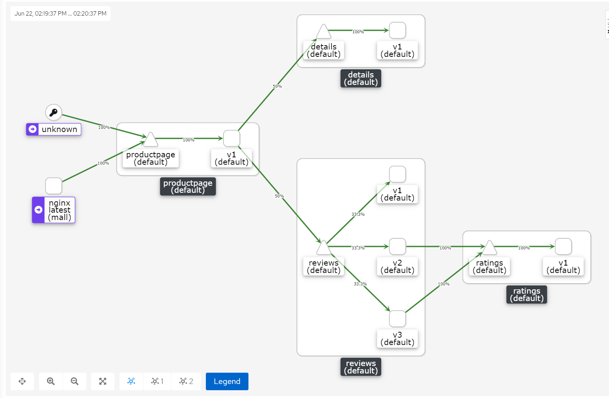

# kiali

## 关于Kiali
Kiali是Istio服务网格的管理控制台。它给你的服务网格提供了强大的可观测能力，让您快速诊断并修复问题。Kiali提供深入的流量拓扑，健康等级，强大的仪表板，并让您深入到组件的细节。 Kiali提供了相关的指标、日志和tracing视图，和验证能力以查明配置问题。Kiali提供向导，来帮助您将服务添加到服务网格，定义流量路由，网关，流量策略和其他。Kiali能够与Grafana和Jaeger集成。

## kiali中的基本概念

在了解 Kiali 如何提供 Service Mesh 中微服务可观察性之前，我们需要先了解下 Kiali 如何划分监控类别的。

- Application：使用运行的工作负载，必须使用 Istio 的将 Label 标记为 app 才算。注意，如果一个应用有多个版本，只要 app 标签的值相同就是属于同一个应用。
- Deployment：即 Kubernetes 中的 Deployment。
- Label：这个值对于 Istio 很重要，因为 Istio 要用它来标记 metrics。每个 Application 要求包括 app 和 version 两个 label。
- Namespace：通常用于区分项目和用户。
- Service：即 Kubernetes 中的 Service，不过要求必须有 app label。
- Workload：Kubernetes 中的所有常用资源类型如 Deployment、StatefulSet、Job 等都可以检测到，不论这些负载是否加入到 Istio Service Mesh 中。

## 源码解读

HTTP 请求的处理逻辑入口位于 `kiali/handlers/graph.go` . 以GraphNamespaces这个绘制namespace graph的方法为例，它的核心逻辑如下：

```go
// GraphNamespaces is a REST http.HandlerFunc handling graph generation for 1 or more namespaces
func GraphNamespaces(w http.ResponseWriter, r *http.Request) {
	defer handlePanic(w)

    // 设置 绘图的选项：什么namespace的图、是否需要显示什么appenders等...
    o := graph.NewOptions(r)
    // 设置k8s、p8s、jaeger client，以及初始化kiali缓存。而kiali缓存了k8s和istio的资源和namespace信息
    business, err := getBusiness(r)
    graph.CheckError(err)
    // 根据options生成namespace的graph
    code, payload := api.GraphNamespaces(business, o)
    respond(w, code, payload)
}
```
Appender 是一个接口，在 service graph 中注入详细的信息，这里后文做了很详细的介绍。

## appender
appenders 可以 增、删、改 nodes

### DeadNodeAppender
负责删除多余的节点。他有两种情况:
- 没有traffic 报告的nodes和后台的workload不能被发现的nodes
- service node中没有service entries 的node、没有incoming错误traffic和没有outgoing edges的节点

以上都会被认为是dead node，而从trafficMap中被删除。

还有一种，如果是node对于的workload 的pod 数量为0，那么标记为`isDead`

### SidecarsCheckAppender
负责检查 workload 和 app 类型的node中是否missing sidecars，如果丢失sidecar，那么标记为`hasMissingSC`。

### ServiceEntryAppender
负责识别在istio中定义为serviceEntry的service nodes。

### IstioAppender
负责标记具有特殊Istio意义（CircuitBreaker、VirtualService，分别标记为HasCB、HasVS）的节点。

### SecurityPolicyAppender
负责将安全策略信息添加到graph，现在只支持tls。

### ResponseTimeAppender
负责将responseTime信息添加到graph。

### UnusedNodeAppender
负责查找traffic中从未见过的服务请求。它增加了节点代表未使用的定义。添加的节点类型取决于图表类型和/或标签定义


## 程序运行流程


## 指标中的名称解释
kiali查询的istio指标都是envoy去处理的。
envoy 使用wasm插件将传入和传出的流量指标记录到Envoy统计子系统中，并使它们可供Prometheus抓取。

- reporter: 上报者，metric 报告来源，终点服务（destination）是 envoy 代理的上游客户端。如果是流量的起点，则为source，否则是destination。
- app: 数据产生的来源应用，相同app标签为一组应用。如app="reviews"，则表示该条数据由reviews服务产生。
- source: Envoy 代理的下游(DownStream)客户端。在服务网格中，source通常是workload，但入口流量的source可能包括其他客户端，例如浏览器或移动应用程序。
- source_workload: 这标识了控制源的源工作负载(source workload)的名称。如：productpage-v1
- source_workload_namespace: 这标识了源工作负载的命名空间。如：default
- source_principal: 这标识了流量源的对等主体。使用对等身份验证时设置。如：spiffe://cluster.local/ns/default/sa/bookinfo-productpage
- source_app: 这会根据源工作负载的应用标签识别源应用。如：productpage
- source_version: 这标识了源工作负载的版本。如：v1
- source_cluster: 这标识了源工作负载所在的集群。如：Kubernetes
- source_canonical_service: 如下。如：productpage
- source_canonical_revision: 如下。如：v1
- destination_workload: 这标识了目标工作负载(destination workload)的名称。如：details-v1
- destination_workload_namespace: 这标识了目标工作负载(destination workload)的命名空间。如：default
- destination_principal: 这标识了流量目的地的对等主体。使用对等身份验证时设置。如：spiffe://cluster.local/ns/default/sa/bookinfo-details
- destination_app: 这会根据目标工作负载的应用标签(app)识别目标应用。如：details
- destination_version: 这标识了目标工作负载的版本。如：v1
- destination_service: 这标识了负责传入请求的目标服务主机。如：details.default.svc.cluster.local
- destination_service_name: 这标识了目标服务名称。如：details
- destination_service_namespace: 这标识了目标服务命名空间。如：default
- destination_canonical_revision: 如下。如：v1 
- destination_canonical_service: canonical代表规范，destination_canonical_service代表规范服务。虽然工作负载可以属于多个服务，但是其只能属于一个规范服务。如：details
- destination_cluster: 这标识了目标工作负载所在的集群。如：Kubernetes
- request_protocol: 这标识了请求的协议。如果提供，则设置为 API 协议，否则设置为请求或连接协议。如：http
- response_code: 这标识了请求的响应代码。此标签仅出现在 HTTP 指标上。如：200
- response_flags: 有关来自代理的响应或连接的其他详细信息。如果是 Envoy，请参阅 Envoy 访问日志中的 %RESPONSE_FLAGS% 了解更多详细信息。如："-"
- connection_security_policy: 这标识了请求的服务认证策略。当 Istio 用于确保通信安全并且报告来自目的地时(destination)，它设置为mutual_tls。当报告来自源时，它设置为未知，因为无法正确填充安全策略。如：mutual_tls
- istio_io_rev: istio注入后的标签指标，原标签为"istio.io/rev: default"
- service_istio_io_canonical_name: 工作负载所属的规范服务的名称。它是istio注入后的标签指标，原标签为"service.istio.io/canonical-name: details"
- service_istio_io_canonical_revision: istio注入后的标签指标，原标签为"service.istio.io/canonical-revision: v1"
- security_istio_io_tlsMode: istio注入后的标签指标，原标签为"security.istio.io/tlsMode: istio"

destination telemetry: 
- reporter="destination" , 则为destination telemetry，即为destination上报的数据。同理，reporter="source" , 则为source telemetry。
- 没有被istio注入的也为 destination telemetry 。原文： `Unknown sources have no istio sidecar so it is destination telemetry`.


### 实际案例

#### Demo1：查看details的pod（details-v1-79f774bdb9-2bwb9）在Prometheus中生成的数据，以及对应的kiali图的情况。

流量走向：流量从productpage指向details

数据如下：

```json
{
  app: "details"
  connection_security_policy: "mutual_tls"
  destination_app: "details"
  destination_canonical_revision: "v1"
  destination_canonical_service: "details"
  destination_cluster: "Kubernetes"
  destination_principal: "spiffe://cluster.local/ns/default/sa/bookinfo-details"
  destination_service: "details.default.svc.cluster.local"
  destination_service_name: "details"
  destination_service_namespace: "default"
  destination_version: "v1"
  destination_workload: "details-v1"
  destination_workload_namespace: "default"
  instance: "10.44.0.18:15020"
  istio_io_rev: "default"
  job: "kubernetes-pods"
  kubernetes_namespace: "default"
  kubernetes_pod_name: "details-v1-79f774bdb9-2bwb9"
  pod_template_hash: "79f774bdb9"
  reporter: "destination"
  request_protocol: "http"
  response_code: "200"
  response_flags: "-"
  security_istio_io_tlsMode: "istio"
  service_istio_io_canonical_name: "details"
  service_istio_io_canonical_revision: "v1"
  source_app: "productpage"
  source_canonical_revision: "v1"
  source_canonical_service: "productpage"
  source_cluster: "Kubernetes"
  source_principal: "spiffe://cluster.local/ns/default/sa/bookinfo-productpage"
  source_version: "v1"
  source_workload: "productpage-v1"
  source_workload_namespace: "default"
  version: "v1"
  __name__: "istio_request_bytes_count"
}
```

对应的图如下：


#### Demo2：查看productpage的pod（productpage-v1-6b746f74dc-bkdw2）在Prometheus中生成的数据，以及对应的kiali图的情况。

流量走向：流量从外部指向productpage

此时的metrics上报者是destination，也就是server端

数据如下：

```json
{
  app: "productpage"
  connection_security_policy: "none"
  destination_app: "productpage"
  destination_canonical_revision: "v1"
  destination_canonical_service: "productpage"
  destination_cluster: "Kubernetes"
  destination_principal: "unknown"
  destination_service: "productpage.default.svc.cluster.local"
  destination_service_name: "productpage"
  destination_service_namespace: "default"
  destination_version: "v1"
  destination_workload: "productpage-v1"
  destination_workload_namespace: "default"
  instance: "10.44.0.15:15020"
  istio_io_rev: "default"
  job: "kubernetes-pods"
  kubernetes_namespace: "default"
  kubernetes_pod_name: "productpage-v1-6b746f74dc-bkdw2"
  pod_template_hash: "6b746f74dc"
  reporter: "destination"
  request_protocol: "http"
  response_code: "0"
  response_flags: "DC"
  security_istio_io_tlsMode: "istio"
  service_istio_io_canonical_name: "productpage"
  service_istio_io_canonical_revision: "v1"
  source_app: "unknown"
  source_canonical_revision: "latest"
  source_canonical_service: "unknown"
  source_cluster: "unknown"
  source_principal: "unknown"
  source_version: "unknown"
  source_workload: "unknown"
  source_workload_namespace: "unknown"
  version: "v1"
  __name__: "istio_request_bytes_count"
}
```
对应的图如下：


#### Demo3：关于reporter和destination telemetry


productpage 访问 reviews，是以productpage为起点，reviews为终点，此时流量的流向是productpage->reviews，而且 app="productpage" ,所以productpage是source telemetry，reporter="source"。

为什么是productpage->reviews？ 右侧数据中已经很清楚了，source_XXX 的只都与productpage相关，destination_XXX的值与reviews相关，所以流量的流向是 productpage->reviews。

我们再看一个图：


同样，这里的流量的流向是 productpage->reviews，但是 app="reviews" , 所以 reviews 是destination telemetry，reporter="destination"。

app="reviews"的含义是啥？ 它代表着当前数据的应用是reviews这个服务，也就是说当前这条数据是reviews服务产生的。在reviews看来，productpage访问我，我当然是destination了。


### 关于unknown
unknown node： 没有sidecar的pod发出的流量。这些流量不是来自部署了 Envoy 代理的源 pod，因此不是 Mesh 的一部分。

unknown 有两种可能的来源：

- Ingress traffic: Istio 期望流量通过 Ingress Gateway。当您看到“未知”流量时，可能只是您使用标准 Kubernetes Ingress 或 OpenShift 路由将流量从外部发送到 Istio。
- Internal traffic: 来自“unknown”的另一个流量来源是（Kubernetes）集群内的（正常）pod，它们没有部署 Envoy sidecar，因此不属于网格的一部分。

有篇文章也说到了这个，原文如下：

[Where does the ‘unknown’ traffic in Istio come from (updated)?](https://itnext.io/where-does-the-unknown-taffic-in-istio-come-from-4a9a7e4454c3)


## buildNamespaceTrafficMap 源码解读

kiali 处理istio http的流量 有以下几步：

1.查询请求端是unknown的workload
```shell
istio_requests_total{reporter="destination",source_workload="unknown",destination_workload_namespace="default"}
```
2.查询请求端是非unknown的workload，且workload所属其他命名空间
```shell
istio_requests_total{reporter="source",source_workload_namespace!="default",source_workload!="unknown",destination_service_namespace="default"}
```
3.查询请求端是当前命名空间的workload
```shell
istio_requests_total{reporter="source",source_workload_namespace="default"}
```


## 远程调试kiali-使用dvl

1.编译kiali代码: clone kiali代码，然后在根路径执行 go build ，得到 kiali 可执行文件

2.重新build kiali镜像，dockerfiler如下
```shell
FROM quay.io/kiali/kiali:v1.50
COPY ./kiali /usr/local/bin/kiali
COPY ./dlv /usr/local/bin/dlv
```
3.替换deploy kiali的镜像为 `2.` 中编译的镜像名

4.进入kiali容器，执行以下命令
```shell
$ kubectl exec -it kiali-67bd7689bf-z8tsr /bin/bash -n istio-system
[kiali@kiali-67bd7689bf-z8tsr kiali]$ dlv --listen=:8015 --headless=true --api-version=2 --log attach 1
```

5. 使用idea，go remote 连接 kiali的pod
```shell
$ kubectl port-forward --address 0.0.0.0 deployment.apps/kiali -n istio-system 8015:8015 
Forwarding from 0.0.0.0:8015 -> 8015
Handling connection for 8015
```


6.访问kiali ui，流量会进入自己的idea代码，然后打断点，调试就好


**注意** ： dlv运行的编译好的代码，也即可执行文件中打包好的代码，而非你idea本地的代码，你本地的改动是无法实时应用的。如果想应用，只能重新编译，重新做一个镜像。


##  如何build kiali的镜像

很多小伙伴，可能会去修改kiali的代码，进行二次开发啥的，那么不可避免会遇到编译镜像的问题。下面会简单描述，如何编译kiali v1.29 版本的镜像，并push到我们自己的docker repository。

```shell
## 构建kiali镜像的cmd
$ make container-build-kiali
```

```shell
# /kiali/make/Makefile.container.mk
container-build-kiali: .prepare-kiali-image-files
ifeq ($(DORP),docker)
	@echo Building container image for Kiali using docker
	docker build --pull -t ${QUAY_TAG} -f ${OUTDIR}/docker/${KIALI_DOCKER_FILE} ${OUTDIR}/docker
else
	@echo Building container image for Kiali using podman
	podman build --pull -t ${QUAY_TAG} -f ${OUTDIR}/docker/${KIALI_DOCKER_FILE} ${OUTDIR}/docker
endif

.prepare-kiali-image-files:
	@CONSOLE_VERSION=${CONSOLE_VERSION} CONSOLE_LOCAL_DIR=${CONSOLE_LOCAL_DIR} deploy/get-console.sh
	@echo Preparing container image files
	@mkdir -p ${OUTDIR}/docker
	@cp -r deploy/docker/* ${OUTDIR}/docker
	@cp ${GOPATH}/bin/kiali* ${OUTDIR}/docker
```

上面只截取了`Makefile.container.mk`关键内容，可以看到核心逻辑是在`deploy/get-console.sh`中完成的，具体的内容如下：

```shell
#deploy/get-console.sh

#!/bin/bash

# This is a helper script used when building the docker image of Kaili.
# You should not run this file directly. It is invoked through the main
# Makefile when doing:
#   $ make docker-build
#
# See the main Makefile for more info.
set -x

DIR=$(dirname $0)/..
VERSION=${CONSOLE_VERSION:-latest}
CONSOLE_DIR=${CONSOLE_LOCAL_DIR:-$DIR/../../../../../kiali-ui}

mkdir -p $DIR/_output/docker
if [ "$VERSION" = "local" ]; then
  echo "Copying local console files from $CONSOLE_DIR"
  rm -rf $DIR/_output/docker/console && mkdir $DIR/_output/docker/console
  cp -r $CONSOLE_DIR/build/* $DIR/_output/docker/console

  # If there is a version.txt file, use it (required for continuous delivery)
  if [ ! -f "$DIR/_output/docker/console/version.txt" ]; then
    # If jq command is available, don't do a trip to the web
    if  ! type "jq" > /dev/null 2>&1 ; then
      echo "$(npm -C $CONSOLE_DIR view $CONSOLE_DIR version)-local-$(cd $CONSOLE_DIR; git rev-parse HEAD)" > $DIR/_output/docker/console/version.txt
    else
      echo "$(jq -r '.version' $CONSOLE_DIR/package.json)-local-$(cd $CONSOLE_DIR; git rev-parse HEAD)" > $DIR/_output/docker/console/version.txt
    fi
  fi
else
  if [ ! -d "$DIR/_output/docker/console" ]; then
    echo "Downloading console ($VERSION)..."
    mkdir $DIR/_output/docker/console || exit 1
    #curl -s $(npm view @kiali/kiali-ui@$VERSION dist.tarball) \
    #    | tar zxf - --strip-components=2 --directory $DIR/_output/docker/console package/build || exit 1

    tar zxf kiali-ui-1.29.1.tgz --strip-components=2 --directory $DIR/_output/docker/console package/build || exit 1

    echo "$(npm view @kiali/kiali-ui@$VERSION version)" > \
        $DIR/_output/docker/console/version.txt || exit 1
  fi
fi

echo "Console version being packaged: $(cat $DIR/_output/docker/console/version.txt)"

```

以上内容的含义就是将`kiali-ui`下载下来，然后将其与编译后的`kiali` 放在一起，打包到镜像中。

执行`make container-build-kiali`的日志：

```shell
[root@devopsman100 kiali]# make container-build-kiali
++ dirname deploy/get-console.sh
+ DIR=deploy/..
+ VERSION=1.29.1
+ CONSOLE_DIR=/root/mark/kiali/../../../../../kiali-ui
+ mkdir -p deploy/../_output/docker
+ '[' 1.29.1 = local ']'
+ '[' '!' -d deploy/../_output/docker/console ']'
++ cat deploy/../_output/docker/console/version.txt
+ echo 'Console version being packaged: 1.29.1'
Console version being packaged: 1.29.1
Preparing container image files
Building container image for Kiali using docker
docker build --pull -t leis17/kiali:v1.29 -f /root/mark/kiali/_output/docker/Dockerfile-ubi7-minimal /root/mark/kiali/_output/docker
Sending build context to Docker daemon  60.54MB
Step 1/10 : FROM registry.access.redhat.com/ubi7-minimal
latest: Pulling from ubi7-minimal
Digest: sha256:dae599fce48f1388a7268010241752b17ea8e1ca524a74fd848cd16bfc61f1e4
Status: Image is up to date for registry.access.redhat.com/ubi7-minimal:latest
 ---> 9d9aa39a7314
Step 2/10 : LABEL maintainer="kiali-dev@googlegroups.com"
 ---> Using cache
 ---> 91c2db6cdb9d
Step 3/10 : ENV KIALI_HOME=/opt/kiali     PATH=$KIALI_HOME:$PATH
 ---> Using cache
 ---> 5375ed9c59ee
Step 4/10 : WORKDIR $KIALI_HOME
 ---> Using cache
 ---> f373caeb5555
Step 5/10 : RUN microdnf install -y shadow-utils &&     microdnf clean all &&     rm -rf /var/cache/yum &&     adduser --uid 1000 kiali
 ---> Using cache
 ---> 18fbdc6773be
Step 6/10 : COPY kiali $KIALI_HOME/
 ---> bc92ddf09c88
Step 7/10 : ADD console $KIALI_HOME/console/
 ---> d56eabafb1cb
Step 8/10 : RUN chown -R kiali:kiali $KIALI_HOME/console &&     chmod -R g=u $KIALI_HOME/console
 ---> Running in d34637d70dff
Removing intermediate container d34637d70dff
 ---> 67960718f402
Step 9/10 : USER 1000
 ---> Running in 1e0d8beecda2
Removing intermediate container 1e0d8beecda2
 ---> 88bbc9cd7200
Step 10/10 : ENTRYPOINT ["/opt/kiali/kiali"]
 ---> Running in dfb8763d3d42
Removing intermediate container dfb8763d3d42
 ---> 462be3733560
Successfully built 462be3733560
Successfully tagged leis17/kiali:v1.29
[root@devopsman100 kiali]# docker push leis17/kiali:v1.29
The push refers to repository [docker.io/leis17/kiali]
2ba0a3b4e5e1: Pushed 
dc3cd4bb8401: Pushed 
59de7d8a4054: Pushed 
72b62fddd204: Layer already exists 
d36fc5f2dbb8: Layer already exists 
207cb0d50629: Layer already exists 
487089fc863f: Layer already exists 
v1.29: digest: sha256:eb7055ae0fa1141817e4aa5c225876514439afe77a8c5e67837bf473e41b53bf size: 1789

```

### 注意点

#### 需要nodejs环境
安装命令如下
```shell
$ wget https://npm.taobao.org/mirrors/node/v14.17.5/node-v14.17.5-linux-x64.tar.xz
$ tar xf node-v14.17.5-linux-x64.tar.xz -C /usr/local/
# 添加软连接
$ ln -sfv /usr/local/node-v14.17.5-linux-x64 /usr/local/node
# 添加环境变量
$ echo 'export NODE_HOME=/usr/local/node
export PATH=$NODE_HOME/bin:$PATH' >>/etc/profile
# 加载环境变量
$ source /etc/profile
# 查看node版本
$ node -v
v14.17.5
# 如果有换源需要的情况，可执行一下命令进行更换npm淘宝源。
$ npm config set registry https://registry.npm.taobao.org/
```

#### 需要手动下载kiali-ui的包
```shell
$ npm view @kiali/kiali-ui@$VERSION dist.tarball
```
脚本有点问题，需要手动自己下载，然后放到指定位置。

#### 需要科学上网
构建镜像的过程中，需要你虚拟机能访问到外网，不然编译容易出错。


## Reference

[metrics](https://istio.io/v1.6/docs/reference/config/policy-and-telemetry/metrics/)


