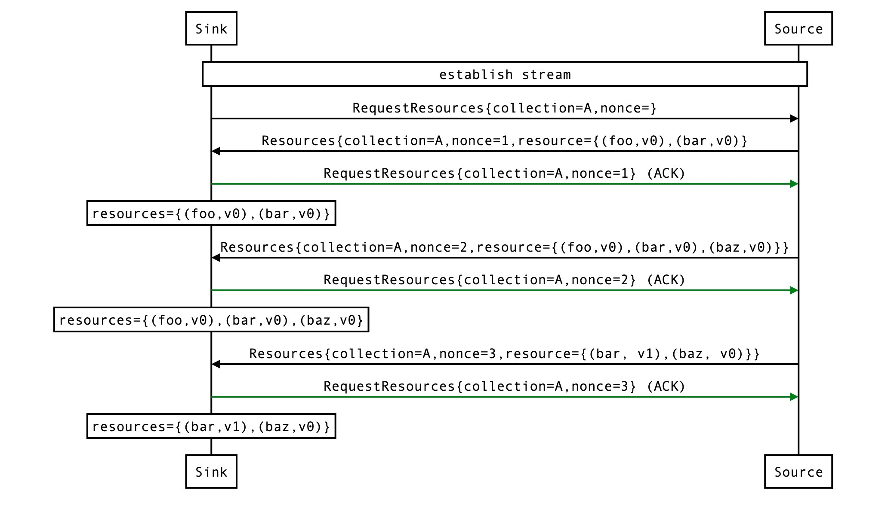
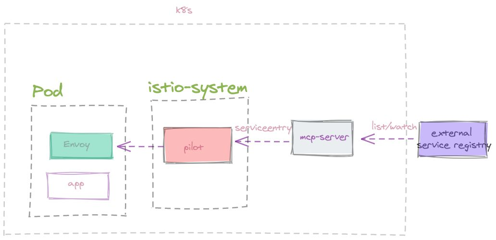

# MCP

`Istio` 作为 Service Mesh 解决方案事实上的标准，解决了开发人员和运维人员所面临的从单体应用向分布式微服务架构转变的挑战。Istio 提供了对整个服务网格的行为洞察和操作控制的能力，以及一个完整的满足微服务应用各种需求的解决方案。

但是`Istio` 对 Kubernetes 有着强依赖，整个服务注册发现都依赖Kubernetes 自身服务发现机制。但是在实际公司落地过程中，稍具规模的公司都会有自己的服务注册中心，比如Consul，Eureka 等。另外k8s service 负载均衡在大规模和大流量的情景下，也很难满足要求。所以Kubernetes 只是用来作为一种应用部署形式，和serverless，vm差不多。此时，Istio 想被广泛采用，必须支持集成第三方服务注册中心。

`Istio` 给出的解决方案是 Mesh Configuration Protocol (MCP)。尽管特定的服务和原型定义不同，但MCP基于XDS并在概念上与之保持一致。

## MCP 是什么

MCP是基于订阅的配置分发API。配置消费者（即sink）请求更新来自配置生产者（即source）的资源集合。添加，更新或删除资源时，source会将资源更新推送到sink。如果sink接受，则回复ACK，如果被拒绝则是NACK，例如因为资源无效。一旦对先前的更新进行了ACK/NACK，则source可以推送其他更新。该source一次只能运行一次未完成的更新（每个集合）。

MCP是一对双向流gRPC API服务（ResourceSource和ResourceSink）。

当source是服务器而sink是客户端时，将使用ResourceSource服务。默认情况下，Galley实现ResourceSource服务，并且Pilot连接作为客户端。
当source是客户端，而sink是服务器时，将使用ResourceSink服务。可以将Galley配置为可选地dial-out到远程配置sink，例如 Pilot位于另一个集群中，在该集群中，它不能作为客户端启动与Galley的连接。在这种情况下，Pilot将实现ResourceSink服务，而Galley将作为客户端进行连接。
就消息交换而言，ResourceSource和ResourceSink在语义上是等效的。唯一有意义的区别是谁启动连接并打开grpc流。

在RequestResources请求和ACK响应中，主要有两个字段：

collection：表示此次请求需要的数据类型，目前Istio定义了若干种类型，其中包含了serviceentries作为服务发现的数据等。
nonce：类似于请求的ID，用来与响应或者请求进行匹配。
而在返回的数据中，还有一个字段就是resources字段，里面包含真正的数据，具体的数据格式和collection的类型有关。

下面的示例显示sink接收到已成功ACK的一系列更改。

同时MCP协议还定义了增量推送的能力，这里不做详细阐述。

接下来让我们看看如何实现一个MCP server。

## MCP实现

MCP为轻松集成外部系统打开了大门。我们可以自己实现一个MCP服务器，并将其和Istio集成起来。MCP服务器提供两个主要功能：

连接并监视外部服务注册系统以获取最新的服务信息（例如Spring Cloud中的Eureka Server和Apache Dubbo的Zookeeper）。
将外部服务信息转换为Istio ServiceEntry并通过MCP资源发布。

Istio Galley实际上是MCP服务器的官方默认实现，这意味着我们可以引用它并实现我们自己的MCP服务器。关键点如下：

在MCP服务器中定义我们要监视的资源集合。
为MCP服务器定义一个监视程序，该监视程序将动态设置MCP资源。
定义其他服务器选项（例如，速率限制，AuthChecker等）。
目前 istio 集成 consul 和 Eureka 的代码已经被移除了，consul 和 Eureka 官方也没有具体MCP 实现。

## 原文
[Istio集成第三方服务注册中心的核心--MCP](https://zhuanlan.zhihu.com/p/322243856)

