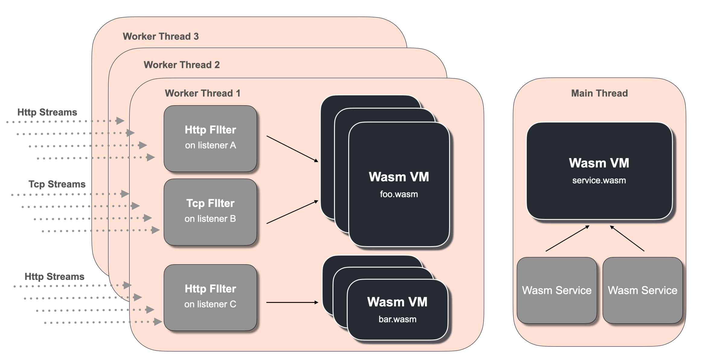
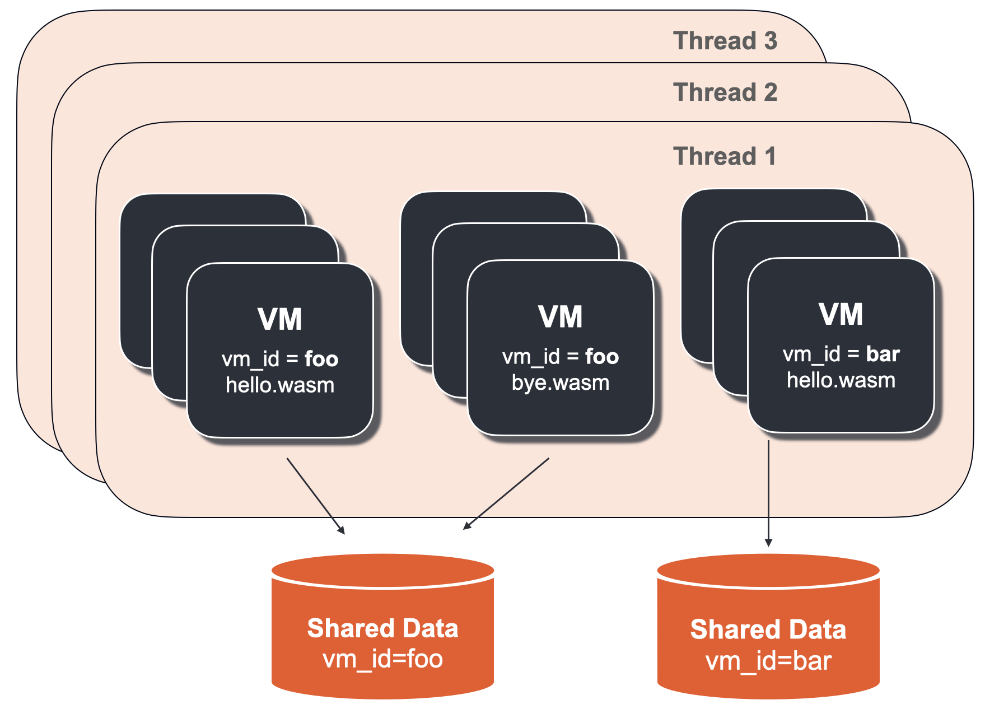
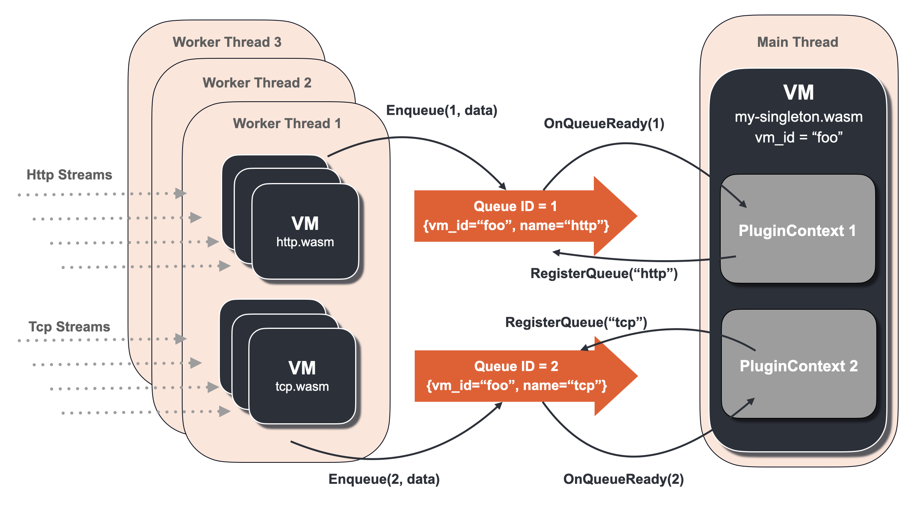

# 概述
# Introduction

Proxy-Wasm 项目的主要目标是以灵活的方式使用任何编程语言来扩展网络代理。

这个 Proxy-Wasm Go SDK 是使用 Go 编程语言在 Proxy-Wasm ABI 规范之上扩展网络代理（例如 Envoyproxy）的 SDK， [Proxy-Wasm ABI ](https://github.com/proxy-wasm/spec) 定义了网络代理和在网络内运行的 Wasm 虚拟机之间的接口代理。

使用此 SDK，每个人都可以轻松地生成与 Proxy-Wasm 规范兼容的 Wasm 二进制文件，而无需了解 Proxy-Wasm ABI 规范。相反，开发人员依靠这个 SDK 的 Go API 来执行他们想要做的事情来扩展网络代理。

本文档解释了使用此 SDK 为您的自定义插件编写程序时应了解的事项。

# Wasm VM, Plugin and Envoy configuration

## 术语

*Wasm虚拟机 (Wasm VM)* or 简称*VM* 表示已加载程序的实例. 在 Envoy 中，VM 通常在每个线程中创建并相互隔离。因此，您的程序将被复制到 Envoy 创建的线程数，并加载到每个虚拟机上。

*Plugin* 是扩展网络代理的基本配置单元。Proxy-Wasm 规范允许在单个 VM 中拥有多个插件。换句话说，一个虚拟机可以被多个网络代理插件使用。使用此 SDK，您可以在 Envoy 中配置三种类型的插件；Http Filter, Network(Tcp) Filter, 和 Wasm Service.

*Http Filter* 是一种处理 Http 协议的插件，例如对 Http request headers, body, trailers等进行操作。它在处理流量的工作线程中使用 VM。

*Network Filter* 是一种处理 Tcp 协议的插件，例如对 Tcp 数据帧进行操作、建立连接等。它在处理流量的工作线程中使用 VM。
*Wasm Service* 是一种在单例 VM 中运行的插件（即 Envoy 主线程中仅存在一个实例）。它主要用于与网络或 Http 过滤器并行执行一些额外的工作，例如聚合指标、日志等。有时，这样的单例 VM 本身也称为 Wasm 服务。



## Envoy 配置

在所有类型的插件中，我们共享 Envoy 的配置，例如

```yaml
vm_config:
  vm_id: "foo"
  runtime: "envoy.wasm.runtime.v8"
  configuration:
    "@type": type.googleapis.com/google.protobuf.StringValue
    value: '{"my-vm-env": "dev"}'
  code:
    local:
      filename: "example.wasm"
configuration:
  "@type": type.googleapis.com/google.protobuf.StringValue
  value: '{"my-plugin-config": "bar"}'
```

字段含义

| 字段 | 描述 |
| --- | --- |
| `vm_config` | 配置运行此插件的特定 Wasm VM |
| `vm_config.vm_id` | 用于跨 VM 通信的语义隔离。 可以参考 [Cross-VM communications](#cross-vm-communications) 获取详情.|
| `vm_config.runtime` | 指定 Wasm 运行时类型。通常设置为 `envoy.wasm.runtime.v8`. |
| `vm_config.configuration` | 用于设置 VM 的配置数据。 |
| `vm_config.code` | Wasm 二进制文件的位置 |
| `configuration` | 对应于 Wasm VM 中的每个 Plugin 实例（我们称之为 `PluginContext` 如下所述）。|

重要的是，为多个插件提供完全相同的`vm_config`字段最终会在它们之间共享一个 Wasm VM。这意味着您可以将单个 Wasm VM 用于多个 Http 过滤器，或者每个线程可以使用 Http 和 Tcp 过滤器（有关详细信息，请参阅 [example config](#sharing-one-vm-among-multiple-plugins-per-thread)。

完整的 API 定义在[这里](https://www.envoyproxy.io/docs/envoy/latest/api-v3/extensions/wasm/v3/wasm.proto#envoy-v3-api-msg-extensions-wasm-v3-pluginconfig) ，这就是我们在这里和其他地方所说的插件配置。

现在这里是 Envoy 中每种插件类型的一些示例配置。请注意，Envoy 如何创建 Wasm VM 取决于这些类型。

### Http Filter

如果在 `envoy.filter.http.wasm` 中给出了插件配置，您可以将您的程序作为 Http Filter 插件运行，以便它可以对 Http 事件进行操作。
```yaml
http_filters:
- name: envoy.filters.http.wasm
  typed_config:
    "@type": type.googleapis.com/envoy.extensions.filters.http.wasm.v3.Wasm
    config:
      vm_config: { ... }
      # ... plugin config follows
- name: envoy.filters.http.router
```

在这种情况下，在 Envoy 中的 *每个工作线程* 上创建 Wasm VM，每个 VM 负责在由相应工作线程处理的侦听器上对每个 Http 流进行操作。请注意，VM 和插件的创建方式与网络过滤器完全相同，唯一的区别是插件只对 Http 流而不是 Tcp 流进行操作。

### Network Filter

如果在 `envoy.filter.network.wasm` 中提供了插件配置，您可以将程序作为网络过滤器插件运行，以便它可以对 Tcp 事件进行操作。
```yaml
filter_chains:
- filters:
    - name: envoy.filters.network.wasm
      typed_config:
        "@type": type.googleapis.com/envoy.extensions.filters.network.wasm.v3.Wasm
        config:
          vm_config: { ... }
          # ... plugin config follows
    - name: envoy.tcp_proxy
```
在这种情况下，在 Envoy 中的每个工作线程上创建 Wasm VM，每个 VM 负责对相应工作线程处理的侦听器上的每个 Tcp 流进行操作。请注意，VM 和 Plugins 的创建方式与 Http Filter 完全相同，唯一的区别是 Plugins 只对 Tcp 流而不是 Http 流进行操作。

### Wasm Service

如果在 `envoy.bootstrap.wasm` 中提供了插件配置，您可以将程序作为 Wasm 服务插件运行。
```yaml
bootstrap_extensions:
- name: envoy.bootstrap.wasm
  typed_config:
    "@type": type.googleapis.com/envoy.extensions.wasm.v3.WasmService
    singleton: true
    config:
      vm_config: { ... }
      # ... plugin config follows
```

顶部`singleton`字段通常设置为 true。这样一来，Envoy 进程的所有线程中只存在一个用于此配置的 VM，并且运行在 Envoy 的主线程上，因此不会阻塞任何工作线程。

### 每个线程在多个插件之间共享一个虚拟机

正如我们所解释的，我们可以跨多个插件共享一个 VM。这是此类配置的示例 yaml:

```yaml
static_resources:
  listeners:
    - name: http-header-operation
      address:
        socket_address:
          address: 0.0.0.0
          port_value: 18000
      filter_chains:
        - filters:
            - name: envoy.http_connection_manager
              typed_config:
                # ....
                http_filters:
                  - name: envoy.filters.http.wasm
                    typed_config:
                      "@type": type.googleapis.com/envoy.extensions.filters.http.wasm.v3.Wasm
                      config:
                        configuration:
                          "@type": type.googleapis.com/google.protobuf.StringValue
                          value: "http-header-operation"
                        vm_config:
                          vm_id: "my-vm-id"
                          runtime: "envoy.wasm.runtime.v8"
                          configuration:
                            "@type": type.googleapis.com/google.protobuf.StringValue
                            value: "my-vm-configuration"
                          code:
                            local:
                              filename: "all-in-one.wasm"
                  - name: envoy.filters.http.router

    - name: http-body-operation
      address:
        socket_address:
          address: 0.0.0.0
          port_value: 18001
      filter_chains:
        - filters:
            - name: envoy.http_connection_manager
              typed_config:
                # ....
                http_filters:
                  - name: envoy.filters.http.wasm
                    typed_config:
                      "@type": type.googleapis.com/envoy.extensions.filters.http.wasm.v3.Wasm
                      config:
                        configuration:
                          "@type": type.googleapis.com/google.protobuf.StringValue
                          value: "http-body-operation"
                        vm_config:
                          vm_id: "my-vm-id"
                          runtime: "envoy.wasm.runtime.v8"
                          configuration:
                            "@type": type.googleapis.com/google.protobuf.StringValue
                            value: "my-vm-configuration"
                          code:
                            local:
                              filename: "all-in-one.wasm"
                  - name: envoy.filters.http.router

    - name: tcp-total-data-size-counter
      address:
        socket_address:
          address: 0.0.0.0
          port_value: 18002
      filter_chains:
        - filters:
            - name: envoy.filters.network.wasm
              typed_config:
                "@type": type.googleapis.com/envoy.extensions.filters.network.wasm.v3.Wasm
                config:
                  configuration:
                    "@type": type.googleapis.com/google.protobuf.StringValue
                    value: "tcp-total-data-size-counter"
                    vm_config:
                      vm_id: "my-vm-id"
                      runtime: "envoy.wasm.runtime.v8"
                      configuration:
                        "@type": type.googleapis.com/google.protobuf.StringValue
                        value: "my-vm-configuration"
                      code:
                        local:
                          filename: "all-in-one.wasm"
            - name: envoy.tcp_proxy
              typed_config: # ...
```

您会看到 `vm_config` 字段在 18000 和 18001 侦听器上的 Http 过滤器链以及 18002 上的网络过滤器链上都是相同的。这意味着在这种情况下，Envoy 中的多个插件使用一个 Wasm VM 每个工作线程。换言之，所有 `vm_config.vm_id`、`vm_config.runtime`、`vm_config.configuration` 和 `vm_config.code` 都必须相同才能重用相同的 VM。

因此，每个 Wasm VM 将创建三个 `PluginContext`，每个 PluginContext 对应于上述每个过滤器配置（顶部配置字段分别为 18000、18001 和 18002）。


# Proxy-Wasm Go SDK API

到目前为止，我们已经解释了概念和插件配置。现在我们准备好深入了解这个 SDK 的 API。

## *Contexts*

上下文有四种类型：`VMContext`、`PluginContext`、`TcpContext` 和 `HttpContext`。它们的关系以及它们如何映射到上面的概念可以描述为下图：

```
                    Wasm Virtual Machine
                      (.vm_config.code)
┌────────────────────────────────────────────────────────────────┐
│  Your program (.vm_config.code)                TcpContext      │
│          │                                  ╱ (Tcp stream)     │
│          │ 1: 1                            ╱                   │
│          │         1: N                   ╱ 1: N               │
│      VMContext  ──────────  PluginContext                      │
│                                (Plugin)   ╲ 1: N               │
│                                            ╲                   │
│                                             ╲  HttpContext     │
│                                               (Http stream)    │
└────────────────────────────────────────────────────────────────┘
```

To summarize,

1) `VMContext`对应每个`.vm_config.code`，每个VM中只存在一个`VMContext`。
2) `VMContext` 是 `PluginContexts` 的父级，负责创建任意数量的 `PluginContexts`。
3) `PluginContext` 对应一个 Plugin 实例。这意味着`PluginContext` 对应于 Http 过滤器或网络过滤器，或者 Wasm 服务，通过插件配置中的 `.configuration` 字段进行配置。
4) `PluginContext` 是 `TcpContext` 和 `HttpContext` 的父级，在 `Http Filter` 或 `Network Filter` 配置时负责创建任意数量的这些上下文。
5) `TcpContext` 负责处理每个 Tcp 流。
6) `HttpContext` 负责处理每个 Http 流。

所以你所要做的就是实现`VMContext`和`PluginContext`。如果你想插入 `Http Filter` 或 `Network Filter` ，那么分别实现 `HttpContext` 或 `TcpContext` 。

让我们看看其中的一些接口。首先我们看到`VMContext`定义如下：

```go
type VMContext interface {
	// OnVMStart is called after the VM is created and main function is called.
	// During this call, GetVMConfiguration hostcall is available and can be used to
	// retrieve the configuration set at vm_config.configuration.
	// This is mainly used for doing Wasm VM-wise initialization.
	OnVMStart(vmConfigurationSize int) OnVMStartStatus

	// NewPluginContext is used for creating PluginContext for each plugin configurations.
	NewPluginContext(contextID uint32) PluginContext
}
```

如您所料，`VMContext` 负责通过 `NewPluginContext` 方法创建 `PluginContext`。另外，在虚拟机启动阶段会调用 `OnVMStart`，您可以通过 `GetVMConfiguration` 主机调用 API 获取 `.vm_config.configuration` 的值。
通过这种方式，您可以执行独立于 VM 的插件初始化并控制 `VMContext` 的行为。

接下来是`PluginContext`，它定义为（这里为了简单我们省略了一些方法）

```go
type PluginContext interface {
	// OnPluginStart is called on all plugin contexts (after OnVmStart if this is the VM context).
	// During this call, GetPluginConfiguration is available and can be used to
	// retrieve the configuration set at config.configuration in envoy.yaml
	OnPluginStart(pluginConfigurationSize int) OnPluginStartStatus

	// The following functions are used for creating contexts on streams,
	// and developers *must* implement either of them corresponding to
	// extension points. For example, if you configure this plugin context is running
	// at Http filters, then NewHttpContext must be implemented. Same goes for
	// Tcp filters.
	//
	// NewTcpContext is used for creating TcpContext for each Tcp streams.
	NewTcpContext(contextID uint32) TcpContext
	// NewHttpContext is used for creating HttpContext for each Http streams.
	NewHttpContext(contextID uint32) HttpContext
}
```

就像 `VMContext` 一样，`PluginContext` 具有 `OnPluginStart` 方法，该方法在网络代理中的插件创建时调用。在该调用期间，可以通过 `GetPluginConfiguration` 主机调用 API [hostcall API](#hostcall-api)  检索插件配置中 `.configuratin` 字段的值。
通过这种方式，开发人员可以告知 `PluginContext` 它应该如何表现，例如，指定 `PluginContext` 应该表现为 `Http Filter` 以及它应该插入哪些自定义headers 作为请求headers 等。

另请注意，`PluginContext` 具有 `NewTcpContext` 和 `NewHttpContext` 方法，这些方法在创建这些上下文以响应网络代理中的每个 Http 或 Tcp 流时被调用。

## Hostcall API

Hostcall API 提供了多种方式来与您的程序中的网络代理进行交互。

## Entrypoint

当 Envoy 创建 VM 时，它会在启动阶段调用程序的 `main` 函数，然后再尝试在 VM 中创建 `VMContext`。因此，您必须在 `main` 函数中传递您自己的 `VMContext` 实现。

```go
func main() {
	proxywasm.SetVMContext(&myVMContext{})
}

type myVMContext struct { .... }

var _ types.VMContext = &myVMContext{}

// Implementations follow...
```

# Cross-VM communications

鉴于虚拟机是以线程本地方式创建的，有时我们可能希望与其他虚拟机通信。例如，聚合数据或统计数据、缓存数据等。

跨 *VM 通信*有两个概念，称为*共享数据*和*共享队列*。

我们还建议您观看此 [演讲](https://www.youtube.com/watch?v=XdWmm_mtVXI&t=1168s) 的介绍。

## *Shared Data (Shared KVS)*

如果你想在多个工作线程中运行的所有 Wasm VM 上拥有全局请求计数器怎么办？或者，如果你想缓存一些应该被所有 Wasm VM 使用的数据怎么办？ *共享数据*或*等效的共享KVS* 将发挥作用。

*共享数据*基本上是一个键值存储，在所有 VM 之间共享（即*跨 VM* 或*跨线程*）。根据 `vm_config` 中指定的[`vm_id`](#envoy-configuration) 创建一个共享数据 KVS。这意味着您可以在所有 Wasm VM 之间共享一个键值存储，而不必使用相同的二进制文件 (vm_config.code)。唯一的要求是具有相同的 vm_id。




在上图中，您可以看到具有“vm_id=foo”的 VM 共享相同的共享数据存储，即使它们具有不同的二进制文件（hello.wasm 和 bye.wasm）。

```go
// GetSharedData is used for retrieving the value for given "key".
// Returned "cas" is be used for SetSharedData on that key for
// thread-safe updates.
func GetSharedData(key string) (value []byte, cas uint32, err error)

// SetSharedData is used for setting key-value pairs in the shared data storage
// which is defined per "vm_config.vm_id" in the hosts.
//
// ErrorStatusCasMismatch will be returned when a given CAS value is mismatched
// with the current value. That indicates that other Wasm VMs has already succeeded
// to set a value on the same key and the current CAS for the key is incremented.
// Having retry logic in the face of this error is recommended.
//
// Setting cas = 0 will never return ErrorStatusCasMismatch and always succeed, but
// it is not thread-safe, i.e. maybe another VM has already set the value
// and the value you see is already different from the one stored by the time
// when you call this function.
func SetSharedData(key string, value []byte, cas uint32) error
```

这个API 很简单，重要的部分是它的线程安全性和跨 VM 安全性。


## *Shared Queue*

如果您想在请求/响应处理中并行聚合所有 Wasm 虚拟机的指标怎么办？或者如果你想将一些跨 VM 的聚合信息推送到远程服务器怎么办？可以使用*共享队列*。

*Shared Queue*是为一对`vm_id`和队列名称创建的FIFO（先进先出）队列。并且*队列 id* 被唯一地分配给用于入队/出队操作的对 (vm_id, name)。

如您所料，“入队”和“出队”等操作具有线程安全性和跨虚拟机安全性。

```golang
// DequeueSharedQueue dequeues an data from the shared queue of the given queueID.
// In order to get queue id for a target queue, use "ResolveSharedQueue" first.
func DequeueSharedQueue(queueID uint32) ([]byte, error)

// RegisterSharedQueue registers the shared queue on this plugin context.
// "Register" means that OnQueueReady is called for this plugin context whenever a new item is enqueued on that queueID.
// Only available for types.PluginContext. The returned ququeID can be used for Enqueue/DequeueSharedQueue.
// Note that "name" must be unique across all Wasm VMs which share a same "vm_id".
// That means you can use "vm_id" can be used for separating shared queue namespace.
//
// Only after RegisterSharedQueue is called, ResolveSharedQueue("this vm_id", "name") succeeds
// to retrive queueID by other VMs.
func RegisterSharedQueue(name string) (ququeID uint32, err error)

// EnqueueSharedQueue enqueues an data to the shared queue of the given queueID.
// In order to get queue id for a target queue, use "ResolveSharedQueue" first.
func EnqueueSharedQueue(queueID uint32, data []byte) error

// ResolveSharedQueue acquires the queueID for the given vm_id and queue name.
// The returned ququeID can be used for Enqueue/DequeueSharedQueue.
func ResolveSharedQueue(vmID, queueName string) (ququeID uint32, err error)
```

基本上 `RegisterSharedQueue` 和 `DequeueSharedQueue` 由队列的“消费者”使用，而 `ResolveSharedQueue` 和 `EnqueueSharedQueue` 用于队列项目的“生产者”。注意
- `RegisterSharedQueue` 用于为调用者的 `name` 和 `vm_id` 创建一个共享队列。这意味着如果要使用队列，则必须事先由 VM 调用。这可以被`PluginContext`调用，因此我们可以想到“comsumers”=PluginContexts。
- `ResolveSharedQueue` 用于获取 `name` 和 `vm_id` 的队列 id。通常这由不调用 `ResolveSharedQueue` 而是应该将项目排队的 VM 使用。这是给“生产者”的。

并且这两个调用都返回一个队列 id，它用于 `DequeueSharedQueue` 和 `EnqueueSharedQueue`。

但是，从消费者的角度来看，当队列与项目一起入队时，如何通知消费者（= `PluginContext`）？这就是为什么我们在 `PluginContext` 中有 `OnQueueReady(queueID uint32)` 接口的原因。每当一个项目在该 `PluginContext` 注册的队列中排队时，都会调用此方法。

此外，强烈建议共享队列应该由单例 *Wasm service*创建，即在 Envoy 的主线程上。否则 `OnQueueReady` 会在工作线程上调用，这会阻止它们处理 Http 或 Tcp 流。

下图是共享队列的说明性用法：



`my-singleton.wasm` 加载为带有 `vm_id=foo` 的单例 VM，其中创建了两个 *Wasm Service*，它们对应于 VM 中的 `PluginContext 1` 和 `PluginContext 2`。这些插件上下文中的每一个都使用“http”和“tcp”名称调用 `RegisterQueue`，这会导致创建两个相应的队列。
另一方面，在工作线程中，每个线程创建两种类型的 Wasm VM。它们在处理 Tcp 流和 Http 流，并将一些数据分别排入相应的队列中。正如我们上面解释的，将数据排入队列最终会调用 `PluginContext` 的 `OnQueueReady` 方法，
该方法调用该队列的 `RegisterQueue`。在此示例中，将数据排入队列 id=2 的队列会调用单例 VM 中 `PluginContext 2` 的 `OnQueueReady(2)`。


## Some of existing libraries not available

一些现有的库不可用（可导入但运行时恐慌/不可导入）。有几个原因：
1. TinyGo 的 WASI target 不支持某些系统调用。
2. TinyGo 没有实现所有的反射包。
3. [Proxy-Wasm C++ host](https://github.com/proxy-wasm/proxy-wasm-cpp-host) 尚不支持某些 WASI API。
4. TinyGo 或 Proxy-Wasm 中不提供某些语言功能：示例包括`recover` 和 `goroutine`。

随着 TinyGo 和 Proxy-Wasm 的发展，这些问题将得到缓解。

## Performance overhead due to Garbage Collection

由于 GC，使用 Go/TinyGo 会产生性能开销，但乐观地说，与代理中的其他操作相比，我们可以说 GC 的开销足够小。

在 TinyGo 中，只要堆用完（参见 [1](https://tinygo.org/lang-support/#garbage-collection),
[2](https://github.com/tinygo-org/tinygo/blob/v0.14.1/src/runtime/gc_conservative.go#L218-L239)) ），就会在内部调用

TinyGo 允许我们禁用 GC，但我们不能这样做，因为内部我们需要使用映射（隐式导致分配）来保存虚拟机的状态。理论上，我们可以通过 `alloc(uintptr)` 接口和 `-gc=none` 选项来实现我们自己为 `proxy-wasm` 量身定制的 GC 算法。这是一个未来的 TODO。

## `recover` not implemented

在 TinyGo 中没有实现`recover`(https://github.com/tinygo-org/tinygo/issues/891)，也没有办法阻止 Wasm 虚拟机中止。这也意味着依赖于`recover` 的代码不会按预期工作。

## Goroutine support

在 TinyGo 中，Goroutine 是通过 LLVM 的协程实现的( 参见这篇 [博文](https://aykevl.nl/2019/02/tinygo-goroutines) )。

在 Envoy 中，Wasm 模块以事件驱动的方式运行，因此一旦主函数退出，“调度程序”就不会执行。这意味着您无法像在普通宿主环境中那样拥有 Goroutine 的预期行为。

“如何在事件驱动方式执行的线程本地 Wasm VM 中处理 Goroutine”这个问题尚未得到解答。

我们强烈建议您为任何异步任务实现 OnTick 函数，而不是使用 Goroutine。