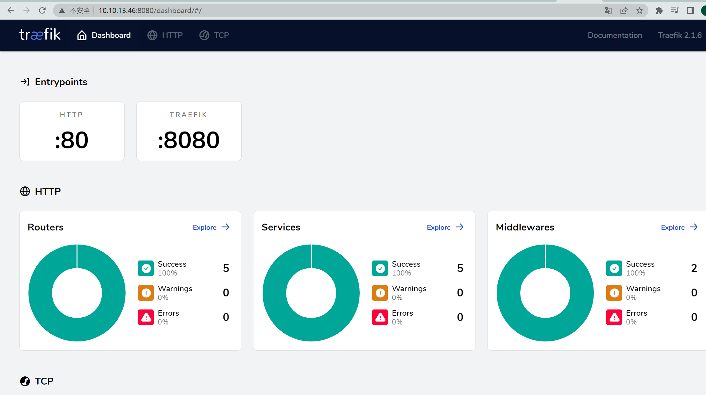

# Traefik

## 架构


## 概念

假设你已经在你的基础设施上部署了一堆微服务。你可能使用了一个服务发现系统（例如 etcd 或 consul）或者一个资源管理框架（swarm，Mesos/Marathon）来管理所有这些服务。 如果你想让你的用户去从互联网访问你的某些微服务， 你就必需使用虚拟hosts或前缀路径来配置一个反向代理：

域名 api.domain.com 将指向你的私有网络中的微服务 api
路径 domain.com/web 将指向你的私有网络中的微服务 web
域名 backoffice.domain.com 将指向你的私有网络中的微服务 backoffice ，在你的多台实例之间负载均衡


我们将`Traefik`放大，一起看看它内部的结构


请求在入口点处结束, 顾名思义, 它们是Træfɪk的网络入口(监听端口, SSL, 流量重定向...)。
之后流量会导向一个匹配的前端。 前端是定义入口点 到 后端之间的路由的地方。 路由是通过请求字段(Host, Path, Headers...) 来定义的，它可以匹配或否定一个请求。
前端 将会把请求发送到 后端。后端可以由一台或一个通过负载均衡策略配置后的多台服务器组成。
最后, 服务器 将转发请求到对应私有网络的微服务当中去。

## 快速入门
`traefik` 具有自动发现服务的能力，它与docker可以完美的集成，我们以docker-compose动一个`traefik`，它的配置如下

```shell
vi traefik-v2.1.yaml
```

```yaml
version: '3'
services:
  reverse-proxy:
    image: traefik:2.1.6
    # Enables the web UI and tells Traefik to listen to docker
    # 启用webUI 并告诉Traefile去监听docker的容器实例
    command: --api.insecure=true --providers.docker
    ports:
      # traefik暴露的http端口
      - "80:80"
      # webUI暴露的端口(必须制定--api.insecure=true才可以访问)
      - "8080:8080"
    volumes:
      # 指定docker的sock文件来让traefik获取docker的事件，从而实现动态负载均衡
      - /var/run/docker.sock:/var/run/docker.sock
```

主要的是 ```--api.insecure=true --providers.docker``` ,配置了这个后，当你将`traefik`部署到某个虚拟机（如 node1）上面后，
只要是在node1上面部署的所有docker容器，会在traefik自动生成配置。


启动 
```shell
docker-compose -f traefik-v2.1.yaml up -d reverse-proxy
```

查看traefik dashboard：
我本机的ip是`10.10.13.46`

```http request
http://10.10.13.46:8080/
```




## 参考
[traefik官网基础](https://docs.traefik.cn/basics)

[Traefik-v2.x快速入门](https://www.cnblogs.com/xiao987334176/p/12447783.html)

