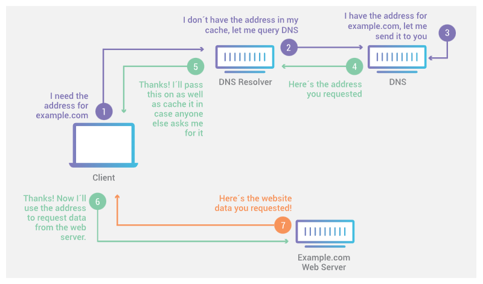

# 网络基础

### 什么是子网？
子网或子网络是网络内部的网络。子网使网络更高效。通过子网划分，网络流量传播距离更短，无需通过不必要的路由器即可到达目的地。
[什么是子网？|子网划分的工作原理](https://www.cloudflare.com/zh-cn/learning/network-layer/what-is-a-subnet/)

### 什么是 IP 地址，它为什么重要？
“IP” 代表互联网协议，它是一组规则，使设备可以通过互联网进行通信。每天有数十亿人访问互联网，因此需要唯一标识符来跟踪谁在做什么。互联网协议通过为每个访问互联网的设备分配 IP 编号来解决这个问题。

计算机的 IP 地址就像房子的实际地址。如果有人打电话给披萨店订购外卖，他们需要提供其实际地址。如果没有那个地址，披萨送货员将不知道将披萨送到哪家！

### IP地址概念
IP地址是一个32位的二进制数，它由网络ID和主机ID两部份组成，用来在网络中唯一的标识的一台计算机。网络ID用来标识计算机所处的网段；主 机ID用来标识计算机在网段中的位置。IP地址通常用4组3位十进制数表示，中间用“.”分隔。比如，192.168.0.1。

为了方便IP寻址将IP地址划分为A、B、C、D和E五类，每类IP地址对各个IP地址中用来表示网络ID和主机ID的位数作了明确的规定。当主机ID的位数确定之后，一个网络中是多能够包含的计算机数目也就确定，用户可根据企业需要灵活选择一类IP地址构建网络结构。

A类：A类地址用IP地址前8位表示网络ID，用IP地址后24位表示主机ID。

B类：B类地址用IP地址前16位表示网络ID，用IP地址后16位表示主机ID。

C类：C类地址用IP地址前24位表示网络ID，用IP地址后8位表示主机ID。

D类：D类地址用来多播使用，没有网络ID和主机ID之分。

网络ID不相同的计算机之间通信必须通过**路由器**连接，我们把网络ID不相同的计算机称之为远程计算机。

当为一台计算机分配IP地址后，该计算机的IP地址哪部份表示网络ID，哪部份表示主机ID，并不由IP地址所属的类来确定，而是由**子网掩码**确定。子网确定一个IP地址属于哪一个子网。

子网掩码的格式是以连续的255后面跟连续的0表示，其中*连续的255这部份表示网络ID*；*连续0部份表示主机ID*。比如，子网掩码255.255.0.0和255.255.255.0。

例1：IP地址：192.168.23.35　子网掩码：255.255.0.0

网络ID:192.168.0.0 主机ID:23.35

例2：IP地址:192.168.23.35 子网掩码：255.255.255.0
网络ID:192.168.23.0 主机ID:35

#### 特殊的网址

### 网关gateway
顾名思义，网关（Gateway）就是一个网络连接到另一个网络的“关口”。也就是网络关卡。

由于历史的原因，许多有关TCP/IP的文献曾经把网络层使用的路由器称为网关，在今天很多局域网采用都是路由来接入网络，因此通常指的网关就是**路由器的IP**！

那么网关到底是什么呢？网关实质上是一个网络通向其他网络的 IP地址。

比如有网络A和网络B，网络A的 IP地址范围为“192.168.1.1~192. 168.1.254”， 子网掩码为255.255.255.0；网络B的IP地址范围为“192.168.2.1~192.168.2.254”，子网掩码为255.255.255.0。在没有 路由器的情况下，两个网络之间是不能进行TCP/IP通信的，即使是两个网络连接在同一台 交换机（或 集线器）上，
TCP/IP协议也会根据 子网掩码（255.255.255.0）判定两个网络中的主机处在不同的网络里（此时是c类ip，除非192.168.1.1和192.168.1.XXX 才能是一个网络）。

而要实现这两个网络之间的通信，则必须通过网关。如果网络A中的主机发现 数据包的目的主机不在本地网络中，就把数据包转发给它自己的网关，再由网关转发给网络B的网关，网络B的网关再转发给网络B的某个主机。网络A向网络B转发数据包的过程。
所以说，只有设置好网关的IP地址，TCP/IP协议才能实现不同网络之间的相互通信。那么这个IP地址是哪台机器的IP地址呢？网关的IP地址是具有路由功能的设备的IP地址，具有路由功能的设备有路由器、启用了路由协议的服务器（实质上相当于一台路由器）、代理服务器（也相当于一台路由器）。

### CIDR
将常规的子网掩码转换为二进制，将发现子网掩格式为连续的二进制1跟连续0，其中**子网掩码中为1的部份表示网络ID**，**子网掩中为0的表示主机ID**。比如255.255.0.0转换为二进制为11111111 11111111 00000000 00000000。

在前面所举的例子中为什么不用连续的1部份表示网络ID，连续的0部份表示主机ID呢？答案是肯定的，采用这种方案的IP寻址技术称之为无类域间路 由（CIDR）。

CIDR技术用子网掩码中连续的1部份表示网络ID，连续的0部份表示主机ID。

比如，网络中包含2000台计算机，只需要用11位表示 主机ID，用21位表网络ID，则子网掩码表示为11111111.11111111.11100000.00000000，转换为十进制则为 255.255.224.0。
此时，该网络将包含2046台计算机，既不会造成IP地址的浪费，也不会利用路由器连接网络，增加额外的管理维护量。

CIDR表示方法：IP地址/网络ID的位数，比如192.168.23.35/21，其中用21位表示网络ID。

例1：192.168.23.35/21

    子网掩码：11111111 11111111 11111000 00000000则为255.255.248.0

网络ID：192.168.00010111.0

00010111的前5位还是代表网络位，因为`/21`表示前21位是网络位，而192.168包含了16位，所以还得往后延申5位。23对应的2进制的值是`00010111`,前五位的值为16。则网络ID为192.168.16.0

起始IP地址：192.168.16.1（主机ID不能全为0，全为0表示网络ID最后一位为1）

结束IP地址：192.168.00010111.11111110（主机ID不能全为1，全为1表示本地广播）则结束IP地址为：192.168.23.254。

[IP地址与CIDR](https://www.iteye.com/blog/uule-2102484)

